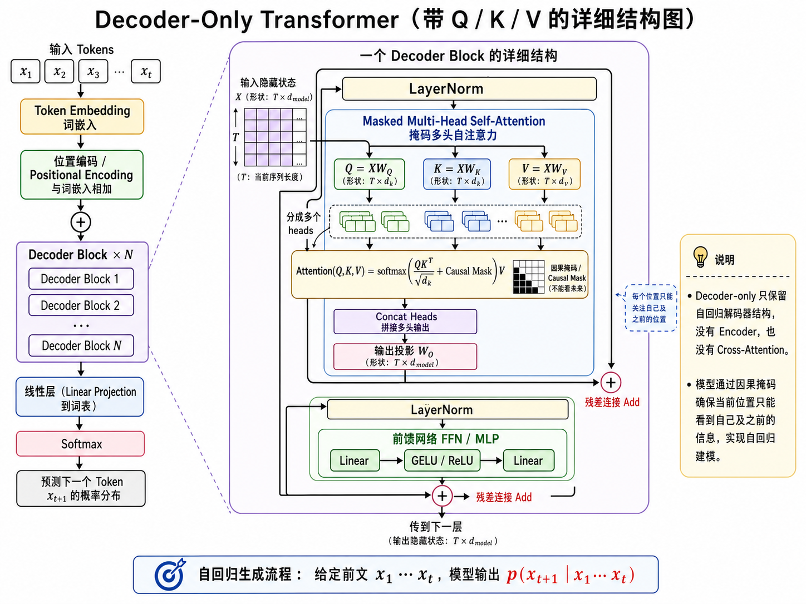

# Agent

## 大语言模型基础

### Decoder-only 模型



### 一个完整例子：从句子输入到预测 token 输出

下面用图中的 decoder-only 流程，完整走一遍“输入一句话 -> 预测下一个 token -> 继续生成”的过程。

#### 整体生成过程

假设输入是：

`我 喜欢 吃`

decoder-only 模型的目标是预测：

$$
P(x_{t+1} \mid x_1, x_2, \ldots, x_t)
$$

也就是：给定前文“`我 喜欢 吃`”，下一个 token 最可能是什么？

可能答案是：苹果。

#### 第一步：输入 Tokens

输入 Tokens：$x_1, x_2, x_3, \ldots, x_t$

对于句子“我 喜欢 吃”，可以简单理解为：

$$
x_1 = \text{我}, \quad x_2 = \text{喜欢}, \quad x_3 = \text{吃}
$$

真实模型里不会直接处理汉字或单词，而是先经过 tokenizer，把文字变成 token id。

例如：

| 文字 | token id |
| ---- | -------: |
| 我   |     1001 |
| 喜欢 |     3056 |
| 吃   |     2088 |

这些 id 才是模型真正的输入。

#### 第二步：Token Embedding

token id 本身只是编号，没有语义，所以模型会查一个 embedding 表，把每个 token id 变成一个向量。

例如：

$$
x_1 = \text{“我”} \rightarrow e_1
$$

$$
x_2 = \text{“喜欢”} \rightarrow e_2
$$

$$
x_3 = \text{“吃”} \rightarrow e_3
$$

这些向量可能长这样：

| token  | 向量示意                      |
| ------ | ----------------------------- |
| “我”   | $[0.12, -0.31, 0.45, \ldots]$ |
| “喜欢” | $[0.66, 0.08, -0.21, \ldots]$ |
| “吃”   | $[-0.15, 0.72, 0.19, \ldots]$ |

每个 token 都会变成一个 $d_{model}$ 维向量。

如果当前有 $T$ 个 token，那么整体输入矩阵是：

$$
X \in \mathbb{R}^{T \times d_{model}}
$$

比如这里 $T = 3$。

#### 第三步：加上位置编码

只看 embedding，模型知道有哪些词，但不知道顺序。

比如“我 喜欢 吃”和“吃 喜欢 我”token 是一样的，但顺序不同，意思完全不同。

所以图里有“位置编码 / Positional Encoding 与词嵌入相加”，也就是：

$$
X = \text{TokenEmbedding} + \text{PositionEmbedding}
$$

于是模型不只知道“这个 token 是什么”，还知道“这个 token 在第几个位置”。

#### 第四步：进入 Decoder Block

图中有：`Decoder Block x N`


也就是说，输入会经过很多层 Decoder Block。

每一层都做类似的事情：

```markdown
LayerNorm
↓
Masked Multi-Head Self-Attention
↓
残差连接 Add
↓
LayerNorm
↓
FFN / MLP
↓
残差连接 Add
```

接下来重点看`Decoder Block`内部的细节。

#### Decoder Block 内部：Q / K / V 是怎么来的？

进入一个 Decoder Block 后，输入隐藏状态是：

$$
X
$$

$$
X \in \mathbb{R}^{T \times d_{model}}
$$

然后模型用三个不同的矩阵，把 $X$ 变成：

$$
Q = XW_Q
$$

$$
K = XW_K
$$

$$
V = XW_V
$$

其中Q、K、V 矩阵的含义如下。

| 符号 | 含义  | 直观理解                     |
| ---- | ----- | ---------------------------- |
| $Q$  | Query | 我这个位置想找什么信息       |
| $K$  | Key   | 我这个位置能提供什么索引信息 |
| $V$  | Value | 我这个位置真正携带的内容信息 |

比如当前 token 是“吃”，它的 Query 可能在问：我后面通常接什么食物？前面的 token“我”“喜欢”“吃”都会提供自己的 Key 和 Value，然后“吃”这个位置会通过 Query 去匹配前面所有位置的 Key，决定应该关注谁。

#### Masked Self-Attention：为什么要 Mask？

图里注意力部分写了：

$$
\operatorname{Attention}(Q, K, V) = \operatorname{softmax}\left( \frac{QK^T}{\sqrt{d_k}} + \operatorname{CausalMask} \right)V
$$

其中最关键的是：Causal Mask / 因果掩码，不能看未来。

decoder-only 是自回归生成模型，它只能看当前位置及之前的 token。

例如序列是：

`我 喜欢 吃 苹果`

当模型处理“吃”这个位置时，它只能看到：

`我 喜欢 吃`

不能提前看到“苹果”。否则训练时就作弊了。

所以 mask 矩阵大概是这样：

$$
\begin{bmatrix}
1 & 0 & 0 & 0 \\
1 & 1 & 0 & 0 \\
1 & 1 & 1 & 0 \\
1 & 1 & 1 & 1
\end{bmatrix}
$$

第 3 个位置“吃”只能看第 1、2、3 个位置，不能看第 4 个位置“苹果”。

#### 注意力具体在算什么？

以“吃”这个位置为例，它会拿自己的 Query 去和前面每个 token 的 Key 做相似度计算：

$$
q_{\text{吃}} \cdot k_{\text{我}}, \quad q_{\text{吃}} \cdot k_{\text{喜欢}}, \quad q_{\text{吃}} \cdot k_{\text{吃}}
$$

然后经过 softmax 得到注意力权重。

假设结果是：

| 被关注的位置 | 注意力权重 |
| ------------ | ---------: |
| 我           |       0.10 |
| 喜欢         |       0.30 |
| 吃           |       0.60 |

这表示模型认为，在预测“吃”之后的内容时，“吃”本身最重要，“喜欢”也比较重要，“我”稍微有点作用。

然后它会把这些位置的 Value 加权求和：

$$
z_{\text{吃}} = 0.10 v_{\text{我}} + 0.30 v_{\text{喜欢}} + 0.60 v_{\text{吃}}
$$

得到一个新的向量，里面融合了上下文信息。

#### Multi-Head：为什么要多个 Head？

一个 head 只能从一个角度看上下文，多个 head 可以从不同角度看。

比如对于“`我 喜欢 吃`”，不同 head 可能关注不同关系：

| Head   | 可能关注的内容     |
| ------ | ------------------ |
| Head 1 | “吃”后面通常接食物 |
| Head 2 | “我 喜欢”表示偏好  |
| Head 3 | 中文语序关系       |
| Head 4 | 句子是否已经完整   |

每个 head 都会得到一个自己的 attention 输出，然后把多个 head 的结果拼接起来：

$$
\operatorname{Concat}(\text{head}_1, \text{head}_2, \ldots, \text{head}_h)
$$

接着经过输出投影：

$$
\operatorname{MultiHeadOutput} = \operatorname{Concat}(\text{head}_1, \text{head}_2, \ldots, \text{head}_h) W_O
$$

这个 $W_O$ 的作用是把多个 head 的信息融合起来，并变回 $d_{model}$ 维的隐藏状态。

#### 残差连接 Add

经过上述计算后，模型不会只保留 attention 的结果，而是把原来的输入也加回来：

$$
X' = X + \text{AttentionOutput}
$$

这样做有两个好处：防止信息在深层网络中丢失；让模型更容易训练。

所以 attention 子层输出的是一个更丰富的隐藏状态，但仍然保留原始信息。

#### FFN / MLP 前馈网络

attention 之后，进入前馈网络 FFN / MLP

$$
\operatorname{FFN}(x) = W_2 \cdot \operatorname{GELU}(W_1 x + b_1) + b_2
$$

然后再经过一次残差连接：

$$
X'' = X' + \text{FFN}(X')
$$

这样一个 Decoder Block 就结束了。

#### 经过 N 层 Decoder Block

$$
Decoder Block \times N
$$

所以模型不是只做一遍，而是做很多层。

每一层都会让表示更抽象、更复杂。浅层可能学习词形、位置、局部搭配；中层可能学习短语结构、语义关系；深层可能学习上下文意图、推理关系、生成方向。

最终得到最后一层隐藏状态：

$$
H \in \mathbb{R}^{T \times d_{model}}
$$

我们通常取最后一行的隐藏状态 $h_t$，因为 decoder-only 要预测的是 $x_{t+1}$，也就是下一个 token。

#### 线性层投影到词表

最后一个位置的隐藏向量是：

$$
h_t \in \mathbb{R}^{d_{model}}
$$

但是词表可能有 50,000 个 token，所以要用一个线性层把它投影到词表大小：

$$
logits = h_t W_{vocab} + b
$$

$$
W_{vocab} \in \mathbb{R}^{d_{model} \times V}
$$

如果词表大小是 50,000，那么：

$$
logits \in \mathbb{R}^{1 \times 50000}
$$

这 50,000 个数字分别表示每个 token 的得分。例如：

| token | logit 分数 |
| ----- | ---------: |
| 苹果  |        8.7 |
| 米饭  |        6.1 |
| 面条  |        5.9 |
| 电影  |        1.2 |
| 天气  |       -0.5 |

注意，这时还不是概率，只是分数。

#### Softmax 得到概率

图里下一步是 Softmax。Softmax 会把 logits 变成概率：

$$
P(x_i) = \frac{e^{\text{logit}_i}}{\sum_j e^{\text{logit}_j}}
$$

得到：

| token | 概率 |
| ----- | ---: |
| 苹果  | 0.55 |
| 米饭  | 0.18 |
| 面条  | 0.15 |
| 香蕉  | 0.06 |
| 电影  | 0.01 |

于是模型得到：

$$
P(\text{苹果} \mid \text{我 喜欢 吃}) = 0.55
$$

#### 选择一个 token

最后模型要从概率分布中选一个 token。最简单的方法是选概率最高的：苹果。

于是输出变成：

`我 喜欢 吃 苹果`

然后模型会把“苹果”接回输入，继续预测下一个 token。

下一轮输入变成：

`我 喜欢 吃 苹果`

模型继续预测：`。`

最终得到：

`我 喜欢 吃 苹果。`

下面补充几种常见的采样/解码策略，供生成时替代“直接选最大概率”的方法：

#### 生成策略补充（常用）

- **贪婪（Greedy）**：每步直接选概率最高的 token（即前文所述）。简单但可能产生重复或局部最优。
- **温度采样（Temperature）**：将 logits 除以温度 $\tau$ 后再做 softmax：

$$
P(i)=\frac{\exp(\text{logit}_i/\tau)}{\sum_j\exp(\text{logit}_j/\tau)}.
$$

当 $\tau<1$ 时分布更尖锐（更确定）；当 $\tau>1$ 时更平滑（更随机）。常用 $\tau\in[0.6,1.2]$。
- **Top-k 采样**：只保留概率最高的 $k$ 个 token（其余置为 0），在这 $k$ 个中按归一化概率采样。能去掉长尾噪声，常用 $k=30\sim150$。
- **Top-p（Nucleus）采样**：取最小的 token 集合 S，使得其累计概率 >= $p$，然后在 S 中采样。相比 fixed k 更自适应，常用 $p=0.9$.


## ReAct模型

ReAct模型是一个结合了Reasoning（推理）和Acting（行动）的框架，旨在让大语言模型能够更好地进行复杂任务的推理和决策。ReAct模型通过引入一个交互式的环境，使得模型能够在推理过程中进行行动，并根据环境反馈调整推理策略，每一步输出都遵循一个固定的轨迹：

- Thought（思考）：模型对当前输入进行分析和推理，生成一个内部的思考过程。
- Action（行动）：基于思考的结果，模型选择一个具体的行动，例如查询数据库、调用API或执行某个操作。
- Observation（观察）：模型根据行动的结果进行观察，获取新的信息，并将信息添加到上下文中，开启新一轮的思考。

### ReAct的优点

1. **可解释性强**：ReAct模型的每一步输出都包含了思考、行动和观察，使得整个推理过程更加透明和可解释。用户可以清晰地看到模型是如何进行推理和决策的。
2. **动态规划和纠错能力**：通过不断地进行思考、行动和观察，ReAct模型能够动态地调整推理策略，纠正错误，并逐步接近正确的答案。
3. **工具协同能力**：LLM负责推理，工具负责执行，ReAct模型能够有效地协调两者的工作，使得整个系统能够更高效地完成复杂任务，解决了LLM在知识时效性和计算能力方面的局限性。

### ReAct的缺陷

1. **强依赖LLM自身能力**：如果模型能力不足，在Thought阶段给出错误的规划，或在Action阶段生成了不符合格式的行动指令，都会导致整个推理过程失败。
2. **执行效率较低**：ReAct模型需要多轮的思考、行动和观察，可能会导致推理过程较长，尤其是在复杂任务中。
3. **提示词设计复杂**：ReAct模型需要精心设计提示词，以确保模型能够正确地理解和执行每个阶段的任务，这可能需要大量的调试和优化。
4. **局部最优问题**：模型在每一步都选择当前看起来最优的行动，但可能导致整体推理过程陷入局部最优，无法找到全局最优解。