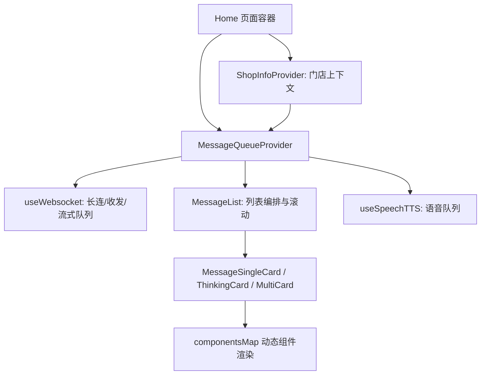

# Agent 开发

## 1. 总体架构



分层职责：

- 页面装配层：`src/pages/home/Home.tsx`
  - Provider 组装、页面生命周期、加载态与失败弹窗。
- 门店上下文层：`src/pages/home/hooks/useShopInfo.tsx`
  - 管理 `selectedShop` 并向会话与页面动作透传门店信息。
- 会话编排层（核心）：`src/pages/home/hooks/useMessageQueue.tsx`
  - 统一暴露 `sendMessage`、`messageList`、`canSendMessage`、`interruptOutputMessage` 等能力。
- 传输与流式层：`src/pages/home/hooks/useWebsocket.ts`
  - WebSocket 初始化、消息入队/出队、流式消费、撤回/中断过滤。
- 渲染层：`src/pages/home/message/*`
  - 按消息类型渲染欢迎卡、思考卡、单卡、多卡等。
- 组件协议层：`src/common/componentMap.ts`
  - 把后端下发的 `element.type` 映射到前端组件实现。

---

## 2. 核心数据建模

- `Message`：统一消息实体，兼容 user/assistant、ack/withdraw/thinking 等类型。
- `MessageContent`：卡片内容协议，核心是 `elements` 数组。
- `InitialMessage.roleEntryImMessages`：初始化协议的能力主载体，包含 welcome、everyOneAsk、askToMeList、allFuncMenu。
- `SelectedShop` / `shopComponent`：门店选择与门店展示协议。

三个关键标识：

- `frontTmpMsgId`：前端临时 ID（乐观更新，前端自动生成，后续收到后端返回后更新该ID的相关状态）。
- `queryId`：用户 query 的链路标识。
- `msgIdentifier`：助手消息标识（流式分包聚合、撤回、中断依赖此字段）。

---

## 3. 核心流程（生命周期）

### 3.1 会话初始化

1. `useWebsocket` 完成 `initClient` -> `startClient`。
2. 主动发送一条空消息建立会话。
3. 接收 `initial` 消息，拿到 `conversationId`、`version`、欢迎信息与门店组件配置。
4. `useMessageQueue` 生成欢迎卡、我可以做、向我提问等引导内容。

### 3.2 用户发送消息

1. `sendMessage` 先做本地乐观插入（`sendStatus: sending`）。
2. 发送 WebSocket 消息，包含意图、卡片状态、上下文参数等。
3. 收到 `ack` 后，用 `queryId`/`msgIdentifier` 回填临时消息。

### 3.3 助手消息接收与流式消费

1. WebSocket 消息先进入缓冲队列 `cunsumerBufferMessage`。
2. 出队策略：
   - 优先过滤已消费/已撤回/已中断/已流式结束消息。
   - 同 `msgIdentifier` 只保留 order 更新的一条。
3. 单消息消费：
   - 能流式则切片输出（`sequenceId` 递增，UI 连续刷新）。
   - 不能流式则一次性输出。
4. 消费完成后 `outputNextMessage` 进入下一条。

### 3.4 Thinking 与正文拼接

通过 `thinkingMessagesMapper` 把 “thinking 卡片 + 正文卡片” 视觉上拼成一组（圆角/边距联动），保证思考过程与最终答案在阅读上连贯。

### 3.5 中断、撤回、系统告警与超时

#### 3.5.1 用户手动中断（点击“停止回答”）

触发时机：输入区展示中断按钮（`showInterruptOutputView = !canSendMessage && !!version`）时，用户点击触发 `interruptOutputMessage`。

前端即时动作：

- 调用 `interruptWebsocketMessage(queryId)`，把当前 `queryId` 放入 `interruptMessageSet`。
- 停止当前 TTS 播报，并提示 “回答已中止”。
- 更新 `messageList`：
  - 同 `queryId` 的消息标记 `queryReplyStatus = 1`（本轮回复结束）；
  - 同 `msgIdentifier` 的消息标记 `messageState = TERMINATE`（终止态）。

后端同步：调用 `terminateMsgRequest(msgIdentifier)` 上报中止；即便上报失败，也不影响前端已进入终止态。

后续包处理：若后端又回了同 `queryId` 的包，消费层会在 `filterNoUsageMessage` / 流式消费阶段命中中断集合并跳过，不再继续渲染。

#### 3.5.2 撤回（withdraw）

- 前端不会主动发 `withdraw`；该事件由后端下发（`type = withdraw`）。
- 收到后按 `msgIdentifier` 标记对应消息 `withdraw: true`，并移除对应 TTS 任务。
- 当前列表实现对 withdraw 消息直接不展示（空视图）。

#### 3.5.3 系统告警（system_warn）

- 该事件也是后端下发（`type = system_warn`）。
- 前端会先尝试 ACK 回填（若带 `frontTmpMsgId`/`msgIdentifier`），再进入 `onRecieveMessage` 渲染链路。
- 具体什么业务条件触发 `system_warn` 由后端策略决定，前端只负责接收并展示。

#### 3.5.4 超时与本地错误兜底

- 发送失败：`sendWebsocketMessage` 失败时，用户消息置 `sendStatus = fail`，并提示网络错误。
- 接收超时：长时间处于 `loading`/`streaming` 会触发错误文案提示，避免用户无反馈等待。
- 长连初始化失败：`websocketLoadingStatus = fail` 时，页面弹出连接失败提示并允许用户关闭页面。

### 3.6 门店切换机制

触发入口：

- 导航栏门店选择器（`NavigationBar`）手动切换。
- `initial` 消息中的门店组件（`shopComponent.needSelectShop`）触发选择。
- 卡片动作 `change_page_shop` / `select_shop` 触发选择并回传表单状态。

状态收敛：页面门店 > 跳链门店 > 首页门店，最终合并为 `selectedShop`。

上下文透传：

- `useWebsocket` 在 `initClientInfo` 中把门店写入 `shopId`。
- 聊天记录请求使用 `shopIdList` 保证历史按门店隔离。

会话重建：

- `MessageQueueProvider` 以 `selectedShop.shopId` 为 key，门店变化时整棵会话树重挂载。
- `useWebsocket` 在门店变化后清空旧会话状态并重建长连，避免跨门店串会话。

### 3.7 引导问渲染机制（对应 `initial` 消息）

`initial` 消息不会被当普通回答卡片直接渲染，而是走“初始化编排逻辑”。

协议载荷（数据来源）：

- `roleEntryImMessages[*].askToMeList`：引导问问题池。
- `roleEntryImMessages[*].allFuncMenu`：分组功能菜单（用于“问点别的”弹窗）。
- `employeeRoleEntry`：当前员工身份信息（用于按角色取对应引导问）。
- 其余如 `version`、`initInputType`、`shopComponent` 会进入会话与页面能力控制。
- 示例中若 `roleEntryImMessages` 只有一个 `manager` 角色，则引导问直接取该角色的 `askToMeList` 与 `allFuncMenu`。

入站阶段（`useWebsocket`）：

- 解析 WebSocket 包后识别 `initial`。
- 首包落 `conversationId` / `version` / `enableFakeStream`。
- 将 `roleEntryImMessages` 存入状态，再回调 `onRecieveMessage` 进入编排层。

编排阶段（`useMessageQueue`）：

- `handleInitialMessage` 会生成三类“占位卡片消息”：
  - `welcome-image-card`
  - `i-can-do-card`
  - `ask-to-me-card`
- 注意：`ask-to-me-card` 本身不携带问题列表，真实数据来自上下文 `askToMeData`。
- `askToMeData` 由 `roleEntryImMessages` + 当前员工角色 计算得到，结构为 `{ askToMeList, allFuncMenu }`。

渲染阶段（消息组件）：

- `MessageList` 遇到 `ask-to-me-card` 时渲染 `MessageAskToMeCard`。
- `MessageAskToMeCard`：
  - 主区展示 `askToMeList` 前 3 条（支持前后切换）；
  - 点击问题后调用 `sendMessage({ action, message, specifyIntent... })` 发起真实提问；
  - 点击“问点别的”打开 `MenuModalInstance`，用 `allFuncMenu` 渲染分组能力面板。

工具栏回流（引导问离屏后）：

- 当 `ask-to-me-card` 离开可视区，`MessageList` 会调用 `onAskToMeVisibleChanged(false)`。
- `useMessageQueue` 把 `isToolbarShow` 置为 `true`。
- `HomeToolbar` 使用同一份 `askToMeData`，在输入框上方继续展示引导问与“更多功能”入口。

字段到 UI 的落地关系：

- `askToMeList[].message`：卡片与工具栏的主展示文案，同时也是发送给后端的 query。
- `askToMeList[].action`：点击后的行为类型（通常是 `message`）。
- `askToMeList[].funcOptionId`：点击/曝光埋点的 `option_id`。
- `allFuncMenu[].typeTitle / icon / funcList`：菜单弹窗中的分组标题、分组图标和条目。

补充：`permissionList`、`grayKey` 在当前前端链路中没有单独做显式过滤逻辑，按后端下发结果直接展示。

### 3.8 消息 type 与渲染对照

先区分两层 `type`：

- 协议层：`message.type`，决定消息如何被消费、是否需要直接展示。
- 展示层：`message.content.type`，决定最终渲染哪个消息组件。

协议层示例（`message.type`）：

- `initial`：否（会话初始化消息；用于落 `conversationId`/`version`，并触发欢迎区与引导问编排）
- `ack`：否（回填前端临时消息 ID）
- `withdraw`：否（原消息被隐藏，标记对应历史消息撤回）
- `link`：否（作为无 UI 消息处理，触发自动跳转）
- `blank`：否（作为无 UI 消息透传，不渲染卡片）
- `system_warn`：视内容而定（按普通消息进入渲染链路）
- 其他（如 `message`/`post`/`upload_image`/`select_shop`/...）：进入普通消息流，最终渲染由 `content.type` 决定。

展示层示例（`message.content.type`）：

- `welcome-card` → `MessageWelcomeCard`（兼容旧欢迎卡）
- `welcome-image-card` → `MessageWelcomeImageCard`（当前欢迎主卡）
- `i-can-do-card` → `MessageICanDoCard`（“我可以帮您做”能力卡）
- `ask-to-me-card` → `MessageAskToMeCard`（引导问卡）
- `card` → `MessageSingleCard`（通用单卡，内部按 `elements[].type` 动态渲染）
- `thinking` → `MessageThinkingCard`（思考过程卡）
- `multicard` → `MessageMultiCard`（继续问等多选卡）
- `image-card` → `MessageImageCard`（图片消息）
- `bottom-padding` / `bottom-padding-large` → 占位空白（用于列表滚动与底部留白）
- `blank` → 不渲染（空消息占位）

当 `content.type = card` 时，内部 `elements[].type` 的映射在 `src/common/componentMap.ts`：

- `plain_text` → `IMText`
- `markdown` → `IMMarkDown`
- `loading_markdown` → `IMMarkDownLoading`
- `image` → `IMImage`
- `table` → `IMTable`
- `button_group` → `IMButtonGroup`
- `html` → `IMHtml`

这层映射是“协议驱动渲染”的核心扩展点：新增 element type 通常只需新增组件并注册 map。

---

### 3.9 假流式消息实现（重写版，含示例）

一句话解释：

- 假流式 = 后端给整段内容，前端自己按步长切成多段，分多次渲染，模拟“字在往外吐”的效果。

它主要在 `useWebsocket` 的“单消息消费”阶段执行。

#### 3.9.1 什么时候会走假流式

必须同时满足两类条件：

1. 消息允许假流式（`messageCanFakeStream()`）：
   - 会话级：`initial.enableFakeStream`
   - 消息级：`message.enableFakeStream` 或 `message.content.enableFakeStream`
2. 消息里有可切片内容：
   - `reasoningContent`（思考文案）
   - 或 `elements` 中存在可切片组件（`plain_text` / `markdown` / `html` / `thinkings`）

#### 3.9.2 核心状态

- `currentStreamOffset`：当前切到第几个字符。
- `currentStreamElementFlag`：当前卡片每个 element 的流式进度（1/0/-1）。
- `sequenceId`：每次局部刷新 +1，保证“同一条消息的新版本”能覆盖旧版本。
- `uiShowStreaming`：当前是否处于流式展示态。
- `streamEndMessageSet`：某条 `msgIdentifier` 完整输出后打标，后续分包不再重复消费。

#### 3.9.3 示例（非真流式后端）

后端一次性返回完整内容，例如：

```json
{  
  "type": "message",
  "msgIdentifier": "m_123",
  "content": {
    "type": "card",
    "elements": [
      {
        "type": "markdown",
        "componentProps": { "text": "Agent回复" }
      }
    ]
  },
  "enableFakeStream": true
}
```

前端按 `fakeStreamOffset` / `fakeStreamTime`（默认 2 字符 / 50ms）循环输出，分帧展示，最后一帧写入完整内容并推进队列。

#### 3.9.4 真流式分包兼容

实现同时兼容真流式与假流式：真流式优先（依据 `transmissionType === 2` 与 `transmissionStatus === 2` 判断收口），但在最后一包之前仍可对当前已到达内容做切片展示。

#### 3.9.5 为什么不能只用真流式

理由：并非所有回答链路都能稳定给到 token 级真流式；业务卡片常为整卡协议，体验上需要假流式兜底。

---

### 3.10 为什么使用 WebSocket，而不是 SSE

#### 3.10.1 结论

选择 WebSocket（长连）是为满足 IM 会话编排的整体需求：双向实时、丰富事件、会话绑定、卡片事件等。

#### 3.10.2 工程事实

- 发送侧是持续双向动作：`websocket.sendMessage` 不只发送用户 query，还会携带卡片状态、事件参数、门店上下文。
- 接收侧是多事件分流：`onRecieveWebSocketMessage` 分别处理 `ack`/`withdraw`/`system_warn`/`initial`/其他消息。
- 消费侧有独立状态机：`cunsumerBufferMessage` -> `currentCunsumeMessage` -> `outputNextMessage`，保证顺序、去重与可中断。
- 同一回复可多包更新：通过 `msgIdentifier` + `order` + `transmissionStatus` 持续替换回复最新版本。

#### 3.10.3 WebSocket 与 SSE 对比（要点）

- WebSocket：双向、适合复杂事件与会话维持。
- SSE：单向、适合轻量文本流输出。

结论：若只需 LLM 文本流输出可选 SSE，但本项目需要更复杂的会话与事件能力，因此选 WebSocket。

---

### 3.11 通信流程对比：本项目（WebSocket） vs 传统 SSE Agent

（此处省略图示细节文字以保持文档可读性；实现中用序列图表示主要交互。）

关键特征：

- 长连全程保持，任何方向事件随时可以到达。
- 单次问答在协议层是多事件：`ack` → `thinking`（可选）→ `message`（多包）。
- 前端消费队列 `cunsumerBufferMessage` 承担乱序缓冲、去重与顺序保证。
- 中断/撤回可以在任意时刻由任意方发出，不依赖“当前请求”是否在进行。

---

### 3.12 TTS 语音播报实现

#### 3.12.1 入口与触发时机

TTS 主入口在 `useMessageQueue` 的 `onRecieveMessage`：

1. 每次收到新消息后，通过 `messageToTtsContent(messageItem)` 抽取可播报文本（标题、纯文本、markdown、table、button_group 等）。
2. 组装 `TTSParams`：
   - `id = msgIdentifier || messageId`
   - `content = speechContent.join(',')`
   - `streaming = messageItem.uiShowStreaming`
   - 声线参数来自当前员工角色（`employeeVoice` / `employeeAdvancedVoice` / `employeeAdvancedSpeed`）。
3. 调用 `speechTTSManeger.speechTTSPlayAsync(ttsParams)` 进入语音播放队列。

前置拦截条件：静音（`mute`）或页面未初始化自动提问时不播报。

#### 3.12.2 队列与增量播报机制（核心）

目标：UI 每帧都在刷新文本，但 TTS 只读“还没读过的新内容”，并尽量按完整短句读。核心状态：

- `queue`：等待播放的文本片段队列。
- `lastSpeechMessageId`：当前正在播放的消息 ID。
- `lastSpeechMessageContent`：当前正在播放的那一段文本。
- `ttsPlaying`：当前是否有音频在播。
- `stoppedItemSet`：被撤回/移除的消息 ID（黑名单）。

决策要点：

- 队列中已有同 id：覆盖队列中该条，保留最新未播增量。
- 队列中无同 id，但当前正在播放同 id：把相对于 `lastSpeechMessageContent` 的新增部分追加到队列末尾。
- 全新消息：直接入队作为新任务（流式与非流式略有差异）。

按标点裁切（`trimPunctuation()`）可优先读取完整短句，避免碎读。

#### 3.12.3 播放循环与回调

- `playLoop()` / `playLoopNativeTTS()` 从队列取一条并调用 Native TTS 播放。
- 通过回调（`start`/`end`/`stop`）驱动下一条播放，并发布 `speechTTSCurrentId` 供 `MessageList` 订阅显示播放态。

#### 3.12.4 停止、撤回、中断与清理

- 手动中断回答：`interruptOutputMessage` 会先 `speechTTSStop()`，立即停播。
- 消息撤回：收到 `withdraw` 后调用 `speechTTSRemoveTask(msgIdentifier)`，剔除待播/在播队列。
- 会话重建/页面卸载：调用 `speechTTSStop()` 清空队列。

#### 3.12.5 双 SDK 兼容策略

`useSpeechTTS` 会按端和版本选择实现：部分环境使用在线 `onlineTTS`，部分支持的环境使用端侧或融合 
`nativeTTS`。对外暴露统一接口 `SpeechTTSManager`（`playAsync`/`playSync`/`stop`/`removeTask`）。

#### 3.13 页面自动下滚

首先是一个UI组件MessageList，内部渲染了所有的对话。
通过一个hook来维护滚动功能，主要来判断是否可以进行滚动，何时进行滚动
hook作为messagelist的provider，向下传递ref，挂在messageList上，hook可以拿到messagelist的ref从而触发messagelist里的方法
当messagelist中收到新消息了之后，执行hook传下来的方法（修改滚动状态的方法），把hook中维持的允许滚动状态置为true，同时通过messageList的ref，触发自身的滚动事件

#### 3.13.1 如何判断页面不在底部

会在MessageList中在最后添加一个占位元素，当页面滚动时，判断占位元素是否在可视区，如果不在占位区，则弹出一个提示用户滚动到底部的按钮，点击后页面滚动到底部

---

## 4. 关键设计决策

1. 前端维护“消费队列”，而不是直接渲染网络包。理由：后端流式分包频繁且乱序风险高，队列机制让 UI 呈现稳定且可控。
2. 采用“假流式”能力兜底，即使后端非严格 token-stream，也可以渐进展示。
3. 乐观更新 + ACK 回填：发送即展示、ACK 对齐真实 ID。
4. 协议驱动渲染：通过 `componentsMap` 进行组件映射，新增卡片类型以协议+注册为主。
5. 以门店为会话边界：门店切换即重建会话，保证上下文隔离。

---

## 5. 可扩展点

1. 新增卡片类型：实现组件并注册到 `componentsMap`。
2. 新增交互动作：在卡片 `dispatch` 与 `sendMessage` 参数中扩展 action。
3. 门店策略扩展：支持门店权限、默认门店规则、门店维度实验策略。
4. 新埋点策略：复用 `trackModuleView` / `trackModuleClick` 在消息或 element 级扩展。
