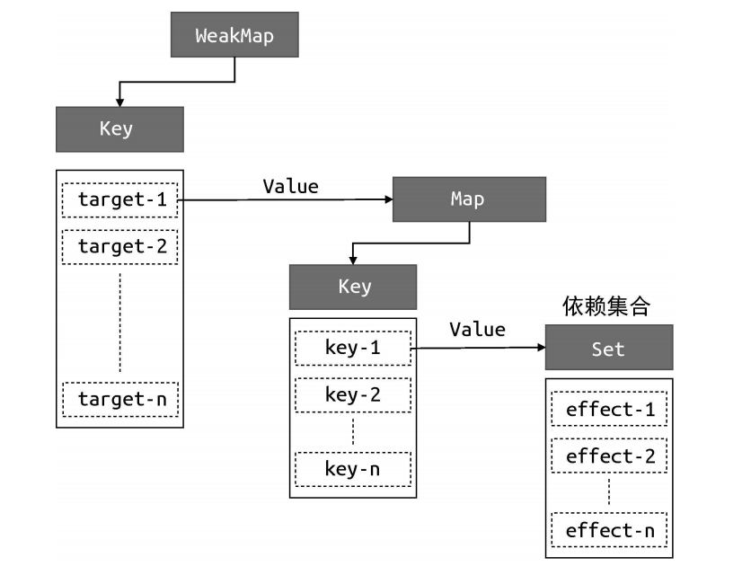

# Vue设计与实现<霍春阳>

## 命令式与声明式

命令式->关注过程（jquery）,需要手动编写过程
声明式->关注结果 (vue)，过程由框架实现，用户只关注结果

**声明式代码的性能不优于命令式代码的性能。** 声明式代码的更新性能消耗= 找出差异的性能消耗 +  直接修改的性能消耗。因此提出虚拟DOM来减少找出差异的性能消耗。

|          | 虚拟DOM                   | innerHTML                    |
| -------- | ------------------------- | ---------------------------- |
| 纯js运算 | 创建新的js对象 + Diff算法 | 渲染HTML字符串               |
| DOM运算  | DOM更新                   | 销毁所有旧DOM；新建所有新DOM |
| 性能因素 | 和更新的数据量有关        | 与模板的大小有关             |

## 框架设计

通过勾选"Console"中的"Enable custom formatters"来优化Vue的控制台输出。

Vue中的警告等内容，是通过判断当前环境是否为开发环境并显示的。

### Tree-Shaking

Tree-Shaking 依赖 ESM 的静态解构，所以模块必须是 ESM 。
除了没有被使用的函数，Tree-Shaking 会判断函数调用是否会产生副作用，如果会，则不会将该函数移除。可以通过注释代码/\*#\_\_PURE\_\_\*/，来告诉打包工具，该函数不会产生副作用，从而将其Tree-Shaking。
一般可以只在顶级调用中添加注释代码。函数中的调用往往要依赖外层函数的调用。

## 渲染器

渲染器的作用是，把虚拟 DOM 对象渲染为真实 DOM 元素。它的工作原理是，递归地遍历虚拟 DOM 对象，并调用原生 DOM API 来完成真实 DOM 的创建。渲染器的精髓在于后续的更新，它会通过 Diff算法找出变更点，并且只会更新需要更新的内容

```javascript
function renderer(vnode, container) {
    // 使用 vnode.tag 作为标签名称创建 DOM 元素
    const el = document.createElement(vnode.tag)

    // 遍历 vnode.props，将属性、事件添加到 DOM 元素
    for (const key in vnode.props) {
        if (/^on/.test(key)) {
            // 如果 key 以 on 开头，说明它是事件
            el.addEventListener(
                key.substr(2).toLowerCase(), // 事件名称 onClick ---> click
                vnode.props[key] // 事件处理函数
            )
        }
    }

    // 处理 children
    if (typeof vnode.children ==='string') {
        // 如果 children 是字符串，说明它是元素的文本子节点
        el.appendChild(document.createTextNode(vnode.children))
    } else if (Array.isArray(vnode.children)) {
        // 递归地调用 renderer 函数渲染子节点，使用当前元素 el 作为挂载点
        vnode.children.forEach(child => renderer(child, el))
    }

    // 将元素添加到挂载点下
    container.appendChild(el)
}
```

组件的本质就是通过一个函数返回虚拟DOM（一系列的原生标签），通过renderer函数判断vnode中的tag标签存储的是字符串还是函数来决定是渲染原生标签还是组件。

## 编译器

编译器和渲染器的联动，通过编译器找到template中会更改的元素，编译器生成虚拟DOM，交给渲染器渲染。

## 响应式设计

副作用函数(effectFn)：即对上下文产生影响的函数

Vue3 通过proxy实现响应式，通过一个桶(weakMap实现)来存储副作用函数。 Vue3会在读取对象属性的时候，将涉及的副作用函数存入桶，在设置对象属性的时候，执行对应桶中的所有副作用函数

```javascript
target1
└── text1
    └── effectFn1
target2
└── text2
    └── effectFn2
```



WeakMap可以实现当key中的对象不再被使用的时候，该对象会被垃圾回收机制回收。

```javascript
const obj = new Proxy(data, {
  // 拦截读取操作
  get(target, key) {
    // /*可封装成track
    // 没有 activeEffect 直接返回属性值（非响应式场景，比如单纯取值不依赖收集）
    if (!activeEffect) return target[key]
    // 根据 target 从“桶”中取得 depsMap，它是 Map 类型：key -> effects
    let depsMap = bucket.get(target)
    // 如果不存在 depsMap，新建 Map 并与 target 关联
    if (!depsMap) {
      bucket.set(target, (depsMap = new Map()))
    }
    // 再根据 key 从 depsMap 中取得 deps，它是 Set 类型，存与当前 key 关联的副作用函数
    let deps = depsMap.get(key)
    // 如果 deps 不存在，新建 Set 并与 key 关联
    if (!deps) {
      depsMap.set(key, (deps = new Set()))
    }
    // 将当前激活的副作用函数添加到“桶”里（建立依赖关系）
    deps.add(activeEffect)
    // */
    // 返回属性值
    return target[key]
  },
  // 拦截设置操作
  set(target, key, newVal) {
    // 设置属性值
    target[key] = newVal
    // /* 可封装成trigger
    // 根据 target 从桶中取得 depsMap（key -> effects 的映射）
    const depsMap = bucket.get(target)
    // 没有 depsMap 直接返回（理论上不会出现，因为 get 时已初始化，除非从未读直接写）
    if (!depsMap) return
    // 根据 key 取得所有关联的副作用函数 effects
    const effects = depsMap.get(key)
    // 执行副作用函数（触发更新）
    effects && effects.forEach(fn => fn())
    // */
  }
})
```

### 依赖清理

以上方式的实现，在条件分支中，可能会导致target中的key不再被访问，而副作用函数依旧被保留。所以可以在注册副作用函数的时候，创建一个数组，用于存储依赖集合。

在 track 函数中将当前执行的副作用函数activeEffect 添加到依赖集合 deps 中，这说明 deps 就是一个与当前副作用函数存在联系的依赖集合，于是也把它添加到
activeEffect.deps 数组中，这样就完成了对依赖集合的收集（其实就是将依赖集合和副作用函数互相绑定）。然后在每次副作用函数执行时，根据effectFn.deps 获取所有相关联的依赖集合，进而将副作用函数从依赖集合中移除。

### 嵌套effect

通过将activeEffect 设计成栈来完成嵌套effect的读取，每次只读取栈顶的effect函数

### 避免set和get的无限嵌套循环

在trigger时添加判断条件，如果trigger 触发执行的副作用函数与当前正在执行的副作用函数相同，则不触发执行

### 调度执行

vue支持在effect中传入调度器来手动控制函数的调度（如加入微、宏任务序列，延迟执行）。effect函数可以自动监控函数中所用到的变量，并响应式的修改数据。

watch同样支持传入调度器，来手动控制变量的更新时机

## computed

本质上就是在effect中传入用于计算的函数，同时通过调度器来延迟计算

实现关键：
- 通过配置调度器中的lazy，来手动确定函数执行的时机 
- 通过value和dirty(false为最新值)来实现缓存，副作用函数执行时，调度器自动执行，同时会将dirty置为true，这样下次访问数据的时候，就需要重新计算 
- 手动配置track和trigger，避免嵌套effect时丢失响应式 

```javascript
function computed(getter) {
  // 存储计算属性的最终值，初始未计算
  let value
  // 标记计算属性是否“脏值”，即是否需要重新计算
  // true 表示需要重新计算，false 表示值是最新的
  let dirty = true  

  // 创建一个副作用函数（effect），包裹用户传入的 getter
  // 配置 lazy: true，让副作用函数默认不立即执行，等待手动触发
  const effectFn = effect(getter, {
    lazy: true,
    // 调度器：当计算属性依赖的响应式数据变化时触发
    scheduler() {
      // 如果当前不是脏值，标记为脏值，这样下次访问计算属性时会重新计算
      if (!dirty) {
        dirty = true  
        // 手动触发响应式更新
        trigger(obj, 'value')  
      }
    }
  })

  // 创建一个包含计算属性逻辑的对象
  const obj = {
    // 计算属性的 getter 逻辑
    get value() {
      // 如果是脏值，需要重新计算
      if (dirty) {  
        // 执行副作用函数，得到最新值并缓存
        value = effectFn()  
        // 计算完成后，标记为非脏值，下次访问直接用缓存
        dirty = false  
      }
      // 手动重新收集依赖
      track(obj, 'value')  
      // 返回缓存的计算值
      return value  
    }
  }

  // 返回这个包含计算属性逻辑的对象，外部可直接使用
  return obj  
}
```

## watch 实现

实现关键:
- 如果传入了getter，则直接使用传入的getter触发响应式；如果传入了对象，需要手动追踪对象的所有属性
- 通过配置lazy来实现副作用函数的手动触发时机
- 初始化时通过oldVal存取旧值，每次执行副作用函数时获取新值newVal，通过传入的cb来处理oldVal和newVal，同时更新oldVal为newVal

```javascript
function watch(source, cb) {
  let getter;
  
  // 处理不同类型的 source：
  // 1. 如果是函数（如 () => state.count），直接作为 getter
  // 2. 如果是对象（如 state），使用 traverse 递归遍历触发所有属性的依赖收集
  if (typeof source === 'function') {
    getter = source;
  } else {
    getter = () => traverse(source);
  }

  // 存储新旧值，用于在回调中对比
  let oldValue, newValue;

  // 创建一个懒执行的 effect，手动控制副作用函数的执行时机
  // - lazy: true 表示不立即执行，而是返回 effectFn 供后续调用
  // - scheduler: 当依赖数据变化时触发，而非直接重新执行 effect
  const effectFn = effect(
    () => getter(), // 执行 getter 获取监听的值
    {
      lazy: true,
      scheduler() {
        // 当依赖变化时， scheduler 会被调用：
        // 1. 重新执行 effectFn 获取新值
        // 2. 调用用户传入的回调函数 cb(newValue, oldValue)
        // 3. 更新旧值为当前新值，为下一次变化做准备
        newValue = effectFn();
        cb(newValue, oldValue);
        oldValue = newValue;
      }
    }
  );

  // 手动执行一次 effectFn，获取初始值并赋值给 oldValue
  // 这一步相当于初始化监听，记录初始状态
  oldValue = effectFn();
}

// 辅助函数：递归遍历对象的所有属性，触发依赖收集
// （注：需结合响应式系统的 track 函数实现依赖收集）
function traverse(value, seen = new Set()) {
  // 处理原始值、null 或已遍历过的对象，避免循环引用
  if (typeof value !== 'object' || value === null || seen.has(value)) {
    return;
  }
  
  // 记录已遍历的对象，防止循环引用导致的死循环
  seen.add(value);
  
  // 递归遍历对象的所有属性（包括嵌套对象）
  for (const key in value) {
    traverse(value[key], seen);
  }
  
  return value;
}
```

其他选项实现：
- immediat: 其实就是将调度函数scheduler单独封装，然后在watch初始化的时候执行一次。
- flush['pre' | 'post' | 'sync']: 其实就是改变schedule的调用时机。如'post'，实际就是通过将执行时机调整到下一个微任务序列执行

watch中可以传入一个onCleanUp钩子，用来处理过期回调的问题（即先发请求A，再发请求B，结果请求B的结果先回来，请求A的结果后回来，拿到的并非最新的数据（B））。onCleanUp钩子触发时机是副作用函数下次重新执行前。

## vue中对数组对象方法的改写

因为数组对象上的方法如`push`、`pop`、`shift`、`unshift`、`slice`都会影响数组中的length属性(get和set)，导致反复执行，可能招致栈溢出。所有需要重写这些方法，在这些方法中添加一个变量shouldTrack，来影响track，如果shouldTrack为false的时候，应该禁止track追踪

```javascript
let shouldTrack = true
// 重写数组的 push、pop、shift、unshift 以及 splice 方法
;['push', 'pop','shift', 'unshift','splice'].forEach(method => {
  const originMethod = Array.prototype[method]
  arrayInstrumentations[method] = function(...args) {
    shouldTrack = false
    // 这里执行方法的时候，可能会影响length等属性，track方法会判断shouldTrack，如果为false，不会进行依赖收集
    let res = originMethod.apply(this, args)
    shouldTrack = true
    return res
  }
})
```

## ref

由于对原始值并不可以使用代理对象，所以需要将原始值处理成对象，然后通过reactive返回。可以在ref上对象定义一个属性用来标识该对象是通过ref定义的

```javascript
function ref(val) {
  const wrapper = {
    value: val
  }
  // 使用 Object.defineProperty 在 wrapper 对象上定义一个不可枚举的属性 __v_isRef，并且值为 true，用来区分ref(a)和reactive({value:a})的区别
  Object.defineProperty(wrapper, '__v_isRef', {
    value: true
  })

  return reactive(wrapper)
}
```

## 响应丢失

使用解构运算符操作响应式对象时，会丢失响应式，需要重新给他包上

使用toRef时，针对的还是原来的对象。如果再次使用ref包裹，会生成一个新的代理对象

```javascript
function toRef(obj, key) {
  const wrapper = {
    get value() {
      return obj[key]
    },
    // 允许设置值
    set value(val) {
      obj[key] = val
    }
  }

  Object.defineProperty(wrapper, '__v_isRef', {
    value: true
  })

  return wrapper
}
```

## 模板中自动脱ref

组件中的setup函数所返回的数据会传递给proxyRefs函数进行处理，这样在模板中就可以直接使用对象

```javascript
function proxyRefs(target) {
  return new Proxy(target, {
    get(target, key, receiver) {
      const value = Reflect.get(target, key, receiver)
      return value.__v_isRef ? value.value : value
    },
    set(target, key, newValue, receiver) {
      // 通过 target 读取真实值
      const value = target[key]
      // 如果值是 Ref，则设置其对应的 value 属性值
      if (value.__v_isRef) {
        value.value = newValue
        return true
      }
      return Reflect.set(target, key, newValue, receiver)
    }
  })
}
```

## 渲染器详解

渲染功能render只是渲染器的一部分

```javascript
function createRenderer() {
  // 渲染功能，将vnode挂载到container上，可以首次挂载、更新、卸载
  function render(vnode, container) {
    if (vnode) {
      // 新 vnode 存在，将其与旧 vnode 一起传递给 patch 函数，进行打补丁（更新）
      patch(container._vnode, vnode, container)
    } else {
      if (container._vnode) {
        // 旧 vnode 存在，且新 vnode 不存在，说明是卸载（unmount）操作
        // 只需要将 container 内的 DOM 清空即可
        container.innerHTML = ''
      }
    }
    // 把 vnode 存储到 container._vnode 下，即后续渲染中的旧 vnode
    container._vnode = vnode
  }

  return {
    render
  }
}
```

构建vnode时，可以传入props作为元素的属性。其中HTML Attributes 与 DOM Properties 之间存在映射关系，具体来说，HTML Attributes 的作用是设置与之
对应的 DOM Properties 的初始值。一旦值改变，那么 DOM Properties始终存储着当前值，而通过 getAttribute 函数得到的仍然是初始值。

patch的时候，如果新旧节点的类型不同，则先卸载旧节点，再挂载新节点。