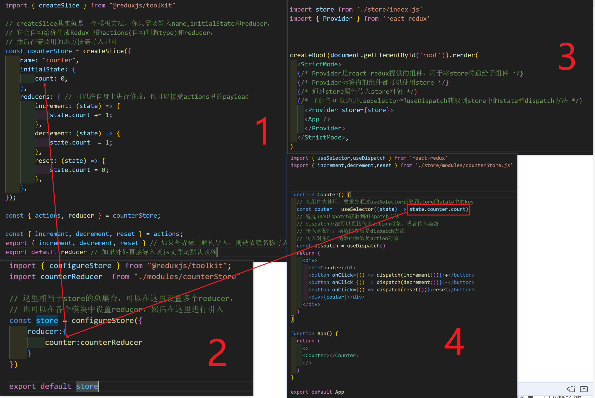

# React18

# JSX

## 响应表达式

通过 `{}` 识别表达式，类似vue中的双`{}`

## 列表渲染

对比vue中用v-for

```react
<ul>
    {list.map(item=><li key = {item.id}>{item.value}</li>)}
</ul?
```

## 条件渲染

```react
const flag = 0;
return (
  <>
    {flag == 1 && <div>flag=1时显示</div> }  {/*前面需要先判断一下，否则为0的时候会直接显示0，如果变量是true/false则无需判断*/}
    {flag ? <div>三元真时显示</div>:<div>三元假时显示</div>} {/*三元可以直接用隐式转换*/}
  </>
)

// 复杂逻辑渲染
const flag = 2; // 情况分别为0，1，2
function render() {
  if (flag == 0) {
    return <div>flag=0时显示</div>
  } else if (flag == 1) {
    return <div>flag=1时显示</div>
  } else {
    return <div>flag=2时显示</div>
  }
}
return (
  <>
    {render()}
  </>
)
```

## 事件绑定

```react
const pa = "haha"
function handleClick1() {
  console.log("click")
}
function handleClick2(e){
  console.log(e)
}
function handleClick3(e,param){
  console.log(e)
  console.log(param)
}
return (
  <>
    <button onClick={handleClick1}>按钮1</button>
    <button onClick={(e)=>handleClick2(e)}>按钮2</button>
    <button onClick={(e)=>handleClick3(e,pa)}>按钮3</button>
  </>
)
```

## 自定义组件

实现方法是定义一个名称首字母大写的函数，在函数内部返回HTML标签	

```react
const Button = () => {
  return (
    <button>按钮</button>
  )
}

return (
  <>
    <div className="App">
      <Button></Button>
    </div>
  </>
)
```

## 响应式变量

通过useState()实现，返回一个数组[具体的变量名，set方法]

set方法是异步的，并不会同步更新数据

```react
function Button({ count, onClick }) {
  return <button onClick={onClick}>按钮{count}</button>
}


function App() {
  const [count, setCount] = useState(0) // count是一个状态变量，setCount是一个函数，用于更新count的值
  return (
    <>
      <div className="App">
        <Button count={count} onClick={() => setCount(count + 1)} />      </div>
    </>
  )
}

// 响应式对象的实现，不能直接更改对象的属性，需要调用对应的修改方法，在方法中解构对象，再添加需要修改的内容
const [obj, setobj] = useState(
  {
    name: '小明',
    age: 18,
  }
)
const fun = () => {
  setobj({
    ...obj,
    age: obj.age + 1
  })
}
return (
  <>
    <div className="App">
      <div>
        {obj.name}+{obj.age}
      </div>   
      <button onClick={fun}>点击</button>
    </div>
  </>
)
```

如果组件不是通过函数返回实现的，而是通过class实现的，则需要通过this.setState方法更新，此时setState非全量更新，而是局部更新(和老的state进行合并,合并第一层的属性)

## 样式引入

```react
// 1.行内样式
function App() {
  const style = {
    color: 'red',
    fontSize: '30px'
  }
  return (
    <>
      <div className="App">
        <div style={style}>test</div>
      </div>
    </>
  )
}

// 2.外部引入
// style.css
.foo{
    background-color: red;
    font-size: 30px;
}
// app
import './test.css'
function App() {
  return (
    <>
      <div className="App">
        <div className='foo'>test</div> {/*通过css文件引入的样式，使用className对应文件中的类名*/}
      </div>
    </>
  )
}
// 动态绑定类名,可以使用模板字符串，或下载classNames包
<div className = {`static-class ${active === isActive && 'active-class'}`}></div>
```

## 表单的双向绑定

类似vue中的v-model

```react
const [value, setValue] = useState('')
return (
  <>
    <div className="App">
      <input
        type="text"
        value={value} /* 获取数据 */
        onChange={(e) => setValue(e.target.value)} /* 修改数据 */
      ></input>
      <div>result:{value}</div>
    </div>
  </>
)
```

## 获取dom

和vue中获取dom对象一样

```react
function App() {
  const inputRef = useRef(null) // 先绑定一个空的ref
  const showDom = () => {
    console.log(inputRef.current) // 通过current属性获取DOM元素
  }
  return (
    <>
      <input type="text" ref={inputRef}> {/* 绑定ref */}
      </input>
      <button onClick={showDom}>Show DOM</button>
    </>
  )
}
```

## forwardRef 与 useImperativeHandle

用于在函数组件中向父组件暴露内部 DOM 或自定义实例方法，常与 `forwardRef` 配合使用(react19以前，react19以后可以直接传入ref而不使用forwardRef)。

简单示例（`forwardRef` 转发 ref 到子组件的 DOM）：

```react
// 子组件通过 forwardRef 转发 ref 到内部 DOM
const Child = forwardRef((props, ref) => {
  return <input ref={ref} placeholder="child input" />
})

function Parent() {
  const inputRef = useRef(null)
  const focus = () => inputRef.current && inputRef.current.focus()
  return (
    <>
      <Child ref={inputRef} />
      <button onClick={focus}>聚焦子输入框</button>
    </>
  )
}
```

配合 `useImperativeHandle` 自定义暴露给父组件的接口（只导出需要的方法，保持封装）：

```react
// 子组件自定义暴露的实例方法
const Child = forwardRef((props, ref) => {
  const inputRef = useRef(null)
  useImperativeHandle(ref, () => ({
    focus: () => inputRef.current && inputRef.current.focus(),
    clear: () => { if (inputRef.current) inputRef.current.value = '' }
  }), [])
  return <input ref={inputRef} />
})

function Parent() {
  const childRef = useRef(null)
  return (
    <>
      <Child ref={childRef} />
      <button onClick={() => childRef.current?.focus()}>调用子 focus()</button>
      <button onClick={() => childRef.current?.clear()}>调用子 clear()</button>
    </>
  )
}
```

注意：
- `forwardRef` 用于将父组件的 `ref` 传递给函数组件；
- `useImperativeHandle` 应只暴露必要方法，避免破坏组件封装；
- 第三个参数（依赖数组）控制返回值重建时机。


## 组件间通信

父子通信，类似vue中的props

```react
function Son(props) {
  return (
    <div>
      <span>子组件</span>
      <div>{props.content}</div> {/* props是一个对象，里面存储所有父组件传入的键值对，子组件只能读取无法修改 */}
    </div>
  )
}
// App相当于父组件
function App() {
  return (
    <>
      <Son content="父组件传入"> {/* 传入子组件 */}
    </Son>
    </>
  )
}

// 可以在子组件标签中传入标签或数据，子组件都可以通过props.children获得
<Son content="父组件传入"> 
{data}
<span>父组件传入的值</span>
</Son>
```

子传父，通过父组件传入方法，调用后返回

```react
function Son(props) {
  const {func} = props // 解构出函数
  func("子组件传递过来的数据")  // 调用函数传值
  return (
    <div>子组件</div>
  )
}
// App相当于父组件
function App() {
  const [data, setData] = useState('')
  const getData = (msg)=> {
    setData(msg)
  }
  return (
    <>
    <Son func={getData}> {/* 传递函数 */}
    </Son>
    <div>输出:{data}</div> 
    </>
  )
}
```

兄弟组件通信，通过父组件传递信息(状态提升)

```react
function SonA(props) {
  const data = "AtoB" // A组件要传递给B组件的数据
  const {func} = props // 解构出函数
  func(data)  // 调用函数传值
  return (
    <div>子组件A</div>
  )
}

function SonB(props) {
  return (
    <>
    <div>子组件B</div>
    <div>子组件B接收到的数据:{props.data}</div>
    </>
  )
}

function App() {
  const [data, setData] = useState('')
  const getData = (msg)=> {
    setData(msg)
  }
  return (
    <>
    <SonA func={getData}/>  {/* 传递函数给子组件A,用于接受A传递给B的数据 */}
    <SonB data={data}/>  {/* 传递数据给子组件B */}
    </>
  )
}
```

祖孙组件之间的通信，类似vue中的provide/inject

```react
const DataContext = createContext(null) // 在全局创建一个上下文对象

function A(props) {
  return (
    <>
    <B></B>
    </>
  )
}

function B(){
  const data = useContext(DataContext) // 使用上下文数据,使用data可以接收到数据
  return (
  <div>这里是B组件，获取到的上下文数据是：{data}</div>
  )
}
function App() {
  const [data, setData] = useState('父组件数据') // 定义一个状态变量data
  return (
    <>
    <input value={data} onInput={(e)=>setData(e.target.value)}></input>
    <DataContext.Provider value={data}> {/* 使用value提供上下文数据 */}
    <A></A>  {/* 这里的所有组件都可以通过DataContext获取到父组件的data数据 */}
    </DataContext.Provider>
    </>
  )
}
```

## useEffect

一般用于渲染完成或依赖数据更新之后所进行的操作

useEffect(执行的函数，依赖项)

依赖项有三种情况:

- 为空。useEffect中的函数会在组件渲染完成后执行一次，当组件中的响应式数据发生变更后再执行一次
- 为空数组[]。useEffect中的函数会在组件渲染完成后执行一次
- 为[**name**]。useEffect中的函数会在组件渲染完成后执行一次，当**name**变更后再执行一次（name为定义的响应式变量）

```react
const url = "http://geek.itheima.net/v1_0/channels"

function App() {
  const [list, setList] = useState([]) // 定义一个状态变量data
  useEffect(() => {
    async function getList(url) {  // 异步函数需要写在useEffect内部，否则会报错（无法使用第一个参数直接调用函数，因为异步函数的返回值是Promise）
      const res = await fetch(url)
      const data = await res.json()  // fetch返回的是一个Stream流，需要序列化
      return data
    }
    getList(url).then(data => {
      const res = data.data.channels
      setList(res)
    })
  }
  , [])
  return (
    <>
    <ul>
      {list && list.map((item) => {
        return (
          <li key={item.id}>
            <h3>{item.name}</h3>
          </li>
        )
      })}
    </ul>
    </>
  )
}
```

在useEffect中编写函数，一般被称作副作用函数，对于异步函数而言，如果没有清除副作用函数则会继续执行，所以需要编写清理函数，如清空定时器，取消网络请求等

```react
// 如何清除副作用函数：在首个函数参数内，加入return ()=>{清除逻辑}
useEffect(()=>{
    const timer = setInterval(()=>{
        console.log("--执行中--")
    },1000)
    return ()=>{clearInterval(timer)}
})
```

## useLayoutEffect

与useEffect类似，区别在于useLayoutEffect会在DOM更新完成后立即执行（会阻塞浏览器绘制），而useEffect会在DOM更新完成后延迟执行（等浏览器空闲时）。因此，如果需要在DOM更新后立即读取布局信息或同步执行副作用，应该使用useLayoutEffect。

渲染 → DOM更新 → useLayoutEffect → 浏览器绘制 → useEffect

如果需要在使用useEffect的时候，更新了组件的状态，可能会重新渲染组件，导致页面闪烁，这时可以使用useLayoutEffect来避免这种情况，因为它会在DOM更新后立即执行，可以同步更新状态，避免不必要的重新渲染。


## 自定义Hook

用来将可复用的代码包装起来

封装自定义hook的通用思路

1. 声明一个名称以use开头的函数
2. 在函数内部封装可以复用的逻辑
3. 将组件中用到的状态和函数return出去
4. 在哪个组件中需要用到封装的逻辑，就通过解构，将状态和函数获得并使用

hook(use*)的使用规则：

- 只能在组件中或其他自定义Hook函数中使用
- 只能在组件的顶层进行调用，无法嵌套在if、for、内部函数中

```react
// 示例
function useToggle(){
  const [value, setValue] = useState(true)
  const toggle = () => {
    setValue(!value)
  }
  return { value, toggle } // 将状态和函数返回
}

function App() {
  const { value, toggle } = useToggle() // 解构对象
  return (
    <>
      <div>
        {value && <h1>hello</h1>}
        <button onClick={toggle}>Toggle</button>
      </div>
    </>
  )
}
```

## useMemo

计算属性，用于缓存结果，当依赖项发生变化时才会重新计算，否则会直接返回之前缓存的结果，避免不必要的计算，提高性能。

```
// 第一个参数是计算函数，需要返回计算后的值；第二个参数则是依赖项，即当依赖项变更后再重新计算
useMemo(func, dependencies)
```

## \<\>和\<Fragment\>的区别
\<\>是\<Fragment\>的语法糖，区别在于可以在\<Fragment\>上添加key


## memo组件

一般情况下，父组件的重新渲染会导致子组件的重新渲染，即使子组件的props没有发生变化，这时可以使用memo组件来优化性能，memo组件会对比前后props的变化（浅比较），如果没有变化则不会重新渲染子组件。

基本用法：`const MemoizedComponent = memo(SomeComponent, arePropsEqual?)`,其中`someComponent`是要包装的组件，`arePropsEqual`是一个可选的函数，用于自定义比较逻辑，默认情况下，memo会进行浅比较(Object.is)。

自定义比较逻辑：
`memo` 接受第二个参数 `arePropsEqual(prevProps, nextProps)`。
- 返回 `true`：不重新渲染（props 相等）
- 返回 `false`：重新渲染（props 不相等）
- 注意：这与 `shouldComponentUpdate` 的返回值逻辑相反。

```javascript
const MyComponent = memo(Chart, (prevProps, nextProps) => {
  // 可以在这里实现深比较，或者只比较特定的某些 props
  return prevProps.data.id === nextProps.data.id;
});
```

两种用法：
```js
// 1. 使用React.memo
import React from 'react'
const memoComp = React.memo(({ value }) => {
  return <div>{value}</div>
})
// 2. 使用memo函数
import { memo } from 'react'
const memoComp = memo(({ value }) => {
  return <div>{value}</div>
})
```

什么场景下使用memo组件：
- 父组件频繁更新，但子组件的props不经常变化
- 子组件的渲染比较复杂，性能开销较大
- 子组件的props是基本类型
- 子组件的props是对象类型，但父组件每次更新时都会传入同一个对象（即引用地址不变）
- 一般来说，渲染item的组件推荐使用memo

什么情况下不适合使用memo组件：
- 父组件更新不频繁，或者子组件的渲染开销较小（比较的开销可能大于渲染开销）
- 子组件的props几乎总是变化（例如父组件传入了未经过 `useCallback` 或 `useMemo` 优化的引用类型数据）

## useCallback

`useCallback` 用于缓存函数，返回一个 memoized 版本的回调函数，该函数仅在依赖项发生变化时才会更新。它的作用是避免在组件重新渲染时创建新的函数实例，从而优化性能。

使用场景：
- 子组件使用 `React.memo` 包裹，并且父组件传递了一个函数作为 props。使用 `useCallback` 可以确保在父组件重新渲染时，传递给子组件的函数引用保持不变，从而避免子组件不必要的重新渲染。
- 函数作为依赖项传入 `useEffect`、`useMemo` 或其他 `useCallback` 时，使用 `useCallback` 可以确保依赖项的稳定性，避免因函数引用变化而导致的副作用重新执行。


# Redux

```javascript
// 1. 定义 reducer 函数 
// 根据不同的 action 对象，返回不同的 state
// state 管理数据的初始状态
// action 对象的 type 属性标记需要做的修改操作
const state = { count: 0 }

function reducer (state, action) {
  switch (action.type) {
    case 'INCREMENT':
      // 必须返回一个新的对象，Redux不允许在原有state上进行修改，Redux会绑定到新对象上去
      return { count: state.count + 1 }
    case 'DECREMENT':
      return { count: state.count - 1 }
    default:
      return state
  }
}
// 2. 使用reducer函数生成store实例,整个应用一般就一个store实例
const store = Redux.createStore(reducer)

// 3. 通过 store 实例的 subscribe 订阅数据变化
// 回调函数在每一次 state 发生变化时自动执行
store.subscribe(() => {
  console.log(store.getState()) // 会返回当前的store对象
  document.getElementById('count').innerText = store.getState().count

})
// 4. 通过 store 的 dispatch 函数提交 action 的更改状态
const inBtn = document.getElementById('increment')
inBtn.addEventListener('click', () => {
  // 匹配的是 action 对象，所以传入 action 对象
  store.dispatch({
    type: 'INCREMENT' //一般必须要有type属性，也可以传递其他信息
  })
})
// 减
const dBtn = document.getElementById('decrement')
dBtn.addEventListener('click', () => {
  store.dispatch({
    type: 'DECREMENT'
  })
})
```

## React-redux

首先需要安装@reduxjs/toolkit和redux

操作逻辑如下

注:actions.payload就是图四调用中传入的参数



由于Redux自身只支持同步actions的操作，如果想使用异步actions，就必须要引入redux-thunk，这是一个中间件，用于拦截actions->state，可以在内部添加复杂逻辑。

原先流程是使用时直接使用dispatch传入名称和参数，现在相当于使用一个异步函数包上这个流程，然后直接dispatch这个函数。redux-thunk会检测到返回的是函数，并自动执行它，传入 `dispatch` 和 `getState`两个函数。如果传递的是普通对象，redux-thunk不会进行额外操作。

写法如下

```react
// 这是一个异步的actions
const fetchFoodList = () => {
	// 返回一个异步的函数
    return async(dispatch) => {
        const response = await axios.get("http://localhost:3004/takeaway")
        // console.log(response.data)
        dispatch(setFoodList(response.data))
    }
}

// 通过调用该函数实现actions操作
export {fetchFoodList}

// 外界调用dispatch(fetchFoodList()),redux-thunk会检测dispatch的参数，发现是函数，于是自动执行它，传入 dispatch 和 getState
```

# React-router

相关包名为react-router-dom

## 路由模块声明

```react
// 引入包
import {createBrowserRouter,RouterProvider} from 'react-router-dom'

// 创建路由
const router = createBrowserRouter([
  {
    path: "/",
    element: <App />,
  },
  {path: "/about",
    element: <div>About</div>,
  }
])

createRoot(document.getElementById('root')).render(
  <StrictMode>
    {/*传递路由*/}
    <RouterProvider router={router} />
  </StrictMode>,
)
```

## 路由导航

```react
import { Link,useNavigate } from "react-router-dom"

const About = () => {
    const navigate = useNavigate() 
    return (
        <div>
        <h1>About</h1>
        <p>This is the about page.</p>
        {/*声明式导航,使用自带的Link标签，react会解析成a标签*/}
        <Link to="/contact">联系我们</Link>

        {/*编程式导航，使用useNavigate钩子*/}
        <button onClick={() => navigate("/contact")}>
            联系我们
        </button>
        </div>
    )
}

export default About
```

## 路由传参

```react
{/*searchParams传参,通过在?后拼接kv，使用&区分*/}
<button onClick={() => navigate("/contact?id=1&name=john")}>
searchParams传参
</button>

{/*使用useSearchParams钩子接受参数*/}
const [params] = useSearchParams() // 返回的是数组，先解构
const name = params.get('name') // 通过get方法
```

```react
{/*Params传参*/}
<button onClick={() => navigate("/contact/1/john")}>
Params传参
</button>

// 需要在路由处配置
const router = createBrowserRouter([
  {
    path: "/contact/:id/:name", // 配置接受的参数
    element: <Contact/>,
  }
])

{/*使用useParams钩子接受参数*/}
const params = useParams() // 返回的是对象
const name = params.name   // 直接访问对象属性即可
```

## 嵌套路由

通过在路由中配置Children实现子路由，然后再在主路由中配置<Outlet/>,该标签会将对应的路由组件渲染到该标签内

````react
// 创建路由
const router = createBrowserRouter([
  {
    path: "/",
    element: <App></App>,
    children: [
      {
        path: "/about",
        element: <About></About>,
      },
      {
        path: "/contact",
        element: <Contact></Contact>,
      },
    ],
  },
]);

// <Outlet>
<Link to="/about">关于我们</Link>
<Link to="/contact">联系我们</Link>
<Outlet></Outlet> //会根据点击跳转的路由，渲染对应的组件
```

子路由如果需要直接渲染（而不是通过路由跳转），需要把path去掉，换成index:true。这样的话路由会直接渲染到<Outlet>中

## 404路由

```react
const router = createBrowserRouter([
  {
  ...
  },
  { 
  ...
  },
  ...
  // 末尾添加
  {
  	path:'*', //找不到路由信息的会走该路由
  	element:<NotFound />
  }
]);
```

## 路由模式

`createBrowserRouter` 对应的是history模式

`createHashRouter` 对应的是hash模式

