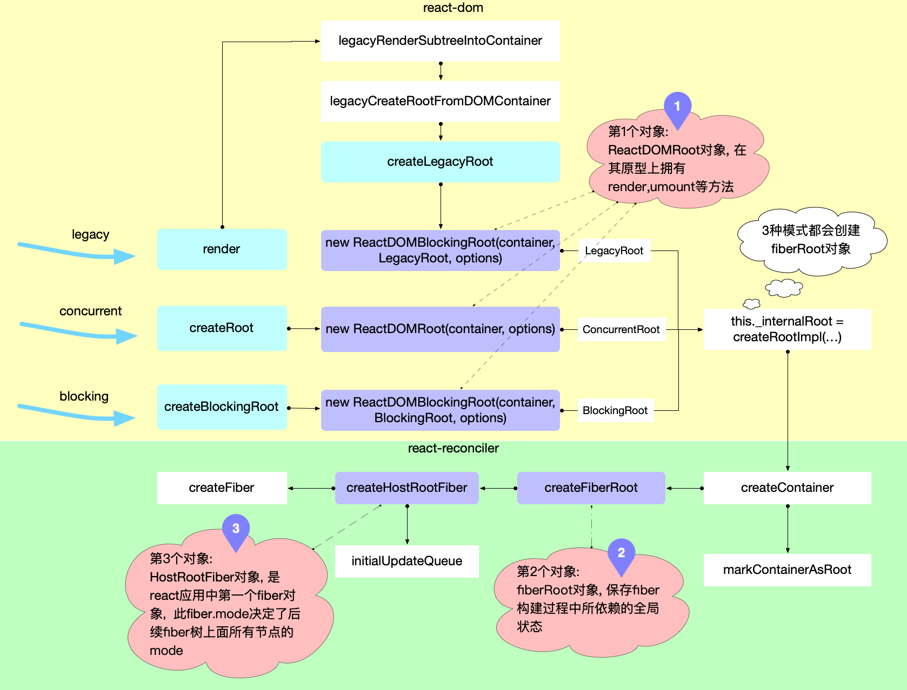
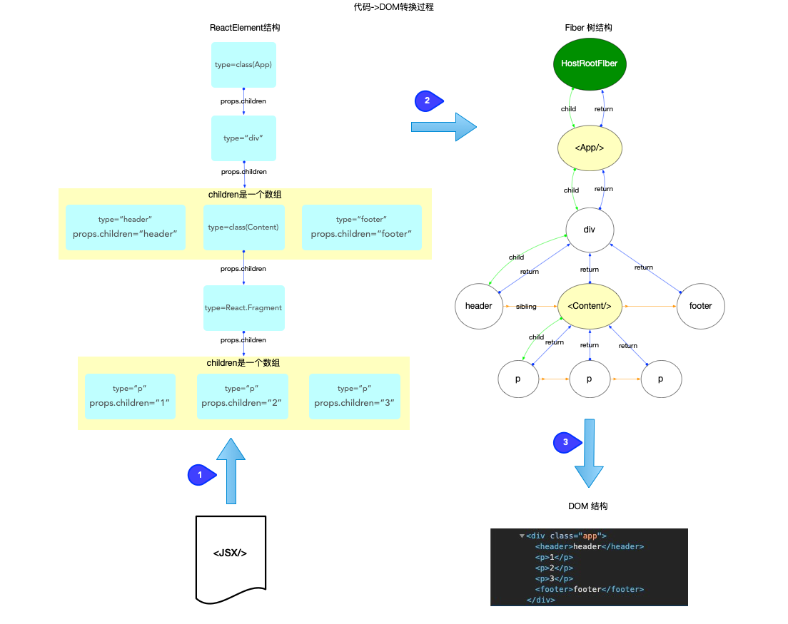
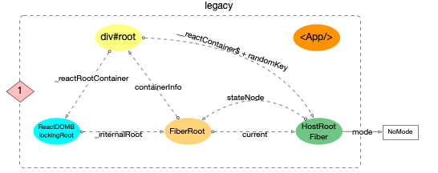
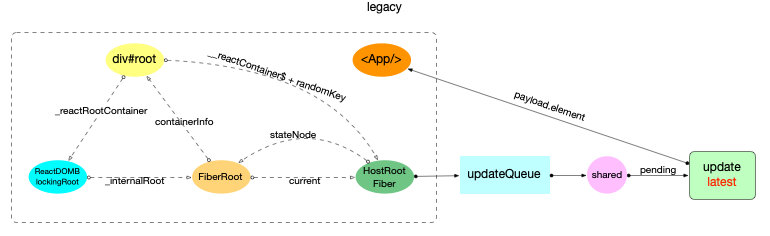
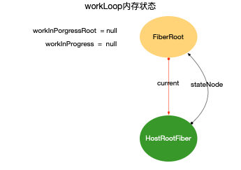
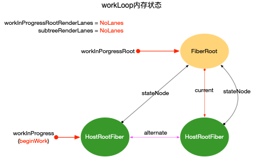

# react原理

图片和内容部分来自 https://aojiaodemeng.github.io/react-illustration-series/

## 核心包关系图分析


下面为基于文档中 `react-core.png` 的详尽说明，按职责分层并补充示例调用序列，便于把抽象流程对应到源码实现。

一、总体分工（一句话概括）
- `react-reconciler`：负责构建/调和 Fiber 树（计算差异、收集副作用）。
- `scheduler`：负责按优先级/时间切片调度调和工作，决定何时运行 reconciler 的 `workLoop`。
- `react-dom`：负责提交阶段（把 reconciler 的副作用应用到浏览器 DOM）以及宿主环境的配置（`ReactDOMHostConfig`）。

二、关键模块与职责（深入）
- `react-reconciler`（调和细节）
	- `workLoop`：驱动调和的循环体，按照是否并发（concurrent）选择不同入口：`renderRootConcurrent` 或 `renderRootSync`。
	- `performUnitOfWork(fiber)`：每次处理单个 Fiber 节点，职责分成两部分：
		- `beginWork(fiber)`：计算该 fiber 的下一个状态，处理 `updateQueue`（合并 setState/update），并调用子节点的 reconciliation（例如 `reconcileChildren`）以生成/复用子 fiber；此阶段可能发生 bailout（当 props/state 未变时跳过子树）。
		- `completeWork(fiber)`：完成当前节点，生成 DOM 节点（host component）或收集副作用（例如需要插入/删除/更新的标记），并把这些副作用通过 fiber 链接到父节点（维护 `firstEffect`/`lastEffect`/`nextEffect`）。
	- effect（副作用）收集：调和阶段不会直接操作 DOM，而是把需要在提交阶段执行的操作记录在 effect list 上，最终由 `commitRoot` 统一执行。

- `react-dom`（提交阶段的三部分）
	- Before Mutation（变更前）阶段：触发 `getSnapshotBeforeUpdate` 等需要在 DOM 更新前读取布局信息的生命周期/Hook。
	- Mutation（变更）阶段：执行实际的 DOM 操作（插入、删除、更新属性）。
	- Layout（布局）阶段：同步调用 `useLayoutEffect` 的回调与 ref 的更新，这些在变更应用后立即运行。

- `scheduler`（调度与时间切片）
	- 核心是提供 `unstable_scheduleCallback`、`unstable_cancelCallback`、`requestHostCallback` 等接口，决定何时调用传入的回调。
	- 常见宿主实现采用 `MessageChannel` 驱动微任务轮询；时间切片由 `shouldYield()` 与 `frameDeadline` 控制（即长任务中断并在下一帧继续）。
	- Scheduler 按“优先级 lane”或“优先级等级”（Immediate、UserBlocking、Normal、Low、Idle）来排序任务，React 的 `ensureRootIsScheduled` 会把更新映射到合适的优先级并选择 `scheduleSyncCallback`（同步）或 `scheduleCallback`（异步）进行注册。

三、典型调用序列（带示例，便于对照源码）
下面以一个并发模式下组件调用 `setState` 为例，给出从触发到 DOM 更新的关键步骤（数字可与图上箭头对应）：

1. 组件调用 `setState`：向当前 fiber 的 `updateQueue` 推入更新对象。
2. React 触发 `updateContainer` / `scheduleUpdateOnFiber`：找到根 fiber 并调用 `ensureRootIsScheduled(root, currentEventPriority)`。
3. `ensureRootIsScheduled`：根据更新的 lane/优先级选择调度函数：若为同步优先级调用 `scheduleSyncCallback`，否则调用 `scheduleCallback`（并传入合适的优先级）。
4. Scheduler 层：通过 `requestHostCallback` 把任务注册到宿主（例如 `MessageChannel`），等待宿主唤醒并在合适时间调用回调。
5. 宿主执行回调到 Scheduler 的 `workLoop`：Scheduler 检查任务优先级并在当前帧内调用 React 提供的回调（即 reconciler 的 `performConcurrentWorkOnRoot`）。
6. `performConcurrentWorkOnRoot` 调用 reconciler 的 `workLoop`：开始 `performUnitOfWork` 的循环，`beginWork` 创建/更新子 fiber，`completeWork` 收集 effect。
7. 当调和完成（或中途被时间切片暂停）并存在副作用时，reconciler 调用 `commitRoot` 进入提交阶段。
8. `commitRoot` 按顺序执行 Before Mutation → Mutation → Layout 阶段，最终 DOM 更新完成，`useLayoutEffect` 回调执行，refs 被同步更新。

## 启动过程



区分legacy（react 17 及更早）和concurrent（react 18+）入口的示例：


```jsx
import React from 'react'
import ReactDOM from 'react-dom'
import App from './App'

// 同步渲染（React 17 及更早常用）
ReactDOM.render(<App />, document.getElementById('root'))
```


```jsx
import React from 'react'
import { createRoot } from 'react-dom/client'
import App from './App'

// 并发根（React 18+ 推荐）
const root = createRoot(document.getElementById('root'))
root.render(<App />)
```

- `ReactDOMRoot / ReactDOMBlockingRoot / LegacyRoot`（第一个对象：外部根对象）
	- 由 `createRoot` / `createBlockingRoot` / 旧的 `render` 路径构建，`createRoot`和`createBlockingRoot`会返回这个外部根对象，但旧的 `render` 路径不会返回外部根对象。它们是对外的宿主根对象，包含对内部根（通常存放在 `this._internalRoot`，会调用`createRootImpl`返回函数结果）的引用，并对外暴露 `render`/`unmount` 等方法。

- `fiberRoot`（react内部根状态对象，图中第二个对象）
	- 由 `createContainer` → `createFiberRoot` 创建，是调和器维护的根级别全局状态（比如 `current` 指向根 fiber、callback 列表、pending updates、containerInfo 等）。
	- `markContainerAsRoot` 会把宿主（DOM）容器标记为根并把它与 `fiberRoot` 关联。关联顺序外部根对象 → `fiberRoot` → DOM容器

- `hostRootFiber`（HostRoot 类型的第一个 Fiber，图中第三个对象）
	- `createHostRootFiber` 返回的第一个 Fiber 实例，`fiberRoot.current` 指向它。它的 `mode` 位决定了后续树上节点的工作模式（如并发/阻塞/同步相关的 flags）。
	- 此 Fiber 上会初始化 `updateQueue`（图中 `initialUpdateQueue`），用于保存挂起的根级更新（例如 hydration 或初次 mount 的更新）。

主要调用序列（简化）：

1. 调用 `createRoot(container)` / `createBlockingRoot` / `legacy render`。
2. 在 `createRootImpl`/`createContainer` 内部，会调用 `markContainerAsRoot(container)`，然后调用 `createFiberRoot(containerInfo, ...)` 创建 `fiberRoot`。
3. `createFiberRoot` 调用 `createHostRootFiber(mode)` 生成根 Fiber，并在 root 上建立 `initialUpdateQueue`、把 `fiberRoot.current` 指向该 hostRootFiber。
4. `ReactDOMRoot`（或其变体）将 `fiberRoot` 保存为内部引用（例如 `this._internalRoot = createRootImpl(...)`），对外提供 `render` 调度入口；后续的更新走 `scheduleUpdateOnFiber` → reconciler 的调度路径。

关键说明：

- 启用方式：并发能力是按“根”启用的——使用 `createRoot` 创建的根会走并发/可中断的调度路径；使用 `ReactDOM.render` 的根则是同步老路径。
- 调度差异：并发根会把渲染拆成可中断的工作（时间切片），使用更细粒度的优先级调度（lane）；老根是同步，一次性完成调和与提交。
- react 中最广为人知的可中断渲染(`render` 可以中断, 部分生命周期函数有可能执行多次,`UNSAFE_componentWillMount`,`UNSAFE_componentWillReceiveProps`)只有在`HostRootFiber.mode === ConcurrentRoot | BlockingRoot`才会开启. 如果使用的是`legacy`, 即通过`ReactDOM.render(<App/>, dom)`这种方式启动时`HostRootFiber.mode = NoMode`, 这种情况下无论是首次 `render` 还是后续 `update` 都只会进入同步工作循环, `reconciliation`没有机会中断, 所以生命周期函数只会调用一次.
- 副作用可观察性：在并发模式下某些副作用触发时机会和旧模式不同；开发模式的 `StrictMode` 还会额外双调用组件 mount/unmount 来帮助发现不安全的副作用。
- 新 API：并发根支持 `startTransition`/`useTransition`、更广泛的自动批处理与改进的 `Suspense` 行为，便于构建响应性更好的界面。

## 优先级管理

实现的功能：
- 可中断渲染：允许调和过程被打断，以便在高优先级任务（如用户交互）到来时能及时响应。
- 时间切片：将长时间运行的任务分割成多个小块，在每个块之间检查是否需要让出控制权，以保持界面响应。
- 异步渲染：支持在未来某个时间点完成渲染，而不是必须立即完成。

内部存在的优先级类型：
- fiber优先级（lane）：React 内部使用 lane 来表示更新的优先级，常见的有 Immediate、UserBlocking、Normal、Low、Idle 等等级。每个更新会被分配一个或多个 lane，调度器根据 lane 的优先级来决定何时执行该更新。
- 调度优先级：Scheduler 提供的优先级等级（ImmediatePriority、UserBlockingPriority、NormalPriority、LowPriority、IdlePriority）用于调度回调的执行时机。
- 优先级等级：实现上述两套优先级体系的切换

### 什么是Lane（车道模型）？

1. `Lane`类型被定义为二进制变量, 利用了位掩码的特性, 在频繁运算的时候占用内存少, 计算速度快.
   - `Lane`和`Lanes`就是单数和复数的关系, 代表单个任务的定义为`Lane`, 代表多个任务的定义为`Lanes`
2. 旧版使用的字段是`expirationTime`, 代表任务的过期时间, 通过比较过期时间来判断优先级. 新版使用`Lane`, 代表任务的优先级, 通过比较`Lane`的优先级来判断优先级.以前使用的`expirationTime`都改为`Lane`来管理优先级.
3. `Lane`相较于`expirationTime`的优势在于：
   1. 更高的性能：`Lane`使用位掩码进行优先级计算，内存占用更少，计算速度更快。
      > 在expirationTime模型设计之初, react 体系中还没有Suspense 异步渲染的概念. 现在有如下场景: 有 3 个任务, 其优先级 A > B > C, 正常来讲只需要按照优先级顺序执行就可以了. 但是现在情况变了: A 和 C 任务是CPU密集型, 而 B 是IO密集型(Suspense 会调用远程 api, 算是 IO 任务), 即 A(cpu) > B(IO) > C(cpu). 此时的需求需要将任务B从 group 中分离出来, 先处理 cpu 任务A和C.
```javascript
// 从 group 中删除或增加 task
// 1) 通过 expirationTime 实现（链表）
// - 删除单个 task（从链表中删除一个元素）
task.prev.next = task.next;

// - 增加单个 task（按优先级插入链表）
let current = queue;
while (task.expirationTime >= current.expirationTime) {
  current = current.next;
}
task.next = current.next;
current.next = task;

// - 比较 task 是否在 group 中（基于范围）
const isTaskIncludedInBatchByExpiration =
  taskPriority <= highestPriorityInRange &&
  taskPriority >= lowestPriorityInRange;

// 2) 通过 Lanes 实现（位运算）
// - 删除单个 task
batchOfTasks &= ~task;
// - 增加单个 task
batchOfTasks |= task;
// - 比较 task 是否在 group 中（基于位掩码）
const isTaskIncludedInBatchByLanes = (task & batchOfTasks) !== 0;
```
   2. 更方便判断单个任务和批量任务的优先级是否重叠
```javascript
// 判断：单 task 与 batch 的优先级是否重叠
// 1) 基于 expirationTime
const isTaskIncludedInBatchByExpiration = priorityOfTask >= priorityOfBatch;
// 2) 基于 Lanes（位掩码）
const isTaskIncludedInBatchByLanes = (task & batchOfTasks) !== 0;

// 当处理一组任务且每个任务优先级不一致时：
// - expirationTime 需要维护 [highest, lowest] 范围
const isTaskIncludedInBatchRange =
  taskPriority <= highestPriorityInRange &&
  taskPriority >= lowestPriorityInRange;
// - Lanes 直接通过位运算判断
const isTaskIncludedInBatchByLanes2 = (task & batchOfTasks) !== 0;
```

### 常见车道类型


- `NoLane`
	- 二进制：`0b0`

- `Sync` / `Immediate`（位 0）
	- 二进制：`0b1` （`1 << 0`）

- `InputDiscrete`（离散输入，位 1）
	- 二进制：`0b10` （`1 << 1`）

- `InputContinuous`（连续输入，位 2）
	- 二进制：`0b100` （`1 << 2`）

- `Default`（默认，位 3）
	- 二进制：`0b1000` （`1 << 3`）

- `Transition`（过渡 / startTransition，示例占用位 4..15）
	- 示例：`TransitionLane1 = 0b1_0000` （`1 << 4`）、`TransitionLane2 = 0b10_0000` （`1 << 5`），依此类推直到 `1 << 15`。

- `Retry` / `Hydration`（示例高位，例如位 16..17）
	- 示例：`0b1 << 16`、`0b1 << 17`

- `Low` / `Idle`（低优先级 / 空闲，例如位 22..23）
	- 示例：`0b1 << 22`、`0b1 << 23`

说明：React 通过组合这些位（位掩码）来表示一组 pending lanes，例如 `pendingLanes |= TransitionLane1`，并用 `(pendingLanes & lane) !== 0` 来判断某个 lane 是否存在。JavaScript 的位运算在底层当作有符号 32 位整数，最高位是符号位（索引 31）。为了避免符号位带来的负数/不确定行为，实践中只用低 31 位（索引 0 到 30）

## 调度原理

```markdown
外部发起调度
    ↓
unstable_scheduleCallback
    ├─ 生成任务：id、callback、priorityLevel、startTime
    ├─ 根据优先级计算 timeout → expirationTime
    ├─ sortIndex = expirationTime
    └─ 推入最小堆 taskQueue，并 requestHostCallback(flushWork)
                ↓
requestHostCallback
    ├─ 保存 scheduledHostCallback = flushWork
    └─ port.postMessage(null) 触发异步宏任务
                ↓
performWorkUntilDeadline
    ├─ 设置 deadline = now + yieldInterval（5ms）
    ├─ 执行 flushWork
    └─ 根据返回值判断是否继续下一轮调度
                ↓
flushWork
    ├─ 标记正在工作
    └─ 调用 workLoop 消费任务队列
                ↓
workLoop【时间切片核心】
    ├─ 取堆顶任务（sortIndex 最小，优先级最高）
    ├─ 判断：是否过期 / 是否需要让出主线程（shouldYieldToHost）
    ├─ 执行任务 callback
    ├─ 任务完成则 pop 出堆，未完成则保留
    └─ 返回是否还有剩余任务
                ↓
shouldYieldToHost【是否暂停】
    ├─ 超过 5ms 且有用户输入/渲染 → 让出
    ├─ 超过 300ms → 必须让出
    └─ 否则继续执行
```

### unstable_scheduleCallback

调度的入口，实现将任务注册到 Scheduler 中。它会根据传入的优先级计算任务的过期时间，并把任务推入一个最小堆（`taskQueue`）中，确保优先级最高的任务总是在堆顶。

主要功能
1. 创建任务
2. 加入任务队列 taskQueue
3. 调用 requestHostCallback 开始调度
4. 支持优先级

```javascript
// 省略部分无关代码
function unstable_scheduleCallback(priorityLevel, callback, options) {
  // 1. 获取当前时间
  var currentTime = getCurrentTime();
  var startTime;
  if (typeof options === 'object' && options !== null) {
    // 从函数调用关系来看, 在v17.0.2中,所有调用 unstable_scheduleCallback 都未传入options
    // 所以省略延时任务相关的代码
  } else {
    startTime = currentTime;
  }
  // 2. 根据传入的优先级, 设置任务的过期时间
  var timeout;
  switch (priorityLevel) {
    case ImmediatePriority:
      timeout = IMMEDIATE_PRIORITY_TIMEOUT;
      break;
    case UserBlockingPriority:
      timeout = USER_BLOCKING_PRIORITY_TIMEOUT;
      break;
    case IdlePriority:
      timeout = IDLE_PRIORITY_TIMEOUT;
      break;
    case LowPriority:
      timeout = LOW_PRIORITY_TIMEOUT;
      break;
    case NormalPriority:
    default:
      timeout = NORMAL_PRIORITY_TIMEOUT;
      break;
  }
  // 通过初始时间和 timeout 计算出过期时间
  var expirationTime = startTime + timeout;
  // 3. 创建新任务
  var newTask = {
    id: taskIdCounter++,
    callback,
    priorityLevel,
    startTime,
    expirationTime,
    sortIndex: -1,
  };
  if (startTime > currentTime) {
    // 省略无关代码 v17.0.2中不会使用
  } else {
    newTask.sortIndex = expirationTime; // 根据过期时间排序，过期时间越早优先级越高，如果过期时间一致，则根据任务 id 排序，id 越小优先级越高
    // 4. 加入任务队列
    push(taskQueue, newTask);
    // 5. 请求调度
    if (!isHostCallbackScheduled && !isPerformingWork) {
      isHostCallbackScheduled = true;
      requestHostCallback(flushWork); // 这里把 flushWork 注册到宿主环境，等待执行
    }
  }
  return newTask;
}
```

### requestHostCallback

实现异步调度。 React Scheduler 通过 `requestHostCallback` 把回调注册到宿主环境（例如浏览器），常见的实现是利用 `MessageChannel` 来创建一个异步执行器，确保回调在“下一个宏任务”中执行，从而不阻塞当前的渲染或用户交互。

```javascript
const channel = new MessageChannel();
const port = channel.port2;
channel.port1.onmessage = performWorkUntilDeadline;

// 请求回调
requestHostCallback = function(callback) {
  // 1. 保存callback
  scheduledHostCallback = callback;
  if (!isMessageLoopRunning) {
    isMessageLoopRunning = true;
    // 2. 通过 MessageChannel 发送消息
    port.postMessage(null);
  }
};
// 取消回调
cancelHostCallback = function() {
  scheduledHostCallback = null;
};
```

### performWorkUntilDeadline 

实际的任务执行代码，是 Scheduler 的核心执行入口。它会在宿主环境（例如浏览器）触发时被调用，负责执行调度的回调函数（通常是 `flushWork`），并根据执行结果决定是否继续下一轮调度。

```javascript
const performWorkUntilDeadline = () => {
  if (scheduledHostCallback !== null) {
    const currentTime = getCurrentTime(); // 1. 获取当前时间
    deadline = currentTime + yieldInterval; // 2. 设置deadline
    const hasTimeRemaining = true;
    try {
      // 3. 执行回调, 返回是否有还有剩余任务
      const hasMoreWork = scheduledHostCallback(hasTimeRemaining, currentTime);
      if (!hasMoreWork) {
        // 没有剩余任务, 退出
        isMessageLoopRunning = false;
        scheduledHostCallback = null;
      } else {
        port.postMessage(null); // 有剩余任务, 发起新的调度
      }
    } catch (error) {
      port.postMessage(null); // 如有异常, 重新发起调度
      throw error;
    }
  } else {
    isMessageLoopRunning = false;
  }
  needsPaint = false; // 重置开关
};
```

### flushWork

`flushWork` 负责维护调度状态，并调用 `workLoop` 来执行任务队列中的任务。它会设置全局标记来表示正在执行调度，并在完成后还原这些标记，以确保调度状态的正确性。

```javascript
// 省略无关代码
function flushWork(hasTimeRemaining, initialTime) {
  // 1. 做好全局标记, 表示现在已经进入调度阶段
  isHostCallbackScheduled = false;
  isPerformingWork = true;
  const previousPriorityLevel = currentPriorityLevel;
  try {
    // 2. 循环消费队列
    return workLoop(hasTimeRemaining, initialTime);
  } finally {
    // 3. 还原全局标记
    currentTask = null;
    currentPriorityLevel = previousPriorityLevel;
    isPerformingWork = false;
  }
}
```
### workLoop

`workLoop` 是 Scheduler 中的核心函数，负责从 `taskQueue` 中取出任务并执行。它会根据任务的过期时间和当前时间来判断是否需要让出主线程，以实现时间切片。

```javascript
// 省略部分无关代码
function workLoop(hasTimeRemaining, initialTime) {
  let currentTime = initialTime; // 保存当前时间, 用于判断任务是否过期
  currentTask = peek(taskQueue); // 获取队列中的第一个任务
  while (currentTask !== null) {
    if (
      currentTask.expirationTime > currentTime &&
      (!hasTimeRemaining || shouldYieldToHost())
    ) {
      // 虽然currentTask没有过期, 但是执行时间超过了限制(毕竟只有5ms, shouldYieldToHost()返回true). 停止继续执行, 让出主线程
      break;
    }
    const callback = currentTask.callback;
    if (typeof callback === 'function') {
      currentTask.callback = null;
      currentPriorityLevel = currentTask.priorityLevel;
      const didUserCallbackTimeout = currentTask.expirationTime <= currentTime;
      // 执行回调
      const continuationCallback = callback(didUserCallbackTimeout);
      currentTime = getCurrentTime();
      // 回调完成, 判断是否还有连续(派生)回调
      if (typeof continuationCallback === 'function') {
        // 产生了连续回调(如fiber树太大, 出现了中断渲染), 保留currentTask
        currentTask.callback = continuationCallback;
      } else {
        // 把currentTask移出队列
        if (currentTask === peek(taskQueue)) {
          pop(taskQueue);
        }
      }
    } else {
      // 如果任务被取消(这时currentTask.callback = null), 将其移出队列
      pop(taskQueue);
    }
    // 更新currentTask
    currentTask = peek(taskQueue);
  }
  if (currentTask !== null) {
    return true; // 如果task队列没有清空, 返回true. 等待调度中心下一次回调
  } else {
    return false; // task队列已经清空, 返回false.
  }
}
```

### shouldYieldToHost

时间切片功能, 用于判断当前任务是否已经执行超过了时间切片的周期（默认5ms），如果是则让出主线程，以便浏览器可以处理用户输入或渲染等高优先级任务。

```javascript
const localPerformance = performance;
// 获取当前时间
getCurrentTime = () => localPerformance.now();

// 时间切片周期, 默认是5ms(如果一个task运行超过该周期, 下一个task执行之前, 会把控制权归还浏览器)
let yieldInterval = 5;

let deadline = 0; // deadline会在其他函数中被设置为当前时间 + yieldInterval, 用于判断是否需要让出主线程
const maxYieldInterval = 300;
let needsPaint = false;
const scheduling = navigator.scheduling;
// 是否让出主线程
shouldYieldToHost = function() {
  const currentTime = getCurrentTime();
  if (currentTime >= deadline) {
	// 需要
    if (needsPaint || scheduling.isInputPending()) {
      return true;
    }
    return currentTime >= maxYieldInterval; // 这里的 maxYieldInterval 通过一个大的时间阈值，在应用启动初期给予 React 更高的执行权重，而在 300ms 后切换到以 5ms 为周期的严格时间切片模式。
  } else {
    // 依然有时间片可以执行, 不需要让出主线程
    return false;
  }
};

// 请求绘制
requestPaint = function() {
  needsPaint = true;
};

// 设置时间切片的周期
forceFrameRate = function(fps) {
  if (fps < 0 || fps > 125) {
    // Using console['error'] to evade Babel and ESLint
    console['error'](
      'forceFrameRate takes a positive int between 0 and 125, ' +
        'forcing frame rates higher than 125 fps is not supported',
    );
    return;
  }
  if (fps > 0) {
    yieldInterval = Math.floor(1000 / fps);
  } else {
    // reset the framerate
    yieldInterval = 5;
  }
};
```

> navigator.scheduling.isInputPending() 是一个实验性 API，用于检测是否有用户输入事件（如点击、键盘输入等）正在等待处理。React Scheduler 使用它来判断是否需要让出主线程，以便浏览器可以优先处理用户输入，从而提高界面响应性。如果用户有输入等待处理，这个函数会返回true

### 与react-conciler的关系

`react-conciler`在第二步中使用`ensureRootIsScheduled`, 通过这个函数来调用`unstable_scheduleCallback`把调和任务注册到 Scheduler 中。

```javascript
function ensureRootIsScheduled(root, currentTime) {
  // 1. 获取当前 root 上所有等待处理的 Lanes 中优先级最高的那一个
  const nextLanes = getNextLanes(root, NoLanes);
  
  // 2. 如果没有任务了，取消之前的调度并退出（有可能是更新合并或者组件卸载）
  if (nextLanes === NoLanes) {
    if (root.callbackNode !== null) {
      cancelCallback(root.callbackNode);
    }
    root.callbackPriority = NoLane;
    root.callbackNode = null;
    return;
  }

  // 3. 检查当前是否已经有一个正在进行的调度任务
  const existingCallbackPriority = root.callbackPriority; // 当前正在调度的任务优先级
  const newCallbackPriority = getHighestPriorityLane(nextLanes); // 新任务的优先级（即等待处理的 lanes 中优先级最高的 lane）

  // 【核心点】如果新任务的优先级和正在运行的任务优先级一致，直接复用，不需要重复调度(防抖)
  if (newCallbackPriority === existingCallbackPriority) {
    return;
  }

  // 4. 如果优先级变了（有了更高优先级的任务），取消旧的并开启新的
  if (root.callbackNode !== null) {
    cancelCallback(root.callbackNode);
  }

  let newCallbackNode;
  // 5. 根据优先级决定调用 Scheduler 的哪个接口
  if (newCallbackPriority === SyncLane) {
    // 同步任务（Legacy 模式或高优同步）
    scheduleSyncCallback(performSyncWorkOnRoot.bind(null, root));
    newCallbackNode = null; 
  } else {
    // 异步/并发任务
    const schedulerPriorityLevel = lanePriorityToSchedulerPriority(newCallbackPriority);
    // 关键：这里调用了你文档中写的 unstable_scheduleCallback
    newCallbackNode = scheduleCallback(
      schedulerPriorityLevel,
      performConcurrentWorkOnRoot.bind(null, root)
    );
  }

  root.callbackPriority = newCallbackPriority;
  root.callbackNode = newCallbackNode;
}
```

## fiber

### ReactElement、Fiber、Dom之间的关系

- ReactElement：所有采用jsx语法书写的节点, 都会被编译器转换, 最终会以`React.createElement(...)`的方式, 创建出来一个与之对应的`ReactElement`对象
- Fiber：`fiber对象`是通过`ReactElement`对象进行创建的, 每一个`fiber对象`描述了组件的一个实例（包括我是谁、我的父节点、我的子节点、我的兄弟节点等）, 多个`fiber对象`构成了一棵fiber树, `fiber树`是构造`DOM树`的数据模型, `fiber树`的任何改动, 最后都体现到`DOM树`.
- Dom：`DOM`将文档解析为一个由节点和对象（包含属性和方法的对象）组成的结构集合, 也就是常说的`DOM树`.`JavaScript`可以访问和操作存储在 DOM 中的内容, 也就是操作`DOM对象`, 进而触发 UI 渲染.

> React内部同时维护两棵fiber树，一颗是当前页面上真正显示的树（current tree），另一颗是正在构建的树（workInProgress tree）。当调和完成后，React 会把 workInProgress tree 切换为 current tree，并把 current tree 作为备用树（alternate）。两棵树通过 alternate 属性相互引用，这样在更新过程中可以复用节点，减少内存分配和垃圾回收的开销。

ReactElemet->Fiber->DOM的过程



### fiber节点上的状态和副作用

状态相关：
- `flag.pendingProps`：输入属性, 从ReactElement对象传入的 props. 它和fiber.memoizedProps比较可以得出属性是否变动.
- `flag.memoizedProps`：一次生成子节点时用到的属性, 生成子节点之后保持在内存中. 向下生成子节点之前叫做pendingProps, 生成子节点之后会把pendingProps赋值给memoizedProps用于下一次比较
- `flag.memoizedState`：上一次生成子节点之后保持在内存中的局部状态.
- `flag.updateQueue`：存储update更新对象的队列, 每一次发起更新, 都需要在该队列上创建一个update对象.

副作用相关：
- `flag.flags`：当前fiber节点的副作用标记, 例如Placement、Update、Deletion等. 这些标记会在调和阶段被设置, 在提交阶段被执行。标记采用位掩码的方式, 可以同时存在多个标记.
- `flag.subtreeFlags`：子树的副作用标记, 代表当前fiber节点及其所有后代节点的副作用.
- `flag.nextEffect`：单项链表，指向下一个具有副作用的fiber节点.
- `flag.firstEffect`：单项链表，指向当前fiber节点的第一个具有副作用的子节点.
- `flag.lastEffect`：单项链表，指向当前fiber节点的最后一个具有副作用的子节点.

### 启动阶段

[之前介绍到](#启动过程)，在进入`react-reconciler`之前，ReactDOM会先创建一个`fiberRoot`对象（图中第二个对象），并在这个`fiberRoot`上创建一个`hostRootFiber`（图中第三个对象）。如下图所示:



随后会调用`updateContainer`, 这个函数的作用是把你要渲染的内容（例如`<App/>`）放入到`hostRootFiber`的更新队列中，并且进入调和器的输入阶段，开始构建 Fiber 树。

```javascript
export function updateContainer(
  element: ReactNodeList, // 你要渲染的内容：<App/>
  container: OpaqueRoot, // 根容器 FiberRoot
  parentComponent: ?React$Component<any, any>,
  callback: ?Function,
): Lane {
  // 获取当前时间戳
  const current = container.current;
  const eventTime = requestEventTime();
  // 1. 创建一个优先级变量(会根据传入fiber的类型和当前更新的优先级来计算出一个新的优先级)
  const lane = requestUpdateLane(current);

  // 2. 根据车道优先级, 创建update对象, 并加入fiber.updateQueue.pending队列
  const update = createUpdate(eventTime, lane);
  update.payload = { element };
  // 很少使用，一般在使用 ReactDOM.render ，作为第三个参数传入，会在更新完成后被调用。
  callback = callback === undefined ? null : callback;
  if (callback !== null) {
    update.callback = callback;
  }
  enqueueUpdate(current, update); // 将更新对象加入到当前 fiber 的 updateQueue.pending 中，等待调和器处理

  // 3. 进入reconciler运作流程中的`输入`环节
  scheduleUpdateOnFiber(current, lane, eventTime);
  return lane;
}
```

于是在执行完上述函数后，会构建一个update对象，对象的内容是`<App/>`，并申请调度，进入调和器的输入阶段，开始构建 Fiber 树。如下图所示：



### 构造阶段

此时`FiberRoot`和`HostRootFiber`的关系如下图所示，随后上述代码在最后执行了`scheduleUpdateOnFiber`，



```javascript
export function scheduleUpdateOnFiber(fiber, lane, eventTime) {
  // 1. 从当前 fiber 一直往上找，找到根 FiberRoot
  const root = markUpdateLaneFromFiberToRoot(fiber, lane); // 这个函数会把更新的 lane 标记到 fiber 和它的祖先上，直到找到根 FiberRoot，并返回该 root。由于是首次渲染，所以直接返回 FiberRoot。

  // 2. 如果是同步更新（首次渲染就是）
  if (lane === SyncLane) {
    // 3. 判断是否满足首次渲染的要求
    if (...) {
      // 4. 直接开始构建 Fiber 树！
      performSyncWorkOnRoot(root);
    }
  }
}
```

```javascript
function performSyncWorkOnRoot(root) {
  // 1. 获取要渲染的优先级
  lanes = getNextLanes(root, NoLanes);

  // 2. 开始同步构建 Fiber 树
  exitStatus = renderRootSync(root, lanes);

  // 3. 构建好的新 Fiber 树放到 root.finishedWork
  const finishedWork = root.current.alternate; // 初次渲染的时候，root.current 指向 hostRootFiber，hostRootFiber.alternate 是正在构建的 workInProgress Fiber 树的根节点（也是 HostRootFiber）。
  root.finishedWork = finishedWork;

  // 4. 进入 DOM 渲染阶段
  commitRoot(root);
}
```

```javascript
function renderRootSync(root, lanes) {
  // 进入渲染模式（位掩码 执行 或操作）
  executionContext |= RenderContext;

  // 如果根变了 或 优先级变了 → 刷新栈帧（直接丢弃之前的渲染结果）
  if (workInProgressRoot !== root || workInProgressRootRenderLanes !== lanes) {
    // 刷新栈帧
    prepareFreshStack(root, lanes);
  }

  // 开始循环构建 Fiber 树
  do {
    workLoopSync();
    break;
  } while (true);

  // 渲染结束，清空全局变量。这个变量的作用是一个全局的锁，用来标记当前正在构建哪个根的 Fiber 树，避免在构建过程中被其他更新打断。
  workInProgressRoot = null;
  workInProgressRootRenderLanes = NoLanes;
  return;
}
```

```javascript
function prepareFreshStack(root, lanes) {
  // 1. 设置当前正在处理的根节点
  workInProgressRoot = root;
  workInProgressRootRenderLanes = lanes;

  // 2. 创建或复用“正在构建树”的根节点 (HostRootFiber)
  // 这是双缓存机制的起点：root.current -> 当前树，root.current.alternate -> 构建树
  workInProgress = createWorkInProgress(root.current, null);

  // 3. 重置其他辅助性的全局变量，确保渲染从零开始
  // 比如重置当前的副作用链、dispatcher 等
  // ...
}
```

该步骤后，React 已经成功构建了一个新的 Fiber 树（workInProgress），并把它放在了 root.finishedWork 上，准备进入循环构造阶段

> workInProgressRoot 和 workInProgress的区别在于，workInProgressRoot 是一个全局变量，用于标记当前正在构建哪个根的 Fiber 树；而 workInProgress 则是一个指针，指向当前正在处理的 Fiber 节点。在构建过程中，workInProgress 会不断地移动，遍历整个 Fiber 树，而 workInProgressRoot 则保持不变，直到整个树构建完成。



```javascript
function workLoopSync() {
  while (workInProgress !== null) {
    performUnitOfWork(workInProgress);
  }
}
// 此处可以对比下concurrent版本的workLoop, 你会发现concurrent版本的workLoop多了一个时间切片的判断, 以便在构建过程中可以被打断, 从而保持界面响应性.
function workLoopConcurrent() {
  while (workInProgress !== null && !shouldYield()) {
    performUnitOfWork(workInProgress);
  }
}
```

```javascript
function performUnitOfWork(unitOfWork: Fiber): void {
  // 1. 拿到旧节点（current = 页面上正在显示的 Fiber）
  const current = unitOfWork.alternate;

  let next;

  // 2. 【往下走】开始处理当前节点（创建子fiber），返回第一个子节点
  next = beginWork(current, unitOfWork, subtreeRenderLanes);

  // 3. 把“待处理属性”变成“已处理属性”（更新完毕标记）
  unitOfWork.memoizedProps = unitOfWork.pendingProps;

  // 4. 如果没有子节点 → 走到头了 → 开始往回走
  if (next === null) {
    // 【往回走】完成当前节点，生成真实DOM并把子节点挂载到自身上、收集副作用
    completeUnitOfWork(unitOfWork);
  } else {
    // 还有子节点 → 继续往下处理
    workInProgress = next;
  }
}
```

> 由以上内容可以看出，React 的构建过程是一个深度优先的递归过程，先往下走到叶子节点，再往回走完成每个节点的工作。每个`fiber`节点都会经历两个阶段：
> - beginWork：处理当前节点，创建子 fiber，返回第一个子节点
> - completeWork：完成当前节点，生成真实 DOM，挂载子节点
> 由此构建出最后的`Fiber`树

```javascript
function beginWork(current, workInProgress, renderLanes) {
  // 1. 性能优化位：Bailout 策略
  // 如果 props 和 context 没变，且当前节点优先级不够，则进入复用(bailoutOnAlreadyFinishedWork)逻辑
  if (current !== null) {
    const oldProps = current.memoizedProps;
    const newProps = workInProgress.pendingProps;
    if (oldProps === newProps && !hasContextChanged()) {
      // 检查是否有挂级的更新请求，如果没有，直接跳过子树
      if (!checkScheduledUpdateOrContext(current, renderLanes)) {
        return bailoutOnAlreadyFinishedWork(current, workInProgress, renderLanes);
      }
    }
  }

  // 2. 根据 tag 类型进入不同的处理逻辑
  // 核心目标：计算子节点的 pendingProps，并调用 reconcileChildren
  switch (workInProgress.tag) {
    case HostRoot:           // 根节点：处理 updateQueue
      return updateHostRoot(current, workInProgress, renderLanes);
    case FunctionComponent:  // 函数组件：执行函数，拿到返回的 jsx
      return updateFunctionComponent(current, workInProgress, Component, nextProps, renderLanes);
    case ClassComponent:     // 类组件：实例化/更新实例，调用 render 方法
      return updateClassComponent(current, workInProgress, Component, nextProps, renderLanes);
    case HostComponent:      // 原生 DOM 节点（如 <div>）：获取 children 属性
      return updateHostComponent(current, workInProgress, renderLanes);
    // ... 其他类型如 Fragment, Suspense 等
  }
}

// reconcileChildren 的伪代码逻辑：
// 它是 beginWork 的终点，负责创建/更新/打标子 Fiber
function reconcileChildren(current, workInProgress, nextChildren, renderLanes) {
  if (current === null) {
    // 首次渲染(Mount)：不追踪副作用（Placement），提高首次渲染效率
    workInProgress.child = mountChildFibers(workInProgress, null, nextChildren, renderLanes);
  } else {
    // 更新渲染(Update)：对比 current.child 和 nextChildren，标记插入/删除/移动
    workInProgress.child = reconcileChildFibers(workInProgress, current.child, nextChildren, renderLanes);
  }
}
```
#### React 是如何标记插入/删除/移动的？

> **什么是“对比并标记”？**
> 这是 React **Diff 算法** 的核心。在更新场景下，React 不会暴力销毁旧 DOM。
> - **插入 (Placement)**：新树有，旧树没。标记为新增。
> - **删除 (Deletion)**：旧树有，新树没。将旧 Fiber 放入 `deletions` 列表，待删。
> - **更新 (Update)**：节点没变，但属性（props）变了。打着 `Update` 标记，后续只更新 DOM 属性。
> - **移动 (Movement)**：节点还在，但位置变了。配合 **`key`** 属性（**节点的唯一身份标识**，而非简单的数组索引），React 使用 `lastPlacedIndex` 算法来计算。使用了确定的 `key` 后，React 能够跨越渲染顺序，精准匹配新旧 Fiber 节点。

**案例：** 将 `A, B, C, D` 更新为 `D, A, B, C`（把最后一个移到最前）。

- **处理 D**：旧索引是 3，`lastPlacedIndex` 初始为 0。因为 `3 >= 0`，D **不动**，`lastPlacedIndex` 更新为 3。
- **处理 A**：旧索引是 0，因为 `0 < 3`（旧索引小于当前已处理的最大索引），判定为**移动**。
- **处理 B**：旧索引 is 1，因为 `1 < 3`，判定为**移动**。
- **处理 C**：旧索引 is 2，因为 `2 < 3`，判定为**移动**。
- **结论**：React 动了 3 次 DOM，把 A, B, C 全都移到了 D 的后面。

**多节点移动案例：** 将 `A, B, C, D` 更新为 `C, B, D, A`。

1. **Render 阶段（打标）**：
   - **处理 C**：`oldIndex=2`。`2 > 0`，C 不动，`lastPlacedIndex = 2`。
   - **处理 B**：`oldIndex=1`。`1 < 2`，B 标记 `Placement`。
   - **处理 D**：`oldIndex=3`。`3 > 2`，D 不动，`lastPlacedIndex = 3`。
   - **处理 A**：`oldIndex=0`。`0 < 3`，A 标记 `Placement`。

2. **Commit 阶段（实际 DOM 操作顺序）**：
   - **当前 DOM 状态**：`[A, B, C, D]`
   - **遇到 C**：不动。
   - **遇到 B**：有 `Placement`。寻找新序列下 B 后面第一个“不需要移动”且“有物理 DOM”的节点。
     - **寻找逻辑（`getHostSibling`）**：
       1. 从 B 的 **`sibling`（兄弟 Fiber）** 开始往后遍历新链表。
       2. 如果遇到标记为 `Placement` 的节点（如 A），跳过（因为它也要动，不能当参照物）。
       3. 如果遇到**没有** `Placement` 标记的节点（如 D），且它是原生 DOM，则返回它的 `stateNode`。
       4. 如果是组件节点且不移动，则**递归进入其子树**寻找最左侧的原生 DOM。
     - **执行指令**：`insertBefore(B, D)`。
     - **此时 DOM 状态**：`[A, C, B, D]`（B 移动到了 D 前面）。
   - **遇到 D**：不动。
   - **遇到 A**：有 `Placement`。寻找新序列下 A 后面第一个不动的节点。A 后面没节点了。
     - **执行指令**：`insertBefore(A, null)`。
     - **此时 DOM 状态**：`[C, B, D, A]`（最终完成）。

> Vue 3 的最长递增子序列算法 (LIS)
> **Vue 的策略：**
> 1. **双端预处理**：先对比头尾，排除没变的节点。
> 2. **构造映射表**：建立新节点在旧集合中的索引映射。
> 3. **计算 LIS**：在映射表中寻找**最长递增子序列**（例如上面的案例中，`A, B, C` 就是递增的）。
> 4. **最小化移动**：属于子序列的节点**原地不动**，只移动不在子序列中的节点（如 `D`）。
> **结论**：Vue 只动了 1 次 DOM，把 D 移到了最前面。

React 这种“仅右移”算法虽然在极端情况下 DOM 操作多，但算法复杂度稳定在 `O(n)`，且更匹配其 Fiber 链表调和的架构；Vue 则通过更复杂的算法逻辑`O(nlogn)`换取了最优的渲染性能（更少的 DOM 操作）。

```javascript
function completeWork(current, workInProgress, renderLanes) {
  const newProps = workInProgress.pendingProps;

  switch (workInProgress.tag) {
    case HostComponent: { // 处理原生 DOM 节点（如 <div>）
      if (current !== null && workInProgress.stateNode !== null) {
        // 【更新模式】：对比新旧 Props，记录变更（updatePayload）
        updateHostComponent(current, workInProgress, workInProgress.tag, newProps);
      } else {
        // 【挂载模式】：真正的“从无到有”
        // 1. 创建 DOM 实例
        const instance = createInstance(workInProgress.type, newProps, ...);
        // 2. 节点组装：将子孙 DOM 挂载到自己下面（形成离屏 DOM 树）
        appendAllChildren(instance, workInProgress, ...);
        // 3. 处理属性：初始化 onClick、className、style 等
        finalizeInitialChildren(instance, workInProgress.type, newProps, ...);
        // 4. 指证：将 DOM 挂到 Fiber 的 stateNode 上
        workInProgress.stateNode = instance;
      }
      return null;
    }
    case FunctionComponent:
    case ClassComponent:
      return null; // 这里通常只处理上下文弹出或 Ref
  }
}
```

**核心机制：副作用冒泡**
`completeWork` 有一个非常重要的隐藏工作：它在往回走的过程中，会把子树上所有的**副作用（flags/deletions）** 向上冒泡，层层收集到父节点。这一步是由 `completeUnitOfWork` 函数实现的：
```javascript
function completeUnitOfWork(unitOfWork) {
  let completedWork = unitOfWork;
  do {
    const current = completedWork.alternate;
    const returnFiber = completedWork.return;
    // 1. 执行真正的 completeWork（创建 DOM、处理差异）
    completeWork(current, completedWork, ...);
    // 2. 副作用收集（冒泡的核心代码）
    if (returnFiber !== null) {
      // 将子节点的删除列表合并到父节点
      if (returnFiber.deletions === null && completedWork.deletions !== null) {
        returnFiber.deletions = completedWork.deletions;
      }
      // 将子节点的 flags 冒泡到父节点 subtreeFlags
      returnFiber.subtreeFlags |= completedWork.subtreeFlags;
      returnFiber.subtreeFlags |= completedWork.flags;
    }
    // 3. 寻找兄弟节点（继续 beginWork）或返回父节点（继续 completeUnitOfWork）
    const siblingFiber = completedWork.sibling;
    if (siblingFiber !== null) {
      workInProgress = siblingFiber;
      return;
    }
    completedWork = returnFiber;
  } while (completedWork !== null);
}
```
> 这样当回到 `HostRoot` 时，根节点就通过 `subtreeFlags` 掌握了整棵树需要做的所有 DOM 改动清单。
>
> **对比：flags vs subtreeFlags**
> - **flags** (旧称 effectTag): 记录**当前节点本身**发生的副作用（如自己需要更新、自己需要插入）。
> - **subtreeFlags**: 记录**该节点的子树中**产生的所有副作用。
>
> **为什么要这么做？**
> 这是为了性能优化。在 Commit 阶段，React 会根据 `subtreeFlags` 快速跳过那些没有副作用的整棵子树。例如：如果一个父节点的 `subtreeFlags` 为 `NoFlags`（即 0），那么 React 连看都不用看它的子节点，直接跳过，极大地提高了提交阶段的遍历效率。

fiber树构造的详细图解流程参考https://7km.top/main/fibertree-create#%E8%BF%87%E7%A8%8B%E5%9B%BE%E8%A7%A3

### 更新阶段

更新阶段（Update）与首次渲染（Mount）在顶层架构上是一致的，都会经历 `scheduleUpdateOnFiber` -> `renderRootSync/Concurrent` -> `commitRoot`。

但其内部逻辑有两个核心差异点：**Bailout（复用/跳过）** 和 **Side Effect（副作用）收集**。

#### 1. 触发更新
当组件调用 `setState` 或 `dispatchAction` 时：
- 创建一个 `update` 对象，记录最新的状态或 action。
- 将 `update` 放入当前 Fiber 的 `updateQueue`。
- 调用 `scheduleUpdateOnFiber(fiber, lane, ...)`，这会沿着当前 Fiber 一路向上找到 `FiberRoot`，并在路径上的所有节点上标记 `childLanes`（提示父节点：你的子树里有更新）。

#### 2. 构造阶段 (Update)
在 `workLoop` 遍历过程中，每个节点的 `beginWork` 逻辑发生了变化：

**Bailout 策略（性能优化的关键）：**
- React 会对比 `oldProps === newProps` 且 `lane` 优先级是否匹配。
- **前提条件**：`Bailout` 只能发生在子树**已经存在**（即 `current !== null`）且**节点类型完全没有变化**的情况下。
- 如果**没有变化**，React 会尝试直接复用子树。
- 如果**有变化**，才会进入 `switch-case` 真正的组件渲染逻辑。

**Diff 算法（决定是否新增/删除/移动节点）：**
1. **父节点 `beginWork` 执行**：拿到最新的 JSX 子元素。
2. **对比阶段**：将 JSX 与旧 Fiber 树对比`key`和`type`，确定子节点是该“复用”、“新建”还是“删除”。
3. **副作用打标（重点）**：如果子节点位置变了，父节点此时会给子节点打上 `Placement`（移动/插入）标记。

**那子节点内容变了(type)怎么办？**
- 子节点的**位置和类型**（即身份）：由父节点的 `beginWork` (Diff) 决定，如果diff期间发现元素的type发生了变化，React 会认为这是一个完全不同的结构，直接**销毁旧的重建新的**。
- 子节点的**具体属性差异**（即内容）：由子节点自己的 `completeWork` (Props Diff) 决定。

**核心判定标准**：React 会根据 **`key`** 和 **`type`** 来决定是否复用旧 Fiber。
  - **`type`**：节点的类型。如果是原生 DOM，就是 `'div'`, `'span'` 等字符串；如果是组件，就是构造函数或类本身。如果 `type` 变了（比如从 `div` 变成 `p`），React 会认为这是一个完全不同的结构，直接**销毁旧的重建新的**。
  - **`key`**：节点的唯一身份 ID（由开发者手动指定）。它是为了解决“兄弟节点位置变化”时的性能问题。如果 `key` 变了，React 会认为这也是一个新节点。
- **匹配成功**：`key` 和 `type` 都没变。复用旧 Fiber，仅更新 `pendingProps`（等待后续更新）。
- **匹配失败**：`key` 或 `type` 变了。标记删除旧 Fiber（放入 `deletions`），创建新 Fiber（打上 `Placement` 标记）。

#### 3. 完成阶段 (Update)
在 `completeWork` 中：
- **HostComponent（原生节点）**：不再创建新 DOM，而是调用 `updateHostComponent`。
- **Diff Props**：对比新旧属性（如 `style`, `className`），计算出增量更新补丁 `updatePayload`（形如 `['className', 'active', 'style', {color: 'red'}]`）。
- **打标**：如果属性有变，给当前 Fiber 打上 `Update` 的 `flags`。

#### 4. 提交阶段 (Update)
进入 `commitRoot` 后，React 根据收集到的 `subtreeFlags` 找到有变动的节点：
- **Before Mutation**：执行 `getSnapshotBeforeUpdate`。
- **Mutation**：根据 `updatePayload` 将差异同步到真实 DOM。
- **Layout**：执行 `useLayoutEffect` 的销毁与回调。

图解部分参考 https://7km.top/main/fibertree-update#%E8%BF%87%E7%A8%8B%E5%9B%BE%E8%A7%A3

### 渲染阶段

即图中的[`commitRoot`](#核心包关系图分析)函数。

这是 React 渲染流程的最后一公里。当 `render` 阶段结束，React 已经通过 `completeUnitOfWork` 得到了整棵 Fiber 树的补丁清单（`flags` 和 `deletions`）。接下来，`commitRoot` 会以**同步、不可中断**的方式将这些补丁应用到物理 DOM 上。

#### commitRoot 的三个子阶段

根据源码实现，`commitRoot` 内部通过一个深度优先遍历，分三次扫描副作用链（Effect List），完成了从逻辑变更到物理展现的转化：

1.  **Before Mutation (变更前)**：
    *   **核心工作**：在 DOM 还没变动之前，给组件一个“留影”的机会。
    *   **触发行为**：调用类组件的 `getSnapshotBeforeUpdate`。
    *   **副作用处理**：开始调度 `useEffect` 的异步任务（使用 `Scheduler` 以 Normal 优先级异步执行）。

2.  **Mutation (变更中)**：
    *   **核心工作**：这是真正动刀子的阶段。React 会遍历副作用链，执行物理操作。
    *   **触发行为**：
        *   **Placement**：调用 `parentNode.insertBefore` 或 `appendChild`。
        *   **Update**：根据 `updatePayload` 更新 DOM 属性（如 `style`, `id`, `textContext`）。
        *   **Deletion**：从父节点移除 DOM，并触发子树上所有组件的 `componentWillUnmount` 和 `useLayoutEffect` 的销毁函数。
    *   **标志位**：此时 `fiber.stateNode` 已经指向了最新的 DOM。

3.  **Layout (布局后)**：
    *   **核心工作**：DOM 已经更新，浏览器还没重绘（Paint）。这是获取 DOM 尺寸、位置的黄金时间。
    *   **触发行为**：
        *   **同步 Hook**：执行 `useLayoutEffect` 的回调。
        *   **生命周期**：执行 `componentDidMount` 或 `componentDidUpdate`。
        *   **Ref 更新**：将最新的 DOM 实例或组件实例绑定到 `ref.current` 上。

#### 流程伪代码示意

```javascript
function commitRoot(root) {
  const finishedWork = root.finishedWork;
  
  // 1. Before Mutation 阶段
  // dom 变更之前, 处理副作用队列中带有Snapshot,Passive标记的fiber节点.
  // Snapshot:对应类组件中的getSnapshotBeforeUpdate生命周期函数
  // Passive:对应useEffect Hook，会添加一个异步任务，等commitRoot执行完毕后由Scheduler调度执行
  commitBeforeMutationEffects(finishedWork);
  
  // 2. Mutation 阶段（真正的 DOM 操作）
  // dom 变更, 界面得到更新. 处理副作用队列中带有Placement, Update, Deletion, Hydrating标记的fiber节点.
  // Placement: 新增节点，调用insertBefore或appendChild
  // Update: 更新节点属性，调用updatePayload中记录的属性更新方法
  // Deletion: 删除节点，调用parentNode.removeChild，并触发componentWillUnmount和useLayoutEffect的销毁函数
  // Hydrating: 服务器渲染时的特殊标记，表示这个节点是从服务器来的，需要特殊处理
  commitMutationEffects(finishedWork, root);
  
  // 3. 树切换：将 workInProgress 树正式变为 current 树
  // 这是一个分水岭：在此之前 current 指向旧树，在此之后指向新树
  root.current = finishedWork;
  
  // 4. Layout 阶段（DOM 已更新，用于读取布局）
  // dom 变更后, 处理副作用队列中带有Update | Callback标记的fiber节点.
  // 此时可以同步读取 DOM 布局信息（offsetWidth等），并执行生命周期/同步 Hook。
  // Update: 对于类组件，涉及componentDidMount/componentDidUpdate；对于函数组件，涉及useLayoutEffect。
  // Callback: 对应触发 setState(partialState, callback) 中的回调函数，或者通过 ReactDOM.render 传入的第三个参数回调。
  commitLayoutEffects(finishedWork, root);
}
```

> **生命周期与 Hooks 的执行时机**
>
> 所有的“副作用”都分布在上述三个子阶段中：
> 1. **Before Mutation**: 触发 `getSnapshotBeforeUpdate`。
> 2. **Mutation**: 执行 `useLayoutEffect` 的销毁函数，触发 `componentWillUnmount`。
> 3. **Layout**:
>    - **同步执行顺序**: 
>      1. **类组件**: `componentDidMount` / `componentDidUpdate`。
>      2. **Hooks**: `useLayoutEffect` 回调（按 Hooks 定义顺序执行）。
>      3. **Refs**: **React 自动更新 `ref.current`**。将最新的 DOM 实例或组件实例绑定到 `ref` 对象上。
>    - **异步调度**: `useEffect` 会在整个 `commitRoot` 完成并**让出主线程**后，由 Scheduler 在空闲时触发其回调。

## hook

hook的目的是为了控制fiber节点的状态和副作用。其身上的主要属性为：
- `hook.memoizedState`：当前渲染阶段最终计算出的状态值。它会尽可能包含所有当前优先级匹配的更新（在高优任务插队时，它可能包含跳过中间低优任务后的“抢跑”计算结果，用于屏幕显示）。
- `hook.baseState`：基础状态锚点。当存在优先级被跳过的更新时，它是第一个被跳过的更新之前的所有更新计算出的状态；作为下次重新遍历 `baseQueue` 时的逻辑起点。
- `hook.baseQueue`：基础更新队列。当高优先级任务插队导致部分更新被推迟处理时，这些被推迟的更新会保存在这里（完整保留后续更新），确保下次渲染时能从正确的起点“恢复”状态计算。
- `hook.queue`：存储update更新对象的环形链表, 每一次发起更新, 都需要在该队列上创建一个update对象.
- `hook.next`：指向下一个hook对象.
- `hook.dependency`：

hook也被分为两种类型的hook，`状态hook`和`副作用hook`

`状态hook`一般是能实现数据持久化且没有副作用的`hook`，如`useState`、`useReducer`等。它们的更新会直接修改`hook.memoizedState`，并且会在下一次渲染时被`beginWork`拿到进行比较和更新。

`副作用hook`一般是有副作用的`hook`，如`useEffect`、`useLayoutEffect`等。它们的更新会被收集到fiber节点的副作用链表中，在提交阶段被执行。

在函数组件执行的时候，当执行到`useState`或者`useEffect`等hook时，会按顺序创建一个`hook`对象，并把它链接到当前fiber节点的`memoizedState`上。每次渲染时，React会根据当前执行的hook数量和顺序来匹配之前的hook对象，从而实现状态的持久化和副作用的正确执行。因此hook执行的顺序和数量必须保持一致，否则会导致状态错乱或者副作用执行错误。

## useContext原理

1. Provider 顶层初始化

当在应用顶层编写 `<MyContext.Provider value={...}>` 时：

Fiber 节点创建：React 会创建一个类型为 ContextProvider 的 Fiber 节点。

值同步：在渲染（BeginWork）阶段，Provider 会将当前的 value 属性同步到 Context 对象内部的隐藏属性（_currentValue）上，确保后续子组件能通过该引用拿到最新值。

2. 底层组件消费（useContext）阶段

寻踪定位：在 Fiber 树深度优先遍历过程中，React 维护着当前路径上的 **Provider 栈**（当 `beginWork` 遇到 `ContextProvider` 时，它会把 旧的 `_currentValue` 推入栈中，然后把 新的 value 覆盖到 Context 对象上。）。后代组件通过 `useContext(MyContext)` 传入的引用作为“钥匙”，定位到距离自己最近的 MyContext 实例。

读取返回值：React 直接从该 Context 对象的 _currentValue 执行 readContext。

建立“双向订阅”关系：
- Context 侧：将当前的消费组件（Fiber 节点）添加到该 Context 的订阅者**链表**中（记录“谁在看我”）。
- Fiber 侧：在当前 Fiber 节点的 `dependencies` 属性中记录下该 Context 的引用。
  - **一致性校验**：当该 Fiber 渲染被中断并恢复时，React 会通过 `dependencies` 检查其订阅的 Context 值是否发生了变化，从而决定是继续渲染还是从头开始。
  - **懒清理机制**：当 Fiber 被销毁时，React 不会立即从订阅链表中删除它。Context 对象在下一次触发变更并遍历链表时，会检查 Fiber 的状态标志并顺带将其移除。

3. 修改 Provider Value 触发变更

当父组件更新，导致 Provider 的 value 发生变化（**Object.is 为 false**）时：

广播通知：Provider 节点会立即遍历其维护的“订阅者名单”（即订阅者链表）。

打上更新标记：找到名单中所有消费该 Context 的 Fiber 节点，并打上高优先级的更新标志（Lanes）。与此同时，这些 Fiber 节点会顺着自己的 `return` 指针递归向上，将该优先级合并到所有祖先组件的 `childLanes` 属性中，从而在 Fiber 树上标记出一条通往消费组件的“更新路径”。

穿透渲染：由于消费组件是通过 Fiber 级别的依赖关系被直接激活的，即使它们的父组件使用了 `React.memo` 拦截了常规更新，React 也会在协调过程中“穿透”这些优化，强制触发这些消费组件及其子树的重新渲染，确保 UI 响应最新数据。