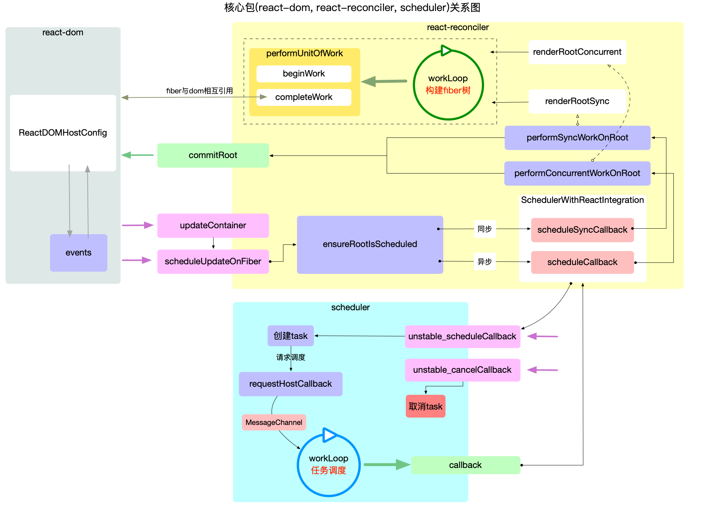

# react原理

本文档介绍 React 的原理（待完善）。

## 核心包关系图分析

下面为基于文档中 `react-core.png` 的详尽说明，按职责分层并补充示例调用序列，便于把抽象流程对应到源码实现。

一、总体分工（一句话概括）
- `react-reconciler`：负责构建/调和 Fiber 树（计算差异、收集副作用）。
- `scheduler`：负责按优先级/时间切片调度调和工作，决定何时运行 reconciler 的 `workLoop`。
- `react-dom`：负责提交阶段（把 reconciler 的副作用应用到浏览器 DOM）以及宿主环境的配置（`ReactDOMHostConfig`）。

二、关键模块与职责（深入）
- `react-reconciler`（调和细节）
	- `workLoop`：驱动调和的循环体，按照是否并发（concurrent）选择不同入口：`renderRootConcurrent` 或 `renderRootSync`。
	- `performUnitOfWork(fiber)`：每次处理单个 Fiber 节点，职责分成两部分：
		- `beginWork(fiber)`：计算该 fiber 的下一个状态，处理 `updateQueue`（合并 setState/update），并调用子节点的 reconciliation（例如 `reconcileChildren`）以生成/复用子 fiber；此阶段可能发生 bailout（当 props/state 未变时跳过子树）。
		- `completeWork(fiber)`：完成当前节点，生成 DOM 节点（host component）或收集副作用（例如需要插入/删除/更新的标记），并把这些副作用通过 fiber 链接到父节点（维护 `firstEffect`/`lastEffect`/`nextEffect`）。
	- effect（副作用）收集：调和阶段不会直接操作 DOM，而是把需要在提交阶段执行的操作记录在 effect list 上，最终由 `commitRoot` 统一执行。

- `react-dom`（提交阶段的三部分）
	- Before Mutation（变更前）阶段：触发 `getSnapshotBeforeUpdate` 等需要在 DOM 更新前读取布局信息的生命周期/Hook。
	- Mutation（变更）阶段：执行实际的 DOM 操作（插入、删除、更新属性）。
	- Layout（布局）阶段：同步调用 `useLayoutEffect` 的回调与 ref 的更新，这些在变更应用后立即运行。

- `scheduler`（调度与时间切片）
	- 核心是提供 `unstable_scheduleCallback`、`unstable_cancelCallback`、`requestHostCallback` 等接口，决定何时调用传入的回调。
	- 常见宿主实现采用 `MessageChannel` 驱动微任务轮询；时间切片由 `shouldYield()` 与 `frameDeadline` 控制（即长任务中断并在下一帧继续）。
	- Scheduler 按“优先级 lane”或“优先级等级”（Immediate、UserBlocking、Normal、Low、Idle）来排序任务，React 的 `ensureRootIsScheduled` 会把更新映射到合适的优先级并选择 `scheduleSyncCallback`（同步）或 `scheduleCallback`（异步）进行注册。

三、典型调用序列（带示例，便于对照源码）
下面以一个并发模式下组件调用 `setState` 为例，给出从触发到 DOM 更新的关键步骤（数字可与图上箭头对应）：

1. 组件调用 `setState`：向当前 fiber 的 `updateQueue` 推入更新对象。
2. React 触发 `updateContainer` / `scheduleUpdateOnFiber`：找到根 fiber 并调用 `ensureRootIsScheduled(root, currentEventPriority)`。
3. `ensureRootIsScheduled`：根据更新的 lane/优先级选择调度函数：若为同步优先级调用 `scheduleSyncCallback`，否则调用 `scheduleCallback`（并传入合适的优先级）。
4. Scheduler 层：通过 `requestHostCallback` 把任务注册到宿主（例如 `MessageChannel`），等待宿主唤醒并在合适时间调用回调。
5. 宿主执行回调到 Scheduler 的 `workLoop`：Scheduler 检查任务优先级并在当前帧内调用 React 提供的回调（即 reconciler 的 `performConcurrentWorkOnRoot`）。
6. `performConcurrentWorkOnRoot` 调用 reconciler 的 `workLoop`：开始 `performUnitOfWork` 的循环，`beginWork` 创建/更新子 fiber，`completeWork` 收集 effect。
7. 当调和完成（或中途被时间切片暂停）并存在副作用时，reconciler 调用 `commitRoot` 进入提交阶段。
8. `commitRoot` 按顺序执行 Before Mutation → Mutation → Layout 阶段，最终 DOM 更新完成，`useLayoutEffect` 回调执行，refs 被同步更新。
