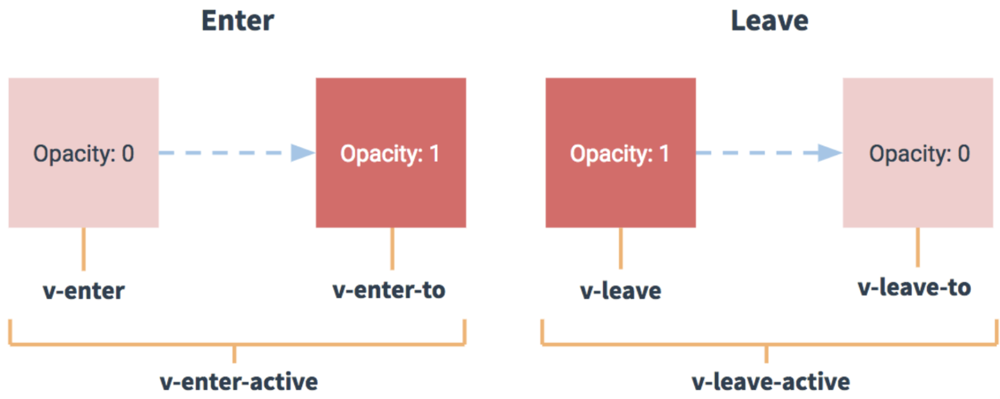
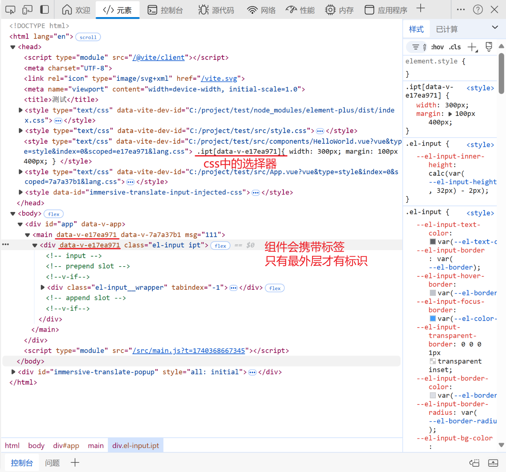
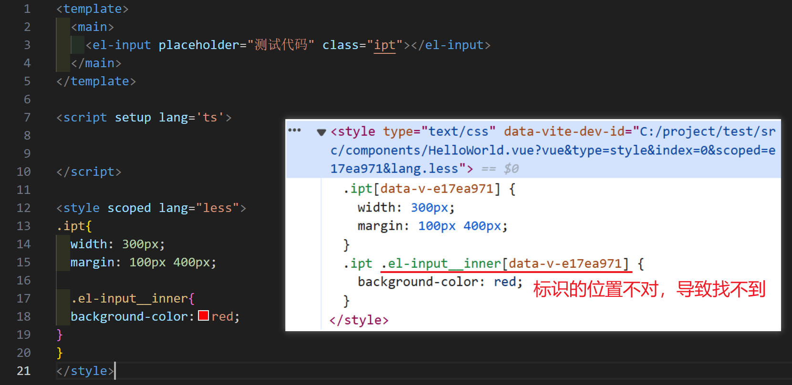
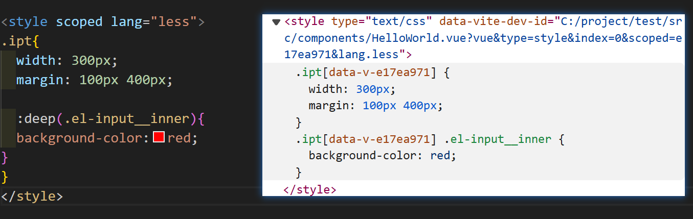

## diff

vue3中的diff算法用于更新虚拟dom后再挂载到真实dom上，通过patchKeyedChildren方法完成新旧dom的对比

## ref

ref 接受一个内部值并返回一个响应式且可变的 ref 对象

isRef 用于判断一个对象是否为ref对象

shallowRef 创建一个跟踪自身 .value 变化的 ref，但不会使其值也变成响应式的（如ref值为一个对象，直接修改对象中的某个值不会更新，但直接修改对象会更新），即只对.value整体值修改时视图会更新

**当shallowRef和Ref同时更新时，shallowRef即使没有修改value，也会强制更新。原因在于shallowRef和Ref本质都是通过RefImpl类实现，在代码中Ref对象属性的修改，会触发Ref对象中的triggerRefValue方法更新视图，导致shallowRef的数据也更新**

shallowRef一般用于数据量很大且变化小的情况，避免频繁修改DOM，从而提升性能

triggerRef 强制更新ref对象，一般用于强制更新shallowRef并显示

customRef，显式声明对其依赖追踪和更新触发的控制方式。customRef()有两个函数作为参数，`track`用于追踪数据，`trigger` 用于触发响应，更新视图。`track` 方法放在 `get` 中，`trigger` 方法放在 `set` 中。

```
// 使用customRef实现防抖节流
function useDebouncedRef(value, delay = 200) {
  let timeout;
  return customRef((track, trigger) => {
    return {
      get() {
        track(); // track收集依赖，即绑定与该ref有关的副作用函数
        return value;
      },
      set(newValue) {
        clearTimeout(timeout);
        timeout = setTimeout(() => {
          value = newValue;
          trigger(); // trigger触发更新，更新与该ref有关的副作用函数
        }, delay);
      }
    };
  });
}

const debouncedText = useDebouncedRef('');
```

toRef，一般用于提取响应式对象中的某个值

toRefs，批量提取响应式对象中的一些值

toRaw，将响应式对象转换成普通对象

## reactive

reactive 只能用在引用类型上，如Array，Object，Map，Set

reactive由于是proxy，不能进行赋值，会破坏其自带的响应性，解决方法如下

- 法一：解构，从数组或对象中，提取出某个值进行修改
- 法二：数组，需要通过数组的方法如pop，push进行修改
- 法三：在整体外再套一个对象，作为对象的一个属性进行修改

## v-on 绑定事件

v-on用于绑定事件如click等

```vue
<!-- 方法处理函数 -->
<button v-on:click="doThis"></button>

<!-- 动态事件 -->
<button v-on:[event]="doThis"></button>

<!-- 内联声明 -->
<button v-on:click="doThat('hello', $event)"></button>

<!-- 缩写 -->
<button @click="doThis"></button>

<!-- 对象语法,对象语法无法传递参数，函数只能被动接受原生事件参数(e) -->
<button v-on="{ mousedown: doThis, mouseup: doThat }"></button>
```

## click

```vue
.prevent  // 阻止默认事件的发生如表单提交后的刷新等
.stop     // 阻止事件接着向外层传递，打断冒泡过程
.capture  // 打乱冒泡顺序，发生click事件时会优先去找你可以传递到的所有父元素中最后一个有.capture的元素，优先执行这个元素的事件，紧接着执行倒数第二个有.capture的事件，最后再按照正常的冒泡顺序从自己开始往上执行未经执行的父元素的click事件
.self     // 不让子元素的事件触发自己绑定的事件，但是不会阻止冒泡
.once     // 事件只触发一次

// capture case1   执行顺序 outer -> middle -> inner
<div id="app"> 
　　<div class="outer" @click.capture="outer"> 
　　　　<div class="middle" @click.capture="middle"> 
　　　　　　<button @click="inner">点击我(^_^) </button>
    　　</div>
    </div> 
</div>

// capture case2   执行顺序 middle -> inner -> outer
<div id="app">  
　　<div class="outer" @click="outer"> 
　　　　<div class="middle" @click.capture="middle"> 
　　　　　　<button @click="inner">点击我(^_^)</button>
    　　</div>
    </div> 
</div>
```

## computed

接受一个 getter 函数，返回一个**只读**的响应式 ref 对象。该 ref 通过 .value 暴露 getter 函数的返回值。它也可以接受一个带有 get 和 set 函数的对象来创建一个**可写**的 ref 对象。

当某个值依赖 一个值的变化时（可以时响应式对象） 强烈建议使用computed

## watch

```typescript
// 侦听单个数据源
let data = ref<string>("haha")

// 监听器第一个参数：数据源 第二个参数回调函数(newVal,oldVal)
watch(data,(newVal,oldVal)=>{
    ...
})
```

```typescript
// 侦听多个数据源
let data1 = ref<string>("hello")
let data2 = ref<string>("world")

//使用数组的形式侦听多个数据源，返回的结果也会变成数组，结果顺序 按照 监听顺序
watch([data1,data2],(newVal,oldVal)=>{//此时新值旧值也会变成一个数组
    console.log('新的值----', newVal); // newVal->[data1,data2]
    console.log('旧的值----', oldVal);
})
```

```
// 侦听ref时需要开启deep来确保对象深层属性的监听，reactive自动实现深层监听
// 使用回调函数替换数据源，使得oldVal和newVal可以访问具体的属性
watch(()=>object1.item,(newVal,oldVal)=>{
	...
})
```

## watchEffect(语法糖)

watchEffect会在一开始自调用一次，立即执行传入的函数，响应式的跟踪函数中所用到的变量，在这些变量更新的时候重新执行该函数

## props

**父传子(defineProps)**

通过`$props`属性可以获得所有的props，非props属性可以通过$attrs获得

```vue
<!-- 基本用法(无TS) -->
<!-- 文件comp.vue -->
<template>
  <div>子集</div>
  <div>值：{{title}}</div>
</template>

<script setup lang="ts">
//defineProps是宏函数。接收父组件传过来的值(没有使用ts的话他就是一个函数，然后里面接收一个对象)------->无TS写法
defineProps({
  title:{
    type:String,
    default:"hello"
  }
})//通过内置函数defineProps完成传递，即可在子组件中直接使用在上面定义好的内容
</script>

<style scoped>

</style>
```

```vue
<!-- 带TS用法 -->
<template>
    <div>子集</div>
    <div>姓名：{{ name }}</div>
    <div>年龄：{{ age }}</div>
</template>
<script>
defineProps < {//1.字面量写法，想要传输多个值就继续往下加，名字要跟父组件的一样(其实就是定义父组件传过来的值的类型，不符合就拦截)
    name: String,
    age: number
} > ();
// 携带默认值，使用withDefault(defineProps<>(),defaultVal)方法
withDefaults(defineProps < {
    name: String,
    age: number
} > (), {
    name: "haha",
    age: 6
})
</script>
<style scoped></style>
```

**子传父(defineEmits)**

```typescript
<script setup lang="ts">

// js版本
//子传父，给父组件传值使用defineEmits
const emit = defineEmits(['on-click'])//参数为数组，名称和父组件中的事件名称对应
const send = () => {
  emit('on-click','haha')//进行派发，第一个是派发，后面内容
}

// ts版本
//子传父，给父组件传值使用defineEmits
const emit = defineEmits<{
  (e: "on-click", name: string): void
  (e: "on-hover", count: number): void
}>()

const sendClick = () => {
  emit('on-click', 'haha')
}

const sendHover = () => {
  emit('on-hover', 42)
}
</script>
```

**子传父(defineExpose)向外暴露子组件的属性**

## 动态组件

```typescript
// comp_name 表示组件名称
<component :is="comp_name"></component>


type Tabs = {//定义类型
    name:string,
    comName:any
}
//这里会有警告，reactive会去代理Proxy，然后里面的组件A,B,C也会去代理，但这是没有必要的。代理一次就够了，多了浪费性能
//这里使用的是markRaw就是给做个标记，意味着告诉vue此组件永远不会改变或者说进入响应式
const data = reactive<Tabs[]>([
    {
        name:'我是A组件',
        //comName:A
        comName:markRaw(A)
    },
    {
    	name:'我是B组件',
    	//comName:B
        comName:markRaw(B)
    },
    {
    	name:'我是C组件',
    	//comName:C
        comName:markRaw(C)
    }
])
```

使用这种方式时，会自动代理组件的proxy，导致性能浪费，使用markRaw来去除组件的响应式

## 插槽slot

插槽就是子组件中的提供给父组件使用的一个占位符，父组件可以在这个占位符中填充任何模板代码，如 HTML、组件等，填充的内容会替换子组件的 < slot> 标签。父组件必须引用子组件

```vue
// 匿名插槽
// 子组件
<template>
    <div>
       <slot></slot>  //这个就是插槽
    </div>
</template>

// 父组件
<Dialog>
    <template v-slot> //使用匿名插槽，在模板中填充内容
		<div>hello</div>
    </template>
</Dialog>
```

```vue
// 具名插槽
// 在匿名插槽的基础上添加name来定向
// 子组件
<div>
	<slot name="header"></slot>
	<slot></slot>
	<slot name="footer"></slot>
</div>

// 父组件
<Dialog>
	<template #header>   // 对应插槽header
		<div>1</div>
	</template>
	<template #default>  // 对应匿名插槽
		<div>2</div>
	</template>
	<template #footer>   // 对应插槽footer
		<div>3</div>
	</template>
</Dialog>
```

```vue
// 作用域插槽
// 在子组件中动态绑定参数，派发给父组件的slot使用
// 子组件MyComponent.vue
<div>
  <slot :text="greetingMessage" :count="1"></slot>  // greetingMessage为定义的变量，如果是传递字符串，必须省略前面的:，否则无法解析
</div>

// 父组件
<MyComponent v-slot="slotProps">    // slotProps表示接受到的对象，名字可以自定义用于后续的读取属性
  {{ slotProps.text }} {{ slotProps.count }}
</MyComponent>

// 具名作用域插槽
// 子组件
<div>
  <slot name="header" :message="head"></slot>
</div>
// 父亲组件
<MyComponent #header="slotProps">    // slotProps表示接受到的对象，名字可以自定义用于后续的读取属性
  {{ slotProps }}                    // -> { "message": "head" }
</MyComponent>
```

```vue
// 条件插槽
// 使用$slots和v-if
// 子组件
<template>
  <div class="card">
    <div v-if="$slots.header" class="card-header">   // 会读取父组件中是否有使用#header的模板，如果有才会渲染在网页上
      <slot name="header" />
    </div>
    
    <div v-if="$slots.default" class="card-content"> // 检查父组件中是否有匿名插槽
      <slot />
    </div>
    
    <div v-if="$slots.footer" class="card-footer">
      <slot name="footer" />
    </div>
  </div>
</template>

// 父组件
<template>
  <Card>
    <template #header>
      <h1>This is the header</h1>
    </template>

    <template #>
      <p>This is the content</p>
    </template>

    <template #footer>
      <em>This is the footer</em>
    </template>
  </Card>
</template>
```

```vue
// 动态插槽 [],内容需要是响应式数据
<Dialog>
    <template #[name]>//name会替换成下面响应式的name
		<div>
    		23
        </div>
    </template>
</Dialog>

const name = ref('header')//header或者footer或者其他什么乱七八糟的东西都可以，只要是定义好的插槽名字(具名插槽)
```

## 异步组件

作用：将大js块拆成多个小js块从服务器获取。

```typescript
import { defineAsyncComponent } from 'vue'

// defineAsyncComponent 方法接收一个返回 Promise 的加载函数。
const AsyncComp = defineAsyncComponent(() => {
  return new Promise((resolve, reject) => {
    // ...从服务器获取组件
    resolve(/* 获取到的组件 */)
  })
})
// ... 像使用其他一般组件一样使用 `AsyncComp`

// 引入ES 模块动态导入也会返回一个 Promise，可以使用该方法替代promise
const AsyncComp = defineAsyncComponent(() =>
  import('./components/MyComponent.vue')
)

// 全局注册
app.component('MyComponent', defineAsyncComponent(() =>
  import('./components/MyComponent.vue')
))
```

## suspense

在组件树上层等待下层的多个嵌套异步依赖项解析完成，并可以在等待时渲染一个加载状态。

```
// 假设存在以下一个dom树，如果不使用suspense，则有可能三个异步同时进行，使用suspense可以更好的展示异步未完成的状态
└─ <Dashboard>
   ├─ <Profile>
   │  └─ <FriendStatus>（组件有异步的 setup()）
   └─ <Content>
      ├─ <ActivityFeed> （异步组件）
      └─ <Stats>（异步组件）
```

```vue
// <Suspense> 组件有两个插槽：#default 和 #fallback。两个插槽都只允许一个直接子节点。在可能的时候都将显示默认插槽中的节点。否则将显示后备插槽中的节点。

<Suspense>
  <!-- 具有深层异步依赖的组件 -->
  <Dashboard />

  <!-- 在 #fallback 插槽中显示 “正在加载中” -->
  <template #fallback>
    Loading...
  </template>
</Suspense>
// 在初始渲染时，<Suspense> 将在内存中渲染其默认的插槽内容。如果在这个过程中遇到任何异步依赖，则会进入挂起状态。在挂起状态期间，展示的是后备内容。当所有遇到的异步依赖都完成后，<Suspense> 会进入完成状态，并将展示出默认插槽的内容。如果在初次渲染时没有遇到异步依赖，<Suspense> 会直接进入完成状态。进入完成状态后，只有当默认插槽的根节点被替换时，<Suspense> 才会回到挂起状态。组件树中新的更深层次的异步依赖不会造成 <Suspense> 回退到挂起状态。
// 在dom树中，同一级的suspense并行执行，有包含关系的串行执行
```

## teleport

通过to将模板渲染到执行位置

## keep-alive

开启keep-alive后声明周期的变化：

1. 初始进入：先onMounted -> 再onActivated
2. 退出后触发：deactivated
3. 再次进入：只触发onActivated

事件挂载的方法等，只执行一次的放在 onMounted 中；组件每次进去执行的方法放在 onActivated 中

```typescript
// 写在include里面的组件会被缓存起来，只写keep-alive是默认里面信息全部缓存的
// 写在include里面的组件会被缓存起来，只写keep-alive是默认里面信息全部缓存的
// :max属性是决定了我们缓存的最大组件数量，假设我们:max="10"，也就是最多缓存10个组件，可我们keep-alive内部即将缓存的有11个组件，使用LRU算法进行替换
<keep-alive :include="keep-alive里的组件" :exclude="" :max=""></keep-alive>

<keep-alive :max="10">
  <component :is="view"></component>
</keep-alive>
```

## transition

动画过渡，适用于以下情况：

- v-if
- v-show
- 动态组件
- 组件根节点

可以使用规定格式的css名称，或使用如下对应标签

| 进入                 | 效果                                                                                                                                                                  |
| -------------------- | --------------------------------------------------------------------------------------------------------------------------------------------------------------------- |
| `enter-from-class`   | 定义了进入过渡的开始状态。元素被插入前生效，元素插入后的下一帧移除                                                                                                    |
| `enter-active-class` | 定义过渡生效时的状态。应用在进入过渡的阶段，元素被插入前生效，过渡 / 动画完成后移除。该类可以用于定义过渡的过程时间，延迟和曲线函数                                   |
| `enter-to-class`     | 元素插入后的下一帧生效，在过渡 / 动画完成之后移除                                                                                                                     |
| **离开**             | 效果                                                                                                                                                                  |
| `leave-from-class`   | 定义离开过渡的开始状态。在离开过渡被触发时立刻生效，下一帧被移除。                                                                                                    |
| `leave-active-class` | 定义离开过渡生效时的状态。在整个离开过渡的阶段中应用，在离开过渡被触发时立刻生效，在过渡 / 动画完成之后移除。这个类可以被用来定义离开过渡的过程时间，延迟和曲线函数。 |
| `leave-to-class`     | 离开过渡的结束状态。在离开过渡被触发之后下一帧生效 (与此同时 v-leave-from 被移除)，在过渡 / 动画完成之后移除。                                                        |



transition的生命周期

```javascript
  @before-enter="beforeEnter" 		//对应enter-from		进入之前
  @enter="enter"			  		//对应enter-active    进入
  @after-enter="afterEnter"   		//对应enter-to		进入后
  @enter-cancelled="enterCancelled" //显示过度打断         进度被打断
  @before-leave="beforeLeave"		//对应leave-from		离开之前
  @leave="leave"					//对应enter-active	离开
  @after-leave="afterLeave"			//对应leave-to		离开之后
  @leave-cancelled="leaveCancelled" //离开过度打断		 离开被打断
// enter和leave钩子需要使用done回调，决定过渡效果何时完成
const Enter = (el: Element,done:Function) => {
    console.log('过渡曲线');
    setTimeout(()=>{
       done()
    },3000)
}
```

transition group

一般用于渲染v-for生成的元素，该组件的特点如下：

- 默认情况下，它不会渲染一个包裹元素，但是你可以通过 `tag` attribute 指定渲染一个元素。
- 过渡模式不可用，因为我们不再相互切换特有的元素。
- 内部元素总是需要提供唯一的 `key` attribute 值。
- CSS 过渡的类将会应用在内部的元素中，而不是这个组 / 容器本身。
- 生命周期是跟transition共通的，自定义过渡类名也是一样的

# provide/inject

props一般用于父组件向子组件传参，provide可以实现祖先节点到后代节点的传参(多层子节点关系)。

```
// 祖先组件
const flag = ref<number>(1)
provide('flag',flag)   // provide(key,value)

// 后代组件
const flag = inject<Ref<number>>('flag') // inject(key,default*)
```

与TS结合使用时，需要对provide的key进行类型声明

```
// types.ts
import {InjectionKey, Ref } from "vue"
// 限制了 provide 导出的数据必须是 ref 且 boolean 类型
export const provideKey: InjectionKey<Ref<boolean>> = Symbol()

// 使用场景
import {provideKey} from 'types.ts'
provide(provideKey,value) // 此时value的类型必须符合provideKey
```

## bus

vue3移除了全局总线bus

推荐使用第三方库mitt

```
// js版本 发布订阅模式
class EventBus{
    constructor(){
        this.callback = {}
    }
    
    emit(name,...args){
        this.callback[name].forEach((fn)=>{
            fn.apply(this.args)
        })
	}

	on(name,fn){
        if(this.callback[name]){
            this.callback.push(fn)
        }else{
            this.callback[name] = [fn]
        }
	}
}


const bus = new EventBus()

bus.on('on',(o) =>{
    console.log(o)
})
bus.emit('on',"hello world")
```

## v-model

v-bind（:）是单向绑定，将底层数据显示到视图上，视图上数据的修改并不会影响底层。

v-model是双向绑定，修改视图数据时会直接修改（体现在文档流中），本质上时通过v-bind和v-on实现，先使用v-bind完成数据绑定，再通过v-on监听事件完成数据修改	

```vue
>3.4版本可以使用defineModel宏
<!-- Child.vue -->
<script setup>
const model = defineModel()

function update() {
  model.value++
}
</script>

<template>
  <div>Parent bound v-model is: {{ model }}</div>
  <button @click="update">Increment</button>
</template>

<!-- Parent.vue -->
<Child v-model="countModel" />
```

```vue
底层机制,使用props和emit触发
<!-- Child.vue -->
<script setup>
const props = defineProps(['modelValue'])
const emit = defineEmits(['update:modelValue'])
</script>

<template>
  <input
    :value="props.modelValue"
    @input="emit('update:modelValue', $event.target.value)"
  />
</template>

<!-- Parent.vue -->
<Child
  :modelValue="foo"
  @update:modelValue="$event => (foo = $event)"
/>
```

```vue
如何给v-model参数取名字
<!-- Child.vue -->
<script setup>
const title = defineModel('title') // 第一个title是本地使用的变量名，第二个title是父组件传入的名字v-model:name
</script>

<template>
  <input type="text" v-model="title" />
</template>

<!-- Parent.vue -->
<Child v-model:title="bookTitle" />
```

## 自定义指令

命名格式 v开头后接驼峰式命名

不推荐在组件上使用自定义指令，会透传

一般只用mounted和updated周期

```javascript
const vMyDirective = {
  // 在绑定元素的 attribute 前
  // 或事件监听器应用前调用
  created(el, binding, vnode) {
    // el:指令绑定的元素，可操作dom
    // binding包含的内容
    // value:传递的值
    // oldvalue:旧值
    // arg:指令的参数
    // modifiers:包含修饰符的对象
    // instance:使用命令的组件实例
    // dir:指令定义的对象
  },
  // 在元素被插入到 DOM 前调用
  beforeMount(el, binding, vnode) {},
  // 在绑定元素的父组件
  // 及他自己的所有子节点都挂载完成后调用
  mounted(el, binding, vnode) {},
  // 绑定元素的父组件更新前调用
  beforeUpdate(el, binding, vnode, prevVnode) {},
  // 在绑定元素的父组件
  // 及他自己的所有子节点都更新后调用
  updated(el, binding, vnode, prevVnode) {},
  // 绑定元素的父组件卸载前调用
  beforeUnmount(el, binding, vnode) {},
  // 绑定元素的父组件卸载后调用
  unmounted(el, binding, vnode) {}
}
```

## 自定义hook

类似公共函数，通过导出，导入使用，组合式函数约定用驼峰命名法命名，并以“use”作为开头。

## 全局变量和函数

在main.js/ts中

使用app.config.globalProperties.$变量名 定义

## vue中的scoped和样式穿透

scoped通过在DOM结构和CSS样式中加上唯一不重复的标记:data-v-hash

渲染规则如下：

1. 给 HTML 的 DOM 节点加一个不重复 data 属性 (形如：data-v-123) 来表示他的唯一性
2. 在每句 css 选择器的末尾（编译后的生成的 css 语句）加一个当前组件的 data 属性选择器（如 [data-v-123]）来私有化样式
3. 如果组件内部包含有其他组件，只会给其他组件的最外层标签加上当前组件的 data 属性



使用less语法的时候会出现bug



使用:deep()来实现穿透



在使用slot的时候，在slot内部修改css并不会影响其样式，因为其样式是由父组件传入的(父组件可修改)，如果要在slot组件内修改样式，需要针对父组件的类名，使用:slotted()修饰

```vue
<!-- 举例 -->
<!-- 父组件 -->
<template>
	<A>
    	<div class = "a"> //可在父组件中直接使用类型，有效
            aaaa
    	</div>
    </A>
</template>
<!-- 子组件 -->
<template>
  <div>
    <slot></slot> //使用类名a编辑css无效，需使用:slotted()修饰
  </div>
</template>
```

动态css

可以在style中使用v-bind来动态绑定样式

```vue
<script lang="ts" setup>
import { ref } from 'vue'
const red = ref<string>('red')
</script>
 
<style lang="less" scoped>
.div{
   color:v-bind(red)//将css属性与script的变量绑定起来了，这里red绑定的是const red的red
} 
</style>

<script lang="ts" setup>
import { ref } from "vue"
const red = ref({
    color:'pink'
})
</script>
 
    <style lang="less" scoped>
.div {
    color: v-bind('red.color'); // 变量形式需要添加''
}
</style>
```

css module

\<style module> 标签会被编译为 CSS Modules 并且将生成的 CSS 类作为 $style 对象的键暴露给组件

```vue
<template>
    <div :class="$style.red">//默认名字是$style.你class的名字。请注意，这里是:class=""，有冒号的
        haha
    </div>
</template>
 
<style module>
.red {
    color: red;
    font-size: 20px;
}
</style>

// 自定义注入名称
<template>
    <div :class="[wy.red,wy.border]"> /c/使用数组形式引入多个样式
        haha
    </div>
</template>
 
<style module="wy">//这个wy可写可不写，写了就样式前缀为wy，不写就依旧为$style
.red {
    color: red;
    font-size: 20px;
}
.border{
    border: 1px solid #ccc;
}
</style>
```

## nextTick

宏任务：1. script (可以理解为外层同步代码)2. setTimeout/setInterval3. UI rendering/UI事件4. postMessage，MessageChannel5. setImmediate，I/O（Node.js）

微任务：1. Promise2.process.nextTick（Node.js） 3. Object.observe（已废弃；Proxy 对象替代）4. MutaionObserver

在异步任务中分为宏任务和微任务，先执行同步代码，遇到异步宏任务则将异步宏任务放入宏任务队列中，遇到异步微任务则将异步微任务放入微任务队列中，当所有同步代码执行完毕后，再将异步微任务从队列中调入主线程执行，微任务执行完毕后再将异步宏任务从队列中调入主线程执行，一直循环直至所有任务执行完毕。

```vue
<script setup lang="ts">
  async function Prom(){ // 宏任务
    console.log('Y')     // 同步任务
    await Promise.resolve()  // 微任务
    console.log('X')     
   }
  setTimeout(()=>{  // 宏任务
    console.log(1)  
    Promise.resolve().then(()=>{  // 微任务
      console.log(2)
    })
  },0)
  setTimeout(()=>{ // 宏任务
    console.log(3)
    Promise.resolve().then(()=>{  // 微任务
      console.log(4)
    })
  },0)
  Promise.resolve().then(()=>{  // 微任务
    console.log(5)
  })
  Promise.resolve().then(()=>{  // 微任务
    console.log(6)
  })
  Promise.resolve().then(()=>{  // 微任务
    console.log(7)
  })
  Promise.resolve().then(()=>{  // 微任务
    console.log(8)
  })
  Prom()
  console.log(0)
</script>
Y,0,5,6,7,8,X,1,2,3,4
执行顺序，定时器1加入宏任务序列，定时器2加入宏任务序列，Promise5678加入微任务序列，执行Prom，输出Y，PromiseX加入微任务序列，同步任务输出0。无同步任务后，执行微任务，输出5678X，执行宏任务定时器1，输出1，Promise2加入微任务序列，执行Promise2，输出2，行宏任务定时器2，输出3，Promise4加入微任务序列，执行Promise4，输出4
```

在vue实际运用中，对dom的修改最好放在异步函数中

```
// 法一
nextTick(()=>{操作dom})  // 传入回调函数
// 法二
await nextTick()  // 将nextTick()转成异步，阻塞在此，当dom更新后再操作dom
操作dom
```

## h函数

```vue
import { h } from 'vue'

const vnode = h(
  'div', // type(标签)
  { id: 'foo', class: 'bar' }, // props(元素的属性)
  [
    /* children */ 文本或子元素
  ]
)
```

```vue
// 使用props传递参数
<template>
    <Btn text="按钮"></Btn> // 可以传参
</template>
  
<script setup lang='ts'>
import { h, } from 'vue';
type Props = {
    text: string
}
const Btn = (props: Props, ctx: any) => {  // 函数式组件
    return h('div', {
        class: 'p-2.5 text-white bg-green-500 rounded shadow-lg w-20 text-center inline m-1',
 
    }, props.text)
}
</script>

// 使用emit触发
<template>
    <Btn @on-click="getNum" text="按钮"></Btn>
</template>
  
<script setup lang='ts'>
import { h, } from 'vue';
type Props = {
    text: string
}
const Btn = (props: Props, ctx: any) => {
    return h('div', {
        class: 'p-2.5 text-white bg-green-500 rounded shadow-lg w-20 text-center inline m-1',
        onClick: () => {//派发
            ctx.emit('on-click', 123) //触发组件内的点击事件
        }
    }, props.text)
}
 
const getNum = (num: number) => {
    console.log(num);
}
</script>
```

```vue
// 挂载使用
// 使用createVNode
const div = createVNode('div',{id:"foo"},'小余')//声明使用

render(div,document.body)//挂载到页面上
console.log(div)//打印看看属性
```

## vite 环境变量

作用：让开发者区分不同的运行环境，实现兼容开发和生产，如配置接口等

Vite 在一个特殊的 import.meta.env 对象上暴露环境变量。这里有一些在所有情况下都可以使用的内建变量。

## vue3 性能优化

## vite配置优化

```
build:{
       chunkSizeWarningLimit:2000,
       cssCodeSplit:true, //css 拆分
       sourcemap:false, //不生成sourcemap
       minify:false, //是否禁用最小化混淆，esbuild打包速度最快，terser打包体积最小。
       assetsInlineLimit:5000 //小于该值 图片将打包成Base64 ，Base64的就不会被打包加载到容器里
},
```

## PWA 离线存储

```
// 安装
npm install vite-plugin-pwa -D

// 引入
import { VitePWA } from 'vite-plugin-pwa' 
plugins: [vue(),VitePWA(), vueJsx(),visualizer({
      open:true
})],

// 配置
VitePWA({
      workbox:{
          cacheId:"tt",//缓存名称
          runtimeCaching:[
            {
              urlPattern:/.*\.js.*/, //缓存文件
              handler:"StaleWhileRevalidate", //重新验证时失效
              options:{
                cacheName:"tt-js", //缓存js，名称
                expiration:{
                  maxEntries:30, //缓存文件数量 LRU算法(优先缓存活跃的)
                  maxAgeSeconds:30 * 24 * 60 * 60 //缓存有效期
 
                }
              }
            }
          ]
      },
    })
```

## 图片懒加载

## 虚拟列表

## 防抖节流

## Web Components

功能：自定义标签

```vue
class Btn extends HTMLElement {
	// 方法一
    constructor () {
        //调用super 来建立正确的原型链继承关系
        super()
        const p = this.h('p')
        p.innerText = 'haha'
        p.setAttribute('style','height:200px;width:200px;border:1px solid #ccc;background:yellow')
        //表示 shadow DOM 子树的根节点。
        const shaDow = this.attachShadow({mode:"open"})
 
        shaDow.appendChild(p)
    }
    // 方法二
	constructor() {
        //调用super 来建立正确的原型链继承关系
        super()
        const template = this.h('template')
        template.innerHTML = `
        <div>haha</div>
        <style>
            div{
                height:200px;
                width:200px;
                background:blue;
            }
        </style>
        `
        //表示 shadow DOM 子树的根节点。
        const shaDow = this.attachShadow({ mode: "open" })
 
        shaDow.appendChild(template.content.cloneNode(true))
 	}
 	
    h (el) {
       return  document.createElement(el)
    }
 
    /**
     * 生命周期
     */
    //当自定义元素第一次被连接到文档 DOM 时被调用。
    connectedCallback () {
        console.log('我已经插入了！！！嗷呜')
    }
 
    //当自定义元素与文档 DOM 断开连接时被调用。
    disconnectedCallback () {
        console.log('我已经断开了！！！嗷呜')
    }
 
    //当自定义元素被移动到新文档时被调用
    adoptedCallback () {
        console.log('我被移动了！！！嗷呜')
    }
    //当自定义元素的一个属性被增加、移除或更改时被调用
    attributeChangedCallback () {
        console.log('我被改变了！！！嗷呜')
    }
 
}
 
window.customElements.define('hb-haha',Btn)//挂载，第一个为标签名(标签名需要用-连接)，第二个是放类名

// 使用方式
<!DOCTYPE html>
<html lang="en">
<head>
    <meta charset="UTF-8">
    <meta http-equiv="X-UA-Compatible" content="IE=edge">
    <meta name="viewport" content="width=device-width, initial-scale=1.0">
    <title>web Component</title>
    <script src="./btn.js"></script>
</head>
<body>
    <hb-haha></hb-haha>
</body>
</html>
```

## 如何在Vue中使用

```
// 首先配置
/*vite config ts 配置*/
vue({
   template:{
     compilerOptions:{
         isCustomElement:(tag)=> tag.includes('hb-')//hb-是设定好的前缀，只要是`hb-`开头的都会跳过组件的检测
         //使用这种Vue单文件。有新的文件命名规则，那就是.ce.vue的后缀，才会开启这个模式
      }
    }
})

// 父组件
<template>
    <div>
        <hb-btn :title=" JSON.stringify(name) "></hb-btn> // 给子组件传参的时候,如果是对象需要使用JSON.stringify()序列化
    </div>
</template>
 
<script setup lang='ts'>
import { ref, reactive, defineCustomElement } from 'vue'//要使用的话，需要导出一个defineCustomElement，这里面封装了那些我们要使用的方法
//自定义元素模式  要开启这个模式，只需要将你的组件文件以 .ce.vue 结尾即可
import customVueVue from './components/custom-vue.ce.vue'//对这个子组件做一个引入
const Btn = defineCustomElement(customVueVue)//将子组件塞进defineCustomElement函数内使方法生效
customElements.define('hb-btn', Btn)//进行挂载，前面是要以hb-开头的，才能跳过组件的检测，后面btn则是我们的子组件
//跳过组件的检测的话，就没有组件的提示了
 
const name = ref({a:1})
 
</script>
 
<style scoped lang='less'>
 
</style>
```

## pinia

```
// Vue3引入
import { createApp } from 'vue'
import App from './App.vue'
import {createPinia} from 'pinia'//引入
//Vue3叫createPinia

const store = createPinia()//调用一下
let app = createApp(App)
 
app.use(store)//使用pinia
 
app.mount('#app')

// Vue2引入
import { createPinia, PiniaVuePlugin } from 'pinia'
 
Vue.use(PiniaVuePlugin)
const pinia = createPinia()
 
new Vue({
  el: '#app',
  // other options...
  // ...
  // note the same `pinia` instance can be used across multiple Vue apps on
  // the same page
  pinia,
})
```

## 使用方法

1.创建一个文件夹Store

2.创建index.ts作为Store的命名空间

```
// index.ts
export const enum StoreNames { //暴露出去并且枚举，用于集中存储Store的变量名
    Test = 'TEST'
}
```

3.引入并定义

```
// store.ts
import { defineStore } from 'pinia'
import { StoreNames } from './index'//抽离出去的名字最终还是需要引入回来store文件进行使用的
 
export const useCounterStore = defineStore(StoreNames.Test, {
  state: () => (return { count: 0, name: 'Eduardo' }),
  getters: {  // 相当于computed,可以从外部访问doubleCount这个变量
    doubleCount: (state) => state.count * 2,
  },
  actions: { // 向外部暴露的方法，用于修改Store中存储的数据，可以是同步或者是异步函数
    increment() {
      this.count++
    },
  },
})
```

4.使用

```
//例子
import {useCounterStore} from "./store"
//然后进行调用一下
const Test = useCounterStore()
console.log(Test.name) // =>Eduardo
```

## 如何修改state中的值

1.直接访问修改

2.批量修改

```
// 使用$patch()，里面是修改的Store对象
const Test = useCounterStore()
const change = () =>{
	Test.$patch({
		count:1,
		name:'Leo'
	})
}

// 使用$patch()，里面是回调函数,这样可以添加复杂逻辑
const change = () => {
    Test.$patch((state)=>{//这里的state就是我们在store仓库中的state
       state.count++;
       state.name = "John"
    })
}
```

3.全部修改

```
// 通过访问
const change = () => {
    Test.$state = { //全量修改，需要用完整的对象（符合原对象的key）
       count:6,
       name:"John"
    }
}
```

4.通过触发在Store中配置的actions方法修改

## 解构Store

直接使用解构，解构出来的变量会丢失响应式

```
const Test = useCounterStore()
 //pinia解构不具有响应式
const { current, name } = Test//普通解构

//需要使用storeToRefs
import { storeToRefs } from 'pinia'
const Test = useCounterStore()
const { current, name } = storeToRefs(Test)//在解构之前先包一层
// 本质上该函数会判断Test中的变量是否是Ref或者Reactive，如果是的话会套一层Ref再返回。避免将actions转换成Ref
```

## 其他

1.可以使用$reset()方法，使得Store的变量重置成原来的样子

2.$subscrible()

```
// $subscrible()方法，类似watch，会监视state中的变化
Test.$subscribe((args,state)=>{
   console.log(args,state);  // args是整个Store变量如Test，state则是具体的state
   
},{
  detached:true  // 默认为false，true为在组件销毁后依然监听状态的改变
})
```

3.$onAction()

```
// 监视actions的调用
Test.$onAction((args)=>{  //args中存储调用的actions的名字，传入的参数和store原型
   console.log(args);
   args.after(()=>{
       console.log('after');
   })
})
//args能够捕获到外面写入的数据内容
//App.vue文件(就是你使用pinia的文件，不一定是App.vue)
const change = ()=>{
    Test.setUser('123')//被args捕获到
}
```

4.pinia当页面刷新时会丢失所有修改，需要通过存入localStorage，session或cookies存储

```vue
const __piniaKey = "__PINIAKEY__";
//定义兜底变量

type Options = {
  key?: string;
};
//定义入参类型

//将数据存在本地
const setStorage = (key: string, value: any): void => {
  //设置的存储函数
  localStorage.setItem(key, JSON.stringify(value));
};

//从缓存中读取
const getStorage = (key: string) => {
  return localStorage.getItem(key)
    ? JSON.parse(localStorage.getItem(key) as string)
    : {}; //判断有没有key，没有就返回空对象
};

//利用函数柯里化接受用户入参
const piniaPlugin = (options: Options) => {
  //将函数返回给pinia  让pinia  调用 注入 context
  return (context: PiniaPluginContext) => {
    const { store } = context;
    const data = getStorage(`${options?.key ?? __piniaKey}-${store.$id}`); //将数据取出来
    store.$subscribe(() => {
      setStorage(
        `${options?.key ?? __piniaKey}-${store.$id}`,
        toRaw(store.$state)
      ); //
    });

    //返回值覆盖pinia 原始值
    return {
      ...data,
    };
  };
};

//初始化pinia
const pinia = createPinia();

//注册pinia 插件
pinia.use(
  piniaPlugin({
    key: "pinia",
  })
);

```

## Route

Router4的配置

```js
//index.js文件
import {createRouter,createWebHistory } from 'vue-router'
 
const routes = [
    {
        path:'/',//必选，这个是显示在路径中的内容
        name:'Reg', // 可选
        component:() => import('../pages/login.vue')//必选，这个是要通过路由跳转过去的组件位置(就是说我们要去的地方),router-view会显示这部分组件
    }
]
 
const router = createRouter({
    history:createWebHistory(), // history模式,如果要使用hash模式改成createHashHistory
    routes  // 上方定义的路由信息
})
export default router//记得将路由暴露出去
```

hashchange(hash模式)只能监听页面前进后退的情况

history模式采用popstate回退，也可以通过history.pushstate来跳转

## 命名路由

通过name给路由赋予名字，好处是不需要特定的url，会对传递的params进行自动编码/解码

```js
// 可以在routes对数组对象中定义name
import { useRouter } from 'vue-router'
const router = useRouter()
 
const toPage = () => {
  router.push({
    name: 'Reg'//这里需要注意，在前面设置的也需要进行修改，不能够再传入url了，因为我们这里是命名式写法，需要传入命名(此处是写死的做法，下面是传值式的写法)
  })
}

const toPage = (Name:string) => {//TS写法，不用TS写法的话写个Name就行了
  router.push({//一样是对象形式写法
    name: Name//传值式写法
  })
}
```

浏览器的历史纪录存在两种写入方式，一种是push（可回退），一种是replace（不可回退）

使用方法一种是直接将replace写在router-link中，一种是使用router.replace(url)

router.go(number)/back(number)可以让页面前进或后退number步

## 路由传参

query传参，在push的时候使用在对象中添加query对象，在url后会看到拼接的传参对象

```js
//子组件login.vue
const toDetail = (item:Item) =>{
    router.push({
        path:'/reg',
        query:item//item是一个对象
    })
}

// /reg
import {useRoute} from 'vue-router' // 读取数据时route不是router
const route = useRoute()
console.log(route.query.item)
```

params传参，只能用在路由有name的时候，内容存在内容当中，当页面刷新时数据会丢失

```js
const toDetail = (item: Item) => {
    router.push({
        name: 'Reg',
        params: item
    })
}
```

动态路由传参

```
params:item//虽然item本身也是对象，但是换成对象形式写会更好
//修改后
params:{
    id:item.id//这里取名定义的要跟下面的`动态路由参数`部分的 path对应上(id)
}

// 修改路由配置
const routes:Array<RouteRecordRaw> = [
    {
        path:"/",
        name:"Login",
        component:()=> import('../components/login.vue')
    },
    {
        //动态路由参数
        path:"/reg/:id",//注意冒号后面的id，这个就是要对应上的部分
        name:"Reg",
        component:()=> import('../components/reg.vue')
    }
]

// reg使用route.params.id可以直接取到
```

## 嵌套路由

一般用于进入首层路由后，显示嵌套路由（如导航栏和页面内容，导航栏为首层路由，页面内容为嵌套路由）

```js
const routes: Array<RouteRecordRaw> = [
    {
        path: "/user",//一级路由
        component: () => import('../components/footer.vue'),
        children: [//注意看，嵌套路由的写法是数组里面装对象的形式
            {
                path: "",//嵌套路由1号(也叫做二级路由)
                name: "Login",
                component: () => import('../components/login.vue')
            },
            {
                path: "reg",//嵌套路由二号
                name: "Reg",
                component: () => import('../components/reg.vue')
            }
        ]
    },
 
]
// 外部访问的时候必须使用 /user/reg,无法直接访问/reg，可以无限嵌套下去
```

## 命名路由

类似具名插槽，使用name来访问特定路由

```js
import { createRouter, createWebHistory, RouteRecordRaw } from 'vue-router'
const routes: Array<RouteRecordRaw> = [
    {
        path: "/",
        components: {//注意这里发生了变化，多了一个s
            default: () => import('../components/layout/menu.vue'),//转到默认的
            header: () => import('../components/layout/header.vue'),//router-view里面的name填header，下面content同理，这个一旦填写了，我们在template中可以定义多个<router-view>视图，然后跳转的时候同时显示多个视图的内容
            content: () => import('../components/layout/content.vue'),
        }
    },
]
 
const router = createRouter({
    history: createWebHistory(),
    routes
})
export default router

<div>
    <router-view></router-view>
    <router-view name="header"></router-view>
    <router-view name="content"></router-view>
</div>
```

## 路由重定向

```js
const routes: Array<RouteRecordRaw> = [
    {
        path:'/',
        component:()=> import('../components/root.vue'),
        redirect:'/user1',//写法上的区别在这里，这redirect是字符串的写法
        redirect: { path: '/user1' },//这里是对象形式的写法，path也会自动对应到下方children的path(子路由)中
        redirect: (to) => {//写法是以to的形式，把to括起来的这个括号可加可不加
            return {//必须要返回值，也就是return
                path: '/user1',
                query: to.query// 可传参
            }
        },
        children:[
			// ...
        ]
    }
]
```

路由别名

```js
const routes: Array<RouteRecordRaw> = [
    {
        path: '/',//我就是下面说的path路径
        component: () => import('../components/root.vue'),//访问/root，/root2，/root3都是展示这个组件
        alias:["/root","/root2","/root3"],//三个名字，或者说是上面这个path路径的外号或者说是别名
        children: [
        	// ...
        ]
    }
]
```

## 导航守卫

前置守卫（可以用于控制是否进行页面跳转，如登录页面等）

```js
//所有跳转、后退都会走这个函数
router.beforeEach((to, from, next) => {
    console.log(to, from); 
    next();
})
/*
to: Route， 即将要进入的目标 路由对象；
from: Route，当前导航正要离开的路由；
next(): 进行管道中的下一个钩子。如果全部钩子执行完了，则导航的状态就是 confirmed (确认的)。
next(false): 中断当前的导航。如果浏览器的 URL 改变了 (可能是用户手动或者浏览器后退按钮)，那么 URL 地址会重置到 from 路由对应的地址。
next('/') 或者 next({ path: '/' }): 跳转到一个不同的地址。当前的导航被中断，然后进行一个新的导航。*/
```

后置守卫（可以用来做加载条(加载条瞬间到100)，一般做些后处理，作用没有前置守卫大）

## 路由元信息

在元信息中添加自定义数据，可以在导航守卫或者路由对象中获得

```js
// 路由对象中添加元信息
const router = createRouter({
  history: createWebHistory(import.meta.env.BASE_URL),
  routes: [
    {
      path: '/',
      component: () => import('@/views/Login.vue'),
      meta: {
        title: "登录"//这里定义什么都行，最终这里的数据是会被获取到的
      }
    },
    {
      path: '/index',
      component: () => import('@/views/Index.vue'),
      meta: {
        title: "首页",
      }
    }
  ]
})
// 导航守卫中访问元信息
router.beforeEach((to, from, next) => {
    console.log(to.meta.xx); // 可以通过导航守卫获取路由元信息中的title，再通过document.title更改页面名称
})
// 组件中访问元信息
console.log(this.$route.meta)
```

## 过渡动效

在router-view中使用slot插槽

```js
<router-view #default="{route,Component}">//#default，像这种使用井号的是简写方式
//能解出来两个属性，route为当前路由的信息，Component就是当前的组件
	<transition  :enter-active-class="`animate__animated ${route.meta.transition}`">//animate__animated是动画组件库的前缀，然后active-class就是高亮样式的选项，动画组件库和路由的结合形成的过度效果
		<component :is="Component"></component>
	</transition>
</router-view>

declare module 'vue-router'{
     interface RouteMeta {
        title:string,
        transition:string,
     }
}
 
const router = createRouter({
  history: createWebHistory(import.meta.env.BASE_URL),
  routes: [
    {
      path: '/',
      component: () => import('@/views/Login.vue'),
      meta:{
         title:"登录页面",
         transition:"animate__fadeInUp",//动画组件库
      }
    },
    {
      path: '/index',
      component: () => import('@/views/Index.vue'),
      meta:{
         title:"首页！！！",
         transition:"animate__bounceIn",
      }
    }
  ]
})
```

## 滚动行为

用于保存路由跳转前页面的位置

```js
const router = createRouter({
  history: createWebHistory(),
  scrollBehavior: (to, from, savePosition) => {//scrollBehavior滚动的属性，savePosition参数为标记的距离
	if(savePosition){
        return savePosition  // savePosition必须是popstate才能有效，内容为{ left: number, top: number }
    }else{
        return{
            top:0//或者可以不进行判断直接return你想要的数据，自定义距离
        }
    }
  },
```

## 动态路由

```js
// 添加路由（仅注册）
router.addRoute({ path: '/about', component: About })

// 删除路由，路由删除时所有的子路由会被一并删除
// 法一，添加一个同名的新路由，会删除旧路由
router.addRoute({ path: '/about', name: 'about', component: About })
// 这将会删除之前已经添加的路由，因为他们具有相同的名字且名字必须是唯一的
router.addRoute({ path: '/other', name: 'about', component: Other })

// 法二，调用addRoute返回的内容
const removeRoute = router.addRoute(routeRecord)
removeRoute() // 删除路由如果存在的话

// 法三，根据名字直接删除对应路由
router.addRoute({ path: '/about', name: 'about', component: About })
// 删除路由
router.removeRoute('about')
```

