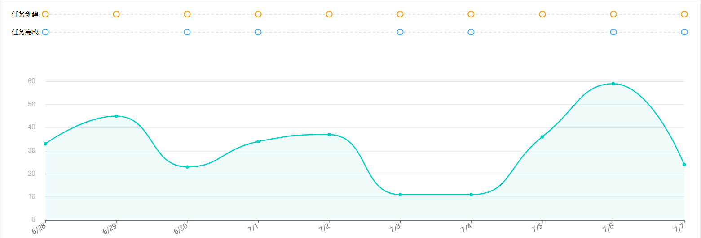

# 使用echarts与其他组件联动

## 需求

通过外部元素触发echarts的option显示，同时需要将echarts内的操作联动到外部元素。

## 实现效果



## 代码实现

```vue
<template>
   <div class="trend-chart-box">
      <div class="trend-chart-labels">
         <!-- 标签区域 -->
         <div class="labels-area">
            <div class="label-row">任务创建</div>
            <div class="label-row">任务完成</div>
         </div>

         <!-- 虚线和点区域 -->
         <div class="lines-area" ref="linesAreaRef">
            <!-- 虚线与点的容器 -->
            <div class="line-points-container" v-for="(pointType, index) in pointTypes" :key="index">
               <div class="dashed-line"></div>
               <div class="points-row">
      <span
         v-for="(point, idx) in pointType.points"
         :key="`${pointType.type}-${idx}`"
         class="point point-cursor"
         :class="pointType.className"
         :style="{ left: `calc(${point.percentage}%)` }"
         @mouseenter="handlePointHover(point.dataIndex, true)"
         @mouseleave="handlePointLeave"
      ></span>
               </div>
            </div>
         </div>
      </div>
      <div class="trend-chart-main" v-loading="loading" ref="chartContainer">
         <div ref="chartRef" class="trend-echart"></div>
      </div>
   </div>
</template>

<script setup lang="ts">
import { ref, onMounted, nextTick, onUnmounted, computed } from "vue";
import * as echarts from "echarts";
import dayjs from "dayjs";

// 定义图表所需格式
interface MergedDataType {
   clusteringProblemId: number;
   clusteringProblemName: string;
   dateStr: string;
   newTaskCount: number;
   newTaskList: string[];
   completionTaskCount: number;
   completionTaskList: string[];
   newPointNumber: number;
   ratio: number;
}

// 图表加载状态
const loading = ref(false);
// 图表所需数据
const mergedData = ref<MergedDataType[]>([]);
// 存储日期
const xAxisData = ref<string[]>([]);
// 存储数值
const yData = ref<number[]>([]);
// 任务节点静态数据 - 修改类型以包含dataIndex
const createPoints = ref<{ percentage: number; dataIndex: number }[]>([]);
const finishPoints = ref<{ percentage: number; dataIndex: number }[]>([]);
// 控制图表tooltip显示
const tooltipEnabled = ref<boolean>(true);
// 图表实例
const chartRef = ref<HTMLDivElement>();
let chartInstance: echarts.ECharts | null = null;
const chartContainer = ref<HTMLElement | null>(null);

const pointTypes = computed(() => [
   {
      type: 'create',
      className: 'point-create',
      points: createPoints.value
   },
   {
      type: 'finish',
      className: 'point-finish',
      points: finishPoints.value
   }
]);

// Mock数据made by ai - 确保每天都有任务创建
function generateMockData() {
   const mockData: MergedDataType[] = [];
   const today = new Date();

   // 任务创建模板，确保每天都有不同的任务
   const taskTemplates = [
      "优化界面响应速度",
      "修复页面加载缓慢",
      "解决内存泄漏问题",
      "改进用户交互体验",
      "提升数据加载效率",
      "修复兼容性问题",
      "优化网络请求",
      "改进错误处理机制",
      "提升页面渲染性能",
      "修复UI显示异常"
   ];

   const completionTemplates = [
      "修复界面卡顿",
      "完成性能优化",
      "解决数据同步问题",
      "修复样式错误",
      "完成功能测试",
      "修复逻辑错误",
      "完成代码重构",
      "修复安全漏洞"
   ];

   for (let i = 9; i >= 0; i--) {
      const currentDate = new Date();
      currentDate.setDate(today.getDate() - i);
      const dateStr = dayjs(currentDate).format('YYYY-MM-DD');

      // 随机生成数据
      const newPointNumber = Math.floor(Math.random() * 50) + 10;
      const ratio = +(Math.random() * 0.3 + 0.1).toFixed(2);

      // 确保每天都有任务创建（1-3个任务）
      const newTaskCount = Math.floor(Math.random() * 3) + 1;
      const newTaskList = [];
      for (let j = 0; j < newTaskCount; j++) {
         const randomTemplate = taskTemplates[Math.floor(Math.random() * taskTemplates.length)];
         newTaskList.push(`${randomTemplate} - ${dateStr}`);
      }

      // 60%概率有完成任务
      const hasCompletionTask = Math.random() > 0.4;
      const completionTaskCount = hasCompletionTask ? Math.floor(Math.random() * 2) + 1 : 0;
      const completionTaskList = [];
      if (hasCompletionTask) {
         for (let j = 0; j < completionTaskCount; j++) {
            const randomTemplate = completionTemplates[Math.floor(Math.random() * completionTemplates.length)];
            completionTaskList.push(`${randomTemplate} - ${dateStr}`);
         }
      }

      mockData.push({
         clusteringProblemId: 1001,
         clusteringProblemName: "界面卡顿问题",
         dateStr,
         newTaskCount,
         newTaskList,
         completionTaskCount,
         completionTaskList,
         newPointNumber,
         ratio
      });
   }

   return mockData;
}

function getOption() {
   // 图表的x轴最多显示内容
   const interval = Math.ceil(xAxisData.value.length / 10) - 1;

   const options = {
      color: ["#00CEC0"],
      tooltip: {
         show: tooltipEnabled.value,
         trigger: "axis",
         axisPointer: {
            type: "line",
            // 隐藏原生标识线，通过为元素添加样式来实现
            lineStyle: {
               width: 0
            }
         },
         backgroundColor: "#fff",
         borderColor: "#e4e7ed",
         borderWidth: 1,
         textStyle: { color: "#303133" },
         formatter(params: any[]) {
            const p = params[0];
            const currentData = p.dataIndex !== undefined ? (mergedData.value[p.dataIndex] as MergedDataType) : null;
            return `
<div style="color:#606266;font-size:14px;line-height:22px;min-width: 205px">
    <div><span style="color:#737278;font-weight:700;">${dayjs(p.axisValue).format("M/D")}</span></div>
    <div style="margin: 4px 0 8px 1px;">
    <span style="display:inline-block;width:8px;height:8px;border-radius:50%;background-color:#00CEC0;margin-right:4px;"></span>
    <span>${currentData?.clusteringProblemName}</span>
    <span style="float:right;font-weight:600;">${p.value}</span></div>

${(() => {
               const tasks = currentData?.newTaskList;
               if (tasks && tasks.length > 0) {
                  return `
    <!-- 任务创建部分 -->
    <div style="display:flex;align-items:flex-start;padding:5px 0 ;border-top:1px solid #E0E6F1">
      <span style="display:inline-block;width:10px;height:10px;border-radius:50%;background:#fff;border:2px solid #ff9800;margin-right:6px;margin-top:6px;flex-shrink:0;"></span>
      <div style="flex-grow:1;">
        <div style="color:#909399;font-size:12px;">任务创建</div>
        ${tasks.map((task: string) => `<div style="color:#303133;font-size:12px;">${task || "未命名任务"}</div>`).join("")}
      </div>
    </div>`;
               }
               return "";
            })()}

${(() => {
               const tasks = currentData?.completionTaskList;
               if (tasks && tasks.length > 0) {
                  return `
    <!-- 任务完成部分 -->
    <div style="display:flex;align-items:flex-start;padding:5px 0 ;border-top:1px solid #E0E6F1">
      <span style="display:inline-block;width:10px;height:10px;border-radius:50%;background:#fff;border:2px solid #409eff;margin-right:6px;margin-top:6px;flex-shrink:0;"></span>
      <div style="flex-grow:1;">
        <div style="color:#909399;font-size:12px;">任务完成</div>
        ${tasks.map((task: string) => `<div style="color:#303133;font-size:12px;">${task || "未命名任务"}</div>`).join("")}
      </div>
    </div>`;
               }
               return "";
            })()}
`;
         }
      },
      grid: {
         left: "60",
         right: "10",
         bottom: "10%",
         top: 40
      },
      xAxis: {
         type: "category",
         boundaryGap: false,
         data: xAxisData.value,
         axisLabel: {
            interval: interval,
            rotate: 30,
            margin: 10,
            color: "#737279",
            fontSize: 12,
            formatter: (value: string) => {
               // 将日期字符串转换为M/D格式
               return dayjs(value).format("M/D");
            }
         }
      },
      yAxis: {
         type: "value",
         min: 0,
         axisLabel: {
            formatter: "{value}",
            margin: 18,
            color: "#B5B4BB",
            fontFamily: "Helvetica",
            fontSize: 12,
            fontWeight: "normal",
            fontStyle: "normal",
            align: "right"
         }
      },
      series: [
         {
            type: "line",
            smooth: true,
            data: yData.value,
            symbol: "circle",
            symbolSize: 6,
            lineStyle: { width: 2 },
            itemStyle: { color: "#00CEC0" },
            areaStyle: { color: "rgba(0,206,192,0.08)" }
         }
      ]
   };

   return options;
}

// 修改点位置计算逻辑，保存数据索引
function calculateTaskPoints() {
   createPoints.value = [];
   finishPoints.value = [];

   if (!mergedData.value.length || !chartInstance) return;

   const dataLength = mergedData.value.length;

   // 获取echarts的grid配置
   const option = chartInstance.getOption();
   const grid = option.grid?.[0] || {};

   // 计算echarts实际绘制区域的偏移和宽度
   const leftOffset = parseFloat(String(grid.left || '60'));
   const rightOffset = parseFloat(String(grid.right || '10'));

   // 获取容器宽度
   const containerWidth = chartRef.value?.offsetWidth || 0;
   const chartWidth = containerWidth - leftOffset - rightOffset;

   // 计算每个点的位置百分比，考虑echarts的边距
   mergedData.value.forEach((dataPoint: any, index: number) => {
      // 计算在echarts绘制区域内的相对位置
      const relativePosition = index / (dataLength - 1);
      // 转换为整个容器的百分比位置
      const pixelPosition = leftOffset + relativePosition * chartWidth;
      const percentage = (pixelPosition / containerWidth) * 100;

      if (dataPoint.newTaskList?.length) {
         createPoints.value.push({
            percentage,
            dataIndex: index  // 保存数据索引
         });
      }
      if (dataPoint.completionTaskList?.length) {
         finishPoints.value.push({
            percentage,
            dataIndex: index  // 保存数据索引
         });
      }
   });
}

// 处理点hover事件
const handlePointHover = (dataIndex: number, showTooltip: boolean = true) => {
   if (!chartInstance || !chartContainer.value) return;

   // 获取图表的grid区域位置
   const option = chartInstance.getOption();
   // 获取x轴偏移量
   const grid = option.grid?.[0] || {};
   const leftOffset = parseFloat(String(grid.left || '60'));
   const containerWidth = chartRef.value?.offsetWidth || 0;
   const chartWidth = containerWidth - leftOffset - parseFloat(String(grid.right || '10'));

   // 计算对应数据点的x坐标
   const dataLength = mergedData.value.length;
   const relativePosition = dataIndex / (dataLength - 1);
   // 计算得到的x坐标是跳跃坐标
   const xPosition = leftOffset + relativePosition * chartWidth;

   // 显示指示器伪元素
   document.documentElement.style.setProperty("--indicator-position", `${xPosition}px`);
   chartContainer.value.classList.add("show-indicator");

   if (showTooltip) {
      // 手动触发echarts中对应坐标的tooltip
      chartInstance.dispatchAction({
         type: 'showTip',
         seriesIndex: 0,
         dataIndex: dataIndex
      });
   }
};

// 处理点离开事件
const handlePointLeave = () => {
   if (!chartInstance || !chartContainer.value) return;

   // 隐藏指示器
   chartContainer.value.classList.remove("show-indicator");

   // 隐藏tooltip
   chartInstance.dispatchAction({
      type: 'hideTip'
   });
};

// 联动功能实现代码，带缓存，可以缓存一段区域中的tooltip位置和数据索引，避免频繁计算
function setupIndicatorExtension() {
   if (!chartInstance || !chartContainer.value) return;
   const container = chartContainer.value as HTMLElement;

   // 添加缓存变量
   let lastDataIndex = -1;
   let lastPosition = -1;

   chartInstance.getZr().on("mousemove", event => {
      // event对象包含：
      // - offsetX/offsetY: 相对于画布的坐标
      // - clientX/clientY: 相对于视口的坐标
      // - target: 触发事件的DOM元素
      if (!container) return;
      const pointInPixel = [event.offsetX, event.offsetY];
      // 使用ECharts的containPixel判断是否在图表区域内
      const isInAxis = chartInstance?.containPixel("grid", pointInPixel);

      if (isInAxis) {
         // 计算最近的数据点位置和索引
         const { position, dataIndex } = calculateNearestDataPositionWithIndex(event.offsetX);

         // 只有当位置或索引发生变化时才更新
         if (dataIndex !== lastDataIndex || position !== lastPosition) {
            // 显示指示器到最近的数据点位置
            document.documentElement.style.setProperty("--indicator-position", `${position}px`);
            container.classList.add("show-indicator");

            // 显示对应数据点的tooltip
            chartInstance?.dispatchAction({
               type: 'showTip',
               seriesIndex: 0,
               dataIndex: dataIndex
            });

            // 更新缓存
            lastDataIndex = dataIndex;
            lastPosition = position;
         }
      } else {
         container.classList.remove("show-indicator");
         chartInstance?.dispatchAction({
            type: 'hideTip'
         });
         // 重置缓存
         lastDataIndex = -1;
         lastPosition = -1;
      }
   });

   chartInstance.getZr().on("mouseout", () => {
      if (chartContainer.value) {
         container.classList.remove("show-indicator");
         chartInstance?.dispatchAction({
            type: 'hideTip'
         });
         // 重置缓存
         lastDataIndex = -1;
         lastPosition = -1;
      }
   });
}

// 修改函数：同时返回位置和数据索引
function calculateNearestDataPositionWithIndex(mouseX: number): { position: number; dataIndex: number } {
   if (!chartInstance || !mergedData.value.length) return { position: mouseX, dataIndex: 0 };

   const option = chartInstance.getOption();
   const grid = option.grid?.[0] || {};
   const leftOffset = parseFloat(String(grid.left || '60'));
   const rightOffset = parseFloat(String(grid.right || '10'));
   const containerWidth = chartRef.value?.offsetWidth || 0;
   const chartWidth = containerWidth - leftOffset - rightOffset;

   const dataLength = mergedData.value.length;
   let nearestPosition = leftOffset;
   let nearestIndex = 0;
   let minDistance = Infinity;

   for (let i = 0; i < dataLength; i++) {
      const relativePosition = i / (dataLength - 1);
      const xPosition = leftOffset + relativePosition * chartWidth;
      const distance = Math.abs(mouseX - xPosition);

      if (distance < minDistance) {
         minDistance = distance;
         nearestPosition = xPosition;
         nearestIndex = i;
      }
   }

   return { position: nearestPosition, dataIndex: nearestIndex };
}

// 窗口大小变化时重新渲染图表
const handleResize = () => {
   if (chartInstance) {
      chartInstance.resize();
      // 窗口大小变化后重新计算点位置
      nextTick(() => {
         calculateTaskPoints();
      });
   }
};

// 在loadMockData函数中添加延迟计算
const loadMockData = () => {
   try {
      loading.value = true;
      mergedData.value = generateMockData();
      xAxisData.value = mergedData.value.map((item: MergedDataType) => item.dateStr);
      yData.value = mergedData.value.map((item: MergedDataType) => item.newPointNumber);

      if (chartInstance) {
         chartInstance.setOption(getOption());
         // 等待图表渲染完成后再计算点位置
         nextTick(() => {
            calculateTaskPoints();
         });
      }
   } finally {
      loading.value = false;
   }
};

onMounted(() => {
   loadMockData();

   nextTick(() => {
      if (chartRef.value) {
         chartInstance = echarts.init(chartRef.value);
         chartInstance.setOption(getOption());
         chartContainer.value = chartRef.value.parentElement;
         setupIndicatorExtension();

         // 图表渲染完成后计算点位置
         setTimeout(() => {
            calculateTaskPoints();
         }, 100);

         window.addEventListener("resize", handleResize);
      }
   });
});

onUnmounted(() => {
   // 移除窗口大小变化监听
   window.removeEventListener("resize", handleResize);
   // 销毁图表实例
   if (chartInstance) {
      chartInstance.dispose();
      chartInstance = null;
   }
});
</script>

<style scoped lang="scss">
.trend-chart-box {
   position: relative;
   background-color: #fff;
   margin: 0 15px;
   padding: 9px 18px 32px;
   box-shadow: 0 2px 8px rgba(0, 0, 0, 0.03);
}

.trend-chart-labels {
   position: relative;
   display: flex;
   margin-bottom: 16px;
   z-index: 1;

   .labels-area {
      position: absolute;
      top:-1px;
      flex-shrink: 0;
      display: flex;
      flex-direction: column;
   }

   .label-row {
      height: 32px;
      line-height: 32px;
      padding-right: 10px;
      font-size: 12px;
      white-space: nowrap;
   }

   .lines-area {
      flex-grow: 1;
      position: relative;
      display: flex;
      flex-direction: column;
      gap: 0;
   }

   .line-points-container {
      position: relative;
      height: 32px;
      display: flex;
      align-items: center;

      .point-cursor {
         cursor: pointer;
      }
   }

   .dashed-line {
      position: absolute;
      left: 60px;
      right: 10px;
      height: 0;
      border-bottom: 2px dashed #e4e7ed;
   }

   .points-row {
      position: absolute;
      left: 0;
      right: 0;
      width: 100%;
      height: 100%;
      display: flex;
      align-items: center;
   }

   .point {
      position: absolute;
      transform: translateX(-50%);
      width: 12px;
      height: 12px;
      border-radius: 50%;
      transition: all 0.2s ease;

      &:hover {
         transform: translateX(-50%) scale(1.2);
         box-shadow: 0 2px 8px rgba(0, 0, 0, 0.15);
      }

      &.point-create {
         background: #fff;
         border: 2px solid #ff9800;

         &:hover {
            border-color: #f57c00;
         }
      }

      &.point-finish {
         background: #fff;
         border: 2px solid #409eff;

         &:hover {
            border-color: #1976d2;
         }
      }
   }
}

.trend-chart-main {
   position: relative;

   .trend-echart {
      width: 100%;
      height: 320px;
      margin-top: 32px;
   }

   &::before {
      content: "";
      position: absolute;
      top: -80px;
      height: calc(100% + 45px);
      width: 2px;
      border-left: 2px dashed #e0e6f1;
      opacity: 0;
      pointer-events: none;
      left: var(--indicator-position);
      transition: opacity 0.2s ease;
   }

   &.show-indicator::before {
      opacity: 1;
   }
}

:root {
   --indicator-position: 0px;
}
</style>
```


## 联动工作流程概述

1. **事件捕获**：
   - 通过`chartInstance.getZr().on("mousemove", ...)`监听echarts中的鼠标移动
   - `getZr()`获取echarts底层ZRender渲染器实例

2. **区域判断**：
   - 使用`containPixel("grid", pointInPixel)`判断鼠标是否在图表绘图区域内
   - 只有鼠标在绘图区域内才激活指示器

3. **CSS变量更新**：
   - 当鼠标在绘图区内时，通过`document.documentElement.style.setProperty`更新CSS变量
   - 将`--indicator-position`设置为当前鼠标X坐标(`event.offsetX`)

4. **控制指示器显隐**：
   - 在合适区域内添加`containerEl.classList.add("show-indicator")`显示指示器
   - 鼠标离开区域时移除类名隐藏指示器

5. **贯穿布局联动**：
   - 伪元素垂直线通过CSS设置延伸到任务节点区域
   - 利用`top: -80px`和`height: calc(100% + 45px)`确保虚线覆盖整个图表和任务点区域

## 补充学习