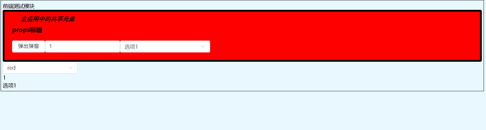

## 微前端中通过主应用向微应用传递组件
理论上可以用在任意应用之间的组件共享。

实现效果


### 技术方案
#### 主应用中在全局挂载组件信息，微应用中通过获取全局的组件信息构造组件。

失败，微应用中无法获取到主应用的样式

#### vite模块联邦，通过在主应用中映射组件，微应用直接访问主应用中暴露的接口

失败，微应用中无法获取到主应用的样式

#### vue自定义元素

```javascript
// element.js
import { defineCustomElement } from 'vue'

import Test from './Test/index.ce.vue';

const components = [
    {
        name: 'wy-test',
        component: Test,
    },
]

const sharedElements = {}

// 将动态导入移到异步函数内部
export async function register() {
    console.log('--------------')

    // 在函数内部动态导入样式
    const styles = await import('element-plus/theme-chalk/src/index.scss?inline');
    components.forEach(item => {
        const customElement = defineCustomElement({
            ...item.component,
            styles: [
                item.component.styles,
                styles.default
            ]
        })

        sharedElements[item.name] = customElement
        customElements.define(item.name, customElement)
    })
}

// 导出自定义元素对象
export { sharedElements }
```
随后，在主应用注册微应用时，通过prop向子应用传递元素
```javascript
const Test = resolveComponent('wy-test')
// 微应用入口
props:{
    sharedComponents:{
        'wy-test': ()=>h(Test), // 生成单独的组件实例
    }
}
// 微应用中的main.ts，在render的时候传入props,并挂载组件
if(props.sharedComponents) {
    Object.entries(props.sharedComponents).forEach(([name, component]) => {
        const compDef = component.__v_raw||component;
        app.component(name, compDef);
    })
}
```

上述方案测试过程中，发现样式可以正确显示，但是无法实现监听事件和触发事件，并且无法通过Props传递参数，怀疑是因为调用者和被调用者的JS环境不同导致。遂更新开发方案。

```typescript
// Finally version element.js
import { defineCustomElement } from 'vue'
import Test from './Test/index.ce.vue';

/**
 * 共享组件配置数组
 * 定义需要注册为自定义元素的 Vue 组件
 * 每个组件包含：
 * - name: 自定义元素的标签名（必须包含连字符）
 * - component: Vue 组件实例
 */
const components = [
    {
        name: 'wy-test', // 自定义元素标签名，将注册为 <dia-test> 元素
        component: Test,  // 对应的 Vue 组件
    },
]

/**
 * 注册共享组件为自定义元素的主函数
 * 
 * 功能：
 * 1. 将 Vue 组件转换为自定义元素（Custom Elements）
 * 2. 注册到浏览器的 customElements 注册表中
 * 3. 返回组件对象供其他应用使用
 * 
 * @returns {Promise<{[key:string]:any}>} 返回包含所有注册组件的对象
 */
export default async function register() {
    try {
        // 动态导入 Element Plus 样式，使用 ?inline 参数将样式内联
        // 这样可以确保自定义元素包含所需的样式
        const styles = await import('element-plus/theme-chalk/src/index.scss?inline');
        
        // 存储处理后的 Vue 组件对象
        const vueComponents : {[key:string]:any} = {};

        // 遍历所有需要注册的组件
        components.forEach(item => {
            try {
                /**
                 * 使用 defineCustomElement 将 Vue 组件转换为自定义元素
                 * 合并组件原有配置和样式：
                 * - ...item.component: 展开原组件的所有配置
                 * - styles: 合并组件样式和 Element Plus 样式
                 */
                const customElement = defineCustomElement({
                    ...item.component,
                    styles: [
                        item.component.styles, // 组件自身的样式
                        styles.default         // Element Plus 的样式
                    ]
                });

                /**
                 * 将自定义元素注册到浏览器的 customElements 注册表
                 * 检查元素是否已存在，避免重复注册导致错误
                 * 注册后可以在任何地方使用 <dia-test> 标签
                 */
                if (!customElements.get(item.name)) {
                    customElements.define(item.name, customElement);
                }
                
                /**
                 * 将自定义元素存入共享对象
                 */
                vueComponents[item.name] = item.name;

                console.log(`Custom element '${item.name}' registered successfully`);
            } catch (error) {
                // 捕获单个组件注册失败的错误，不影响其他组件的注册
                console.error(`Failed to register custom element '${item.name}':`, error);
            }
        });

        // 返回所有成功注册的组件对象
        // 这个对象会被添加到 window.MicroFrontends.VUEComponents 中
        // 供其他微前端应用使用
        return vueComponents;
    } catch (error) {
        // 捕获整个注册过程的错误（如样式导入失败）
        console.error('Failed to register custom elements:', error);
        return {}; // 返回空对象，避免应用崩溃
    }
}
// main.ts
window.VUEComponents = {...await register()}
// 微应用
if (window.VUEComponents) {
    console.log("注册基座中的公共组件", customElements.get('wy-test'));
    Object.entries(window.VUEComponents).forEach(([name, component]) => {
        app.component(name, component);
    });
}
```

### 坑
Vite在开发时会使用 ESBuild 实时编译 SCSS/CSS 文件，因此可以在注入样式的时候可以直接导入 SCSS/CSS 文件。
```javascript
// 可能的处理方式，ai生成
// 开发环境下，Vite 可能这样处理 CSS 导入
// import 'styles.css' 被转换为：
const cssContent = `/* CSS 内容 */`;
const style = document.createElement('style');
style.textContent = cssContent;
document.head.appendChild(style);

// 并且可能返回包含内容的对象
export default { content: cssContent };
```
而生产环境中，并不会走这套流程，单独的import样式会返回一个空对象，导致自定义元素样式注入的时候，无法读取元素。
解决方法：使用vite提供的?inline来处理 SCSS/CSS 文件，vite检测到?inline后会将 SCSS/CSS 文件转换成字符串。此时自定义元素样式注入成功。


#### 有关传值
推荐使用Props和emits来传递参数，尝试了自定义事件来传递，结果并不行，怀疑是因为两个应用的上下文不一致或者调用的时机有问题