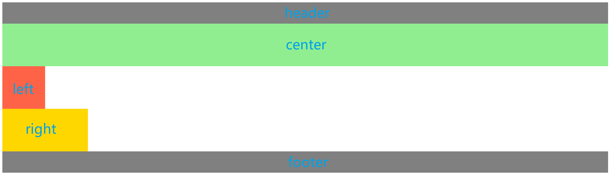
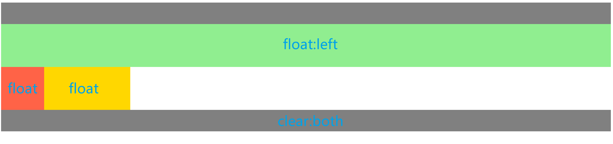
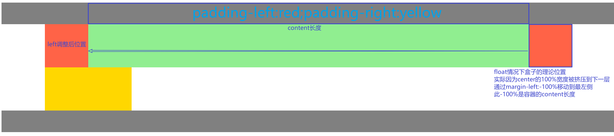
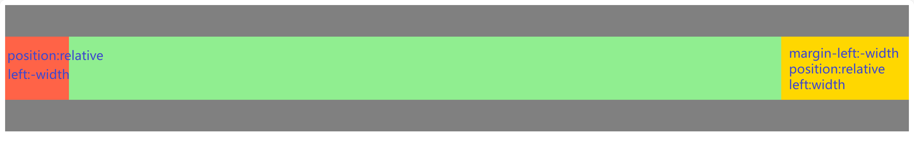
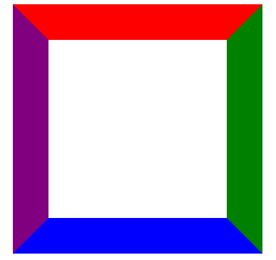

# CSS

## 选择器介绍

### 属性选择器

| 选择器        | 描述                                                                                                                                                 |
| ------------- | ---------------------------------------------------------------------------------------------------------------------------------------------------- |
| [attr]        | 匹配带有一个名为*attr*的属性的元素。                                                                                                                 |
| [attr=value]  | 匹配带有一个名为*attr*的属性的元素，其值正为*value*。                                                                                                |
| [attr~=value] | 匹配带有一个名为*attr*的属性的元素，其值正为*value*，或者匹配带有一个*attr*属性的元素，其值有一个或者更多，至少有一个和*value*匹配（值用空格分隔）。 |
| [attr^=value] | 匹配带有一个名为*attr*的属性的元素，其值开头为*value*子字符串。                                                                                      |
| [attr&=value] | 匹配带有一个名为*attr*的属性的元素，其值末尾为*value*子字符串。                                                                                      |
| [attr*=value] | 匹配带有一个名为attr的属性的元素，其值的字符串中的任何地方（子串），至少出现了一次value子字符串。                                                    |

### 伪类选择器

用于定义元素的特殊状态，使用`:`表示

a标签的的4个伪类，必须按照特定顺序编写，否则后编写的会失效，编写顺序为`a:link`,`a:visited`,`a:hover`,`a:activte`。口诀：**l**o**v**e,**ha**te

### 伪元素选择器

用于设置元素指定部分的样式，使用`::`表示

用于创建不在文档树中的元素，并为其添加样式，默认是inline，可以通过子绝夫相来调整伪元素的位置，伪元素必须要设置content才能显示

### 其他

| 选择器类型         | 语法    | 作用范围                                | 示例      |
| :----------------- | :------ | :-------------------------------------- | :-------- |
| **相邻兄弟选择器** | `A + B` | 选择紧接在 `A` 后面的第一个同级元素 `B` | `div + p` |
| **子选择器**       | `A > B` | 选择 `A` 的直接子元素 `B`               | `div > p` |
| **后代选择器**     | `A B`   | 选择 `A` 的所有后代元素 `B`             | `div p`   |

## 选择器的优先级

| **选择器**     | **格式**      | **优先级权重** |
| -------------- | ------------- | -------------- |
| id选择器       | #id           | 100            |
| 类选择器       | .classname    | 10             |
| 属性选择器     | a[ref=“eee”]  | 10             |
| 伪类选择器     | li:last-child | 10             |
| 标签选择器     | div           | 1              |
| 伪元素选择器   | li:after      | 1              |
| 相邻兄弟选择器 | h1+p          | 0              |
| 子选择器       | ul>li         | 0              |
| 后代选择器     | li a          | 0              |
| 通配符选择器   | *             | 0              |

内联样式的优先级权重为1000，`!important`的优先级为最高

**优先级权重相同的情况下，后出现的样式生效**

继承得到的优先级最低(比0还低)

样式表的来源不同时，优先级顺序为：内联样式 > 内部样式 > 外部样式 > 浏览器用户自定义样式 > 浏览器默认样式

## 可继承属性和不可继承属性

不可继承:

- display
- 盒子模型属性(margin,border...)
- 背景属性
- 定位属性

可继承:

- 字体属性
- 文本属性
- 光标属性
- 列表布局属性(list-style)

## display的属性有哪些

| **属性值**   | **作用**                                                   |
| ------------ | ---------------------------------------------------------- |
| none         | 元素不显示，并且会从文档流中移除。                         |
| block        | 块类型。默认宽度为父元素宽度，可设置宽高，换行显示。       |
| inline       | 行内元素类型。默认宽度为内容宽度，不可设置宽高，同行显示。 |
| inline-block | 默认宽度为内容宽度，可以设置宽高，同行显示。               |
| list-item    | 像块类型元素一样显示，并添加样式列表标记。                 |
| table        | 此元素会作为块级表格来显示。                               |
| inherit      | 规定应该从父元素继承display属性的值。                      |

（1）**block**:会独占一行，多个元素会另起一行，可以设置width、height、margin和padding属性；

（2）**inline**:元素不会独占一行，设置width、height属性无效。但可以设置水平方向的margin和padding属性，不能设置垂直方向的padding和margin，高、宽默认为内容高宽；

（3）**inline-block**:将对象设置为inline对象，但对象的内容作为block对象呈现，之后的内联对象会被排列在同一行内。

## 隐藏元素的方法

- `display:none`:不会被渲染进dom

- `visibility: hidden`:会被渲染，且占据文档位置，但不会响应事件

- `opacity:0`:会被渲染，且占据文档位置，会响应事件

- `position: absolute`：通过使用绝对定位将元素移除可视区域内，以此来实现元素的隐藏。

- `z-index: 负值`：来使其他元素遮盖住该元素，以此来实现隐藏。

- `transform: scale(0,0)`:将元素缩放为 0，来实现元素的隐藏。这种方法下，元素仍在页面中占据位置，但是不会响应绑定的监听事件

  只有opacity和position两种情况会响应事件
  
  只有display:none，才不会触发回流和重绘

## 盒子模型

标准盒子模型，height和width对应content


IE盒子模型，height和width对应content+padding+border


通过修改`box-sizing`属性来改变元素盒模型，content-box为标准盒子，border-box为IE盒子

## 如何实现响应式布局

通过视口宽度，高度vw,vh

使用padding-bottom百分比

```html
<div class="container">
  <div class="content">
  </div>
</div>

<style>
  .container {
    position: relative;
    width: 80%;
    background: black;
    padding-bottom: calc(9/16 * 100%);  /*16:9,利用padding-bottom相对于宽度撑开*/
  }

  .content {
    position: absolute;
    top: 0;
    left: 0;
    background: blue;
    width: 100%;
    height: 100%;
  }
</style>
```

js动态计算(计算消耗大)

```js
function updateAspectRatio() {
  const element = document.querySelector('.flexible-card');
  const width = element.offsetWidth; // offsetWidth是实际可见宽度
  element.style.height = `${width * 0.75}px`; // 4:3 比例
}

window.addEventListener('resize', updateAspectRatio);
updateAspectRatio(); // 初始化

// 相关属性补充
offsetHeight：实际可见高度，内容 + 内边距 + 边框 + 滚动条（同 offsetWidth 的垂直维度）。
clientHeight：内部可视高度，内容 + 内边距，不含边框和滚动条（同 clientWidth 的垂直维度）。
scrollHeight：内容总高度,包含溢出高度（同 scrollWidth 的垂直维度）。

getBoundingClientRect() // 返回一个包含元素位置和尺寸的对象，包括：
left、top、right、bottom：元素相对于视口的坐标。
width、height：元素的实际宽度和高度（等同offsetWidth/offsetHeight）。
x、y：元素左上角的坐标。
```


## 为什么有时候用**translate**来改变位置而不是定位

因为translate属于transform，而改变transform或opacity并不会触发浏览器的重绘或重新布局，改变定位会引发重新布局

1. **不影响布局信息**：
   `transform` 属性（如 `translate`、`rotate`、`scale`）**不会改变元素的布局信息**，它只是在元素渲染后对其进行视觉变换，因此**不会触发重排**。
2. **直接作用于合成层**：
   现代浏览器会为应用了 `transform` 的元素创建一个**独立的合成层**，变换操作直接在合成层完成，跳过布局和绘制阶段，极大提升性能。

## 重绘和重排

重绘：某些元素的外观被改变所触发的浏览器行为（重新计算节点在屏幕中的绝对位置并渲染的过程）； 例如：修改元素的填充颜色，会触发重绘

重排（回流）：重新生成布局，重新排列元素（重新计算各节点和css具体的大小和位置：**渲染树需要重新计算所有受影响的节点**）；例如：改元素的宽高，会触发重排

重排的发生情况

- 改变布局
- 改变几何属性，如宽高，边框宽度，字体大小等
- 获取计算值，如offsetTop，scrollTop。因为计算的即时性


如何优化

统一修改css样式

将修改的dom元素脱离文档流，修改后再返回文档流

将修改的dom元素离线（display改为none）

## 可置换元素

就是会被替换的元素，如**img**,video,iframe。css渲染模型不考虑对此内容的渲染(内容一般都是其他负责，如从网络上下载)，只会影响元素的位置。

## CSSSprites

精灵图，将一个页面涉及到的所有图片都包含到一张大图中去，然后利用CSS的 background-image，background-repeat，background-position属性的组合进行背景定位。

优点是可以减少网页请求

缺点是更新麻烦

## margin和padding的使用场景

margin在border外填充，无背景颜色

padding在border内填充，背景颜色跟随块的背景颜色(`background-color`)

## line-height

- line-height是一行文本的高度，从下一行基线到上一行基线的高度
- 如果标签没有定义height，则标签高度为line-height。同理，撑开标签的高度也是line-height，而不是文本
- 设置line-height = height可以实现单行文本的垂直居中
- line-height可以使用px固定，也可以使用em参考父元素font-size计算行高。如果设置纯数字，则是比例，例如，父级行高为 1.5，子元素字体为 18px，则子元素行高为 1.5 * 18 = 27px。

## 预处理器和后处理器

预处理器：less，sass，用在写css的时候

后处理器：postCss，在完成的css中添加浏览器私有前缀等，实现兼容

## 单行、多行文本溢出

```
// 单行文本
overflow: hidden;            // 溢出隐藏
text-overflow: ellipsis;      // 溢出用省略号显示
white-space: nowrap;         // 规定段落中的文本不进行换行

// 多行文本
overflow: hidden;            // 溢出隐藏
text-overflow: ellipsis;     // 溢出用省略号显示
display:-webkit-box;         // 作为弹性伸缩盒子模型显示。
-webkit-box-orient:vertical; // 设置伸缩盒子的子元素排列方式：从上到下垂直排列
-webkit-line-clamp:3;        // 显示的行数
```

## 媒体查询

`@media(...)`,只有当符合要求的时候才会响应样式，用于适配不同尺寸的媒体设备

```js
<!-- link元素中的CSS媒体查询 --> 
<link rel="stylesheet" media="(max-width: 800px)" href="example.css" /> 
<!-- 样式表中的CSS媒体查询 --> 
<style> 
@media (max-width: 600px) { 
  .facet_sidebar { 
    display: none; 
  } 
}
</style>
```

## 如何判断元素是否到达可视区域

- `getBoundingClientRect()` 返回元素的 **布局边界矩形**（包含 `top`、`bottom`、`left`、`right` 等属性），这些值是相对于 **视口（viewport）** 的坐标。通过比较该矩形与视口的位置关系，判断元素是否可见

- 内容达到显示区域的：`img.offsetTop < window.innerHeight + document.body.scrollTop;`


- 使用IntersectionObserver，[大白话详解Intersection Observer API本文用大白话详细介绍了Iersection Observer - 掘金](https://juejin.cn/post/7146441070828584968)

  IntersectionObserver主要好处就是其是异步的，而以上的两个方法都是同步的，再面对大规模数据的时候会阻塞主进程。

  ```js
  <div class="container"></div>
  
  <script>
      const container = document.querySelector(".container");
  
      // 插入 100000 个 <div class="target"></div>
      function createTargets() {
          const htmlString = new Array(100000)
              .fill('<div class="target"></div>')
              .join("");
          container.innerHTML = htmlString;
      }
      createTargets();
  
      const observer = new IntersectionObserver(getYellow, { threshold: 0.9 }); // new一个IntersectionObserver对象，第一个参数是回调，第二个参数是options
  
      function getYellow(entries, observer) { // 第一个是传入的IntersectionObserverEntry对象，第二个参数是上面的observer
          entries.forEach(entry => {
              entry.target.style.backgroundColor = "green"; // entry为一个实例对象，其中的target为目标元素
          });
      }
  
      const targets = document.querySelectorAll(".target");
      targets.forEach((element) => {
          observer.observe(element);  // 观察每一个元素
      });
  </script>
  ```

## z-index什么情况下会失效

z-index反应了元素的层级，z-index越大的，层级越靠上

做了几个实验，都不会失效，float可以和z-index共存，父组件的状态也不会影响z-index

子元素的z-index受限于父元素的z-index

| **堆叠上下文创建条件**         | **关键属性值**                                                              |
| ------------------------------ | --------------------------------------------------------------------------- |
| **根元素**                     | `<html>`                                                                    |
| **定位元素 + z-index**         | `position: relative/absolute/fixed/sticky` 且 `z-index` 为数值（非 `auto`） |
| **flex/grid 子元素 + z-index** | 父元素为 `display: flex/grid` 子元素 `z-index` 为数值（非 `auto`）          |
| **opacity 小于 1**             | `opacity: 0.0 ~ 0.99`                                                       |
| **transform 不为 none**        | `transform: translate()/rotate()/scale()` 等                                |

## 常用的CSS布局单位

像素：与设备密度有关，一般都是统一的

百分比：子元素的百分比相对于父元素，可以自适应变化

em和rem：

- 文本相对长度单位。相对于当前对象内文本的字体尺寸。如果当前行内文本的字体尺寸未被人为设置，则相对于浏览器的默认字体尺寸(默认16px)。(相对父元素的字体大小倍数)。
-  rem是CSS3新增的一个相对单位，相对于根元素（html元素）的font-size的倍数。**作用**：利用rem可以实现简单的响应式布局，可以利用html元素中字体的大小与屏幕间的比值来设置font-size的值，以此实现当屏幕分辨率变化时让元素也随之变化。

vw/vh：与百分比类似，但百分比更细化，有的属性甚至可以百分比自身(border-radius、translate)

- vw：相对于视窗的宽度，视窗宽度是100vw；
- vh：相对于视窗的高度，视窗高度是100vh；
- vmin：vw和vh中的较小值；vmax：vw和vh中的较大值；

## 什么是BFC

BFC（Block Formatting Context）就是给盒子加了一个属性，使得盒子变成了独立渲染的一部分，内部不受外界影响。

### 如何成为BFC

- 根元素
- 设置浮动
- 绝对定位或fixed定位
- 设置display为inline-block、flex、grid、table、table-cell、table-caption、flow-root
- 设置overflow(auto,scroll,hidden)

对于如果是父元素，可以设置display:inline-block;如果是子元素，可以设置overflow:hidden

### BFC有什么用

- 相邻元素（top和dowm，left和right）的外边距（margin）会合并，合并后margin取值大者。可以给任意元素添加overflow:hidden，使其成为BFC，就可以合并边距了
- 父元素和子元素的外边距塌陷（父元素和其第一个子元素或最后一个子元素之间的垂直外边距发生合并的现象），可以给父元素设置边框或内边距解决，也可以将父元素变成BFC
- 父元素高度塌陷（子元素脱离文档流），可以为父元素开启BFC避免
- 浮动重叠（元素设置成float后脱离文档流，遮住了本来的内容），可以给被遮挡元素开启BFC

## 两栏布局的实现

一般是左边栏固定大小，右边栏自适应

1. 利用浮动，左边栏设置成浮动，宽度200px，右边栏设置margin-left:200px，宽度auto
2. 利用浮动，左侧元素设置固定大小，并左浮动，右侧元素设置overflow: hidden; 这样右边就触发了BFC，BFC的区域不会与浮动元素发生重叠，所以两侧就不会发生重叠
3. 利用flex布局，将左边元素设置为固定宽度200px，将右边的元素设置为flex:1
4. 利用绝对定位，将父级元素设置为相对定位。左边元素设置为absolute定位，并且宽度设置为200px。将右边元素的margin-left的值设置为200px。
5. 利用绝对定位，将父级元素设置为相对定位。左边元素宽度设置为200px，右边元素设置为绝对定位，左边定位为200px，**其余方向定位为0（必须设置，否则没元素填充和其他定位，会导致宽度为0）**

## 三栏布局的实现

一般是左右两栏固定大小，中间一栏自适应

1. 利用**绝对定位**，左右两栏设置为绝对定位，中间设置对应方向大小的margin的值。

2. 父组件利用flex布局，左右两栏设置固定大小，中间一栏设置为flex:1

3. 利用浮动，左右两栏设置固定大小，并设置对应方向的浮动。中间一栏设置左右两个方向的margin值，注意这种方式,**中间一栏必须放到最后**，不然中间一栏会占据文档流，把左右两栏挤下去

4. 圣杯布局

   

   

   

   

5. 双飞翼布局

   本质与圣杯布局类似，但是非父元素padding实现，而是通过center预留margin实现

   ```html
   <div class="outer">
     <div class="wrapper">
       <div class="center">
         center
       </div>
     </div>
     <div class="left">
       left
     </div>
     <div class="right">
       right
     </div>
   </div>
   
   <style>
     .outer {
       height: 100px;
     }
   
     .left {
       float: left;
       margin-left: -100%;
       width: 100px;
       height: 100px;
       background: tomato;
     }
   
     .right {
       float: left;
       margin-left: -200px;
       width: 200px;
       height: 100px;
       background: gold;
     }
   
     .wrapper {
       float: left;
       width: 100%;
       height: 100px;
       background: lightgreen;
     }
   
     .center {
           margin-left: 100px;
           margin-right: 200px;
       height: 100px;
     }
   </style>
   ```

## 水平垂直居中的实现

1. 利用子绝父相，将子元素通过`top:50%`和`left:50%`定位到页面中心，再通过`transform:translate(-50%,-50%)`使其变成垂直水平居中
2. 如果父元素有宽高，可以先通过子绝父相定位，将top,bottom,left,right设置为0，margin设置成auto实现在父元素中水平垂直居中
3. 若自身宽高已知，可以先通过子绝父相完成定位，再通过负margin值来调整水平垂直居中
4. 通过flex布局，修改`justify-content:center;align-items:center;`

## flex布局详解

采用flex布局的元素会变成flex容器，所有子元素自动成为容器成员，称为项目(item)。容器默认存在两根轴，水平的主轴和垂直的交叉轴，项目默认为水平主轴

容器的几个属性：

1. flex-direction:决定主轴的方向。值为row(水平)，row-reverse(反向水平)，column(垂直)，column-reverse(反向垂直)，initial(默认)，inherit(继承父属性)
2. flex-wrap:如何换行。值为wrap(换行)，wrap-reverse(反向换行，123换行后变321)，nowrap(不换行)
3. justify-content:主轴的对齐方式。值为start(起点对齐)，end(终点对齐)，center(居中对齐)，space-between(均匀分布，两侧对齐)，space-around(均匀分布，两侧预留中间间隔的一半)，space-evenly(均匀分布，两侧预留=中间间隔)
4. align-items:侧轴的对齐方式。值为start，center，end，stretch(如果没有设置宽/高，则会拉伸铺满)
5. align-content:多轴线的对齐方式，单轴线下无效

项目的几个属性：

1. order:排列顺序，**值越小在项目的位置越靠前**，但只会改变**视觉上**的排序，不会改变DOM树中的结构和HTML结构（对应DOM树）
2. flex-grow:项目的放大比例（也可以理解为剩余空间的分配权重）。默认为0，即不放大。若所有伸缩项目的 flex-grow 值都为 1 ，则：它们将等分剩余空间（如果有空间的话）。若三个伸缩项目的 flex-grow 值分别为： 1 、 2 、 3 ，则：分别瓜分到： 1/6 、 2/6 、3/6 的**剩余空间**。如果flew-grow的和小于1，如0.1,0.2,0.2，则新剩余空间为源剩余空间的1/2，再进行分配
3. flex-shrink:项目的缩小比例，默认为1。具体的计算方法为：若三个伸缩项目的 flex-flex-shrink 值分别为： 1 、 2 、 3，其宽度分别为200px,300px,400px，容器的宽度为500px，此时需要收缩900-500=400px。先用权重乘以其宽度求和得200+600+1200=2000px，计算收缩的比例分别为200/2000,600/2000,1200/2000，将比例与收缩的宽度相乘即可得到项目的收缩宽度
4. flex-basis:即项目的基本大小，宽度的优先级为max-width/min-width > flex-basis > width > box
5. align-self:单独项目的对齐方式，会覆盖align-items，值与align-items一致，只不过是调整项目自身，对齐对象为当前flex行的其他元素

flex属性是flex-grow，flex-shrink和flex-basis的简写，默认值为0 1 auto。**flex:1 表示 flex: 1 1 0%**

## 响应式设计的概念和基本原理

响应式网站设计（Responsive Web design）是一个网站能够兼容多个终端，而不是为每一个终端做一个特定的版本。

关于原理： 基本原理是通过媒体查询`（@media）`查询检测不同的设备屏幕尺寸做处理。

关于兼容： 页面头部必须有meta声明的`viewport`。

## 什么是清除浮动

清除浮动是当父元素没有指定高度的时候，子元素设置float脱离文档流后，父元素高度塌陷。

解决的方法有：

1. 将父元素变成BFC，使其内部解决浮动问题。可以将display设置成flex，grid，flow-root（设置成table或inline-block会导致宽度也自适应，使其完全包住子元素，这是table和inline-block的特性导致的），也可以设置overflow:hidden，但有可能屏蔽了溢出的正常内容

2. 通过在最后一个浮动标签后新添加一个标签，为标签设置`clear:both`

3. 在父元素中使用clearfix，本质上和第二条类似

   ```html
   .clearfix::after{
     display: block;  //添加一个块级元素
     content: ' ';    //避免不显示，设置空文本
     clear: both;     //清除浮动
   }
   ```

## 元素的层叠顺序

从最低层开始分别是：

（1）背景和边框：建立当前层叠上下文元素的背景和边框。

（2）负的z-index：当前层叠上下文中，z-index属性值为负的元素。

（3）块级盒：文档流内非行内级非定位后代元素。

（4）浮动盒：非定位浮动元素。

（5）行内盒：文档流内行内级非定位后代元素。

（6）z-index:auto：层叠级数为auto的**定位**元素(默认为auto）。

（7）z-index:0：层叠级数为0的定位元素。

（8）正z-index：z-index属性值为正的定位元素。

## absolute和fixed的共同点和不同点

共同点：使元素脱离普通文档流，不再占据文档物理空间，同时会覆盖非定位文档元素

不同点：两者的父元素都是包含块，不过规则不同，首先，transform属性非none的可以成为absolute和fixed的包含块（两者都可基于此定位），其次，**定位元素**（position非none）也可以称为absolute的包含块。

## transform详解（待更新）

 ## sticky 定位

粘性定位的元素是依赖于用户的滚动，在 **position:relative** 与 **position:fixed** 定位之间切换。一般情况下，它的行为就像 **position:relative;** 而当页面滚动超出目标区域时，它的表现就像 **position:fixed;**，它会固定在目标位置。元素定位表现为在跨越特定阈值前为相对定位，之后为固定定位。这个特定阈值指的是 top, right, bottom 或 left 之一，换言之，指定 top, right, bottom 或 left 四个阈值其中之一，才可使粘性定位生效。否则其行为与相对定位相同。

## 如何使用CSS编写三角形

本质上border是从四个角开始的




```css
.container {
	width: 0px;  // !!!保证容器只有边框，没有实际内容，如果有实际内容，则会将三角形显示成矩形
	height: 0px; // !!!同理
	border: 100px solid transparent;  // 将其他边框忽略，100px表示的是边框长度(底边/2)，实际上是一个200x200的矩形
	border-left: red 100px solid;  // 将靠左的三角形显示出来(顶角朝右)，此处的100px是水平长度
}

// 也可以只说明两个元素，这样的话，矩形的组成将不会是四个三角形拼凑，而是只有两个三角形
.container {
	width: 0px;  
	height: 0px; 
	border-top: 100px solid transparent;  
	border-left: 100px solid red;  // 这样会显示一个90度角在左下方的三角形
}
```

## 如何用CSS实现扇形

```
// 方法同三角形，只不过把扇形圆弧边所在的方向设置radius
.container{
    width: 0;
    height: 0;
    border-radius:100px;
    border:100px solid transparent;
    border-left: 100px solid red;  // 尖口朝右的扇形
}
```

## 如何用CSS实现圆形/半圆

圆形

````css
.container {
  background-color: red;
  height: 100px;
  width: 100px;
  border-radius: 50%; // 100%也可以
}
````

半圆

```css
.container {
  background-color: red;
  width: 200px;
  height: 100px;  // 高度是宽度一般
  border-radius: 0px 0px 200px 200px; // 200px对齐宽度，四个值分别代表左上，右上，右下，左下
}
```

## 如何使用CSS实现一个宽高自适应的正方形

1.使用vw，vh实现

2.利用元素的margin/padding百分比是相对父元素width的性质来实现

```
.square {
  width: 20%;  // 父元素宽度的20%
  height: 0;   // 高度为0，纯靠padding撑开
  padding-top: 20%;  // padding和margin百分比相对于父元素的宽度实现
  background: orange;
}
```

3.通过伪元素实现

```
.square {
  width: 30%;  // 可以发现，square元素没有高度，高度纯靠伪元素的margin/padding-top撑开
  overflow: hidden;
  background: yellow;
}
.square::after {
  content: '';
  display: block;  // 必须是block或是inline-block才能有margin和padding
  margin-top: 100%; // 伪元素的百分比基于square的宽度
}
```

## 实现一条宽度0.5px的线

使用transform:scale(1,0.5)
