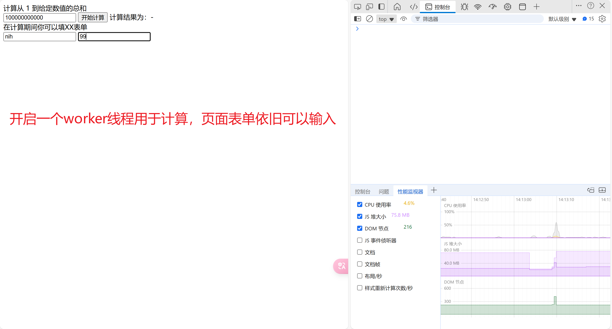

# HTML

## 1. src和href的区别

请求src资源时会下载指向资源并应用到文档内，会先暂停其他资源的下载和处理

请求href的时候会并行下载资源，且不会停止对文档的处理

综上，一般js文件等使用src请求，而css等文件使用href请求

## 2. HTML语义化标签

有利于seo和开发，还有一个是标签中的role

```html
<header></header>  头部
<nav></nav>  导航栏
<section></section>  区块（有语义化的div）
<main></main>  主要区域
<article></article>  主要内容
<aside></aside>  侧边栏
<footer></footer>  底部
```

## 3. DOCTYPE的作用

写在首行，为了告诉浏览器用什么样的文档类型解析文档，有标准模式和混杂模式，会影响CSS和js脚本的解析

`<!Doctype html>`的作用：`<!Doctype html>` 的作用就是让浏览器进入标准模式，使用最新的 HTML5 标准来解析渲染页面；如果不写，浏览器就会进入混杂模式，我们需要避免此类情况发生。

其实还有个用于过渡两个模式的准标准模式

## 4. script中defer和async的作用

首先，不使用defer或async，就会立即加载并执行对应脚本，不会等待后续加载的文档元素，会阻塞后续文档的加载


defer是同步加载，但延迟执行。async是同步加载，立刻执行

如果有多个defer脚本，会按照它们在页面出现的顺序加载，而多个async脚本是不能保证加载顺序的

## 5. 常用的meta标签

1. `<meta charset = "UTF-8"` 用来表示文档的编码类型
2. `<meta name="viewport" content="width=device-width, initial-scale=1, maximum-scale=1">`
   1. `width viewport` ：宽度(数值/device-width)
   2. `height viewport` ：高度(数值/device-height)
   3. `initial-scale` ：初始缩放比例
   4. `maximum-scale` ：最大缩放比例
   5. `minimum-scale` ：最小缩放比例
   6. `user-scalable` ：是否允许用户缩放(yes/no）

## 6. H5的新功能

1. 语义化标签

2. 媒体标签：

   `<audio src='' controls(开启控制面板) autoplay(自动播放) loop='true'(是否循环)></audio>`

   `<video src='' poster='imgs/aa.jpg'(封面，默认视频首帧) controls></video>`

   `<source src='aa.mp4' type='video/mp4'></source>`,一般用于解决video中src无法解析的问题

3. 新的表单类型和表单属性

4. progress进度条，max表示完整进度，value表示当前进度

5. DOM操作，`document.querySelector()`,`document.querySelectorAll()`

6. Web存储，localStorage和sessionStorage

## 7. 行内元素和块级元素

- 行内元素有：`a b span img input select strong`；
- 块级元素有：`div ul ol li dl dt dd h1 h2 h3 h4 h5 h6 p`；

## 8. Web Workder

为了解决JS的单线程问题，Web Worker提供了一个独立的worker线程。

Web Worker分为专用线程和共享线程，专用线程仅供创建worker的线程使用，共享线程可以由多个脚本使用


​	

```js
// 页面js
<script>
    const worker = new Worker('./worker.js') // 引入worker脚本

    function calc() {
        const num = parseInt(document.getElementById('num').value)
        worker.postMessage(num) // 获取dom元素，并向worker发送数据
    }

    worker.onmessage = function (e) {
    	document.getElementById('result').innerHTML = e.data
    }
</script>

// worker.js
function calc(num) {
    let result = 0
    let startTime = performance.now()
    // 计算求和（模拟复杂计算）
    for (let i = 0; i <= num; i++) {
        result += i
    }
    // 由于是同步计算，在没计算完成之前下面的代码都无法执行
    const time = performance.now() - startTime
    console.log('总计算花费时间:', time)
    self.postMessage(result) // 将结果返回给调用线程
}

self.onmessage = function (e) {
    calc(e.data)  // worker进程接受到数据后，开始计算
}
```

webworker有同源要求限制，即同协议，同域名，同端口。可以通过Blob或importScripts引入外部脚本。worker线程内不存在dom对象，且和主线程之间的通过必须通过message传递。通过主线程调用terminate或worker线程调用close进行关闭。

## 9. label标签

可以将焦点转移到绑定的元素

```html
// 两种方法，点击label元素均可以触发input
// 法一，使用for和name绑定
<label for="mobile">Number:</label>
<input type="text" id="mobile"/>

// 法二，直接将绑定元素放到label标签内
<label>Date:<input type="text"/></label>
```

## 10. head标签的作用

`<head>` 标签用于定义文档的头部，它是所有头部元素的容器。`<head>` 中的元素可以引用脚本、指示浏览器在哪里找到样式表、提供元信息等。必须要用`<title>`

## 11. iframe标签

`<iframe>` 标签用于在当前文档中嵌入另一个文档。可以通过`src`属性指定要嵌入的文档的URL。

嵌入的文档可以是同源的，也可以是跨域的，但跨域时会受到一些限制，如无法访问嵌入文档的DOM。

如果需要访问跨域的iframe内容，可以使用`postMessage`方法进行跨域通信。

```javascript
// 实例
// 外部DOM
onMounted(() => {
  if (myIframe.value) {
    // iframe加载完成后，通过iframe中的contentWindow向子应用传递数据，contentWindow代表iframe中的window对象
    // 如果当前页面和iframe中的页面是同源的，可以直接访问contentWindow
    // 否则需要使用postMessage进行跨域通信
    myIframe.value.onload = () => {
      myIframe.value.contentWindow.postMessage(
          {
            eventName: 'permissions',
            permissions: window.MicroFrontends.permissions
          },
          '*'
      );
    };
  }
});
// iframe内的DOM
// 这里通过外部传入的权限数组来设置iframe内DOM的权限
export function authDirective(app: App) {
  window.addEventListener('message', event => {
    const { eventName, permissions } = event.data // 通过event.data获取传递的数据
    // 只处理permissions事件
    if (eventName === 'permissions') {
      window.permissions = permissions
    }
  })
  let authBtnList = window.permissions || []
  // 单个权限验证（v-auth="xxx"）
  app.directive('auth', {
    mounted(el, binding) {
      if (authBtnList.length === 0) {
        // 如果权限列表为空，则从全局变量中获取
        authBtnList = window.permissions
      }
      if (!authBtnList.some((v: string) => v === binding.value)) el.parentNode.removeChild(el)
    }
  })
}
```
