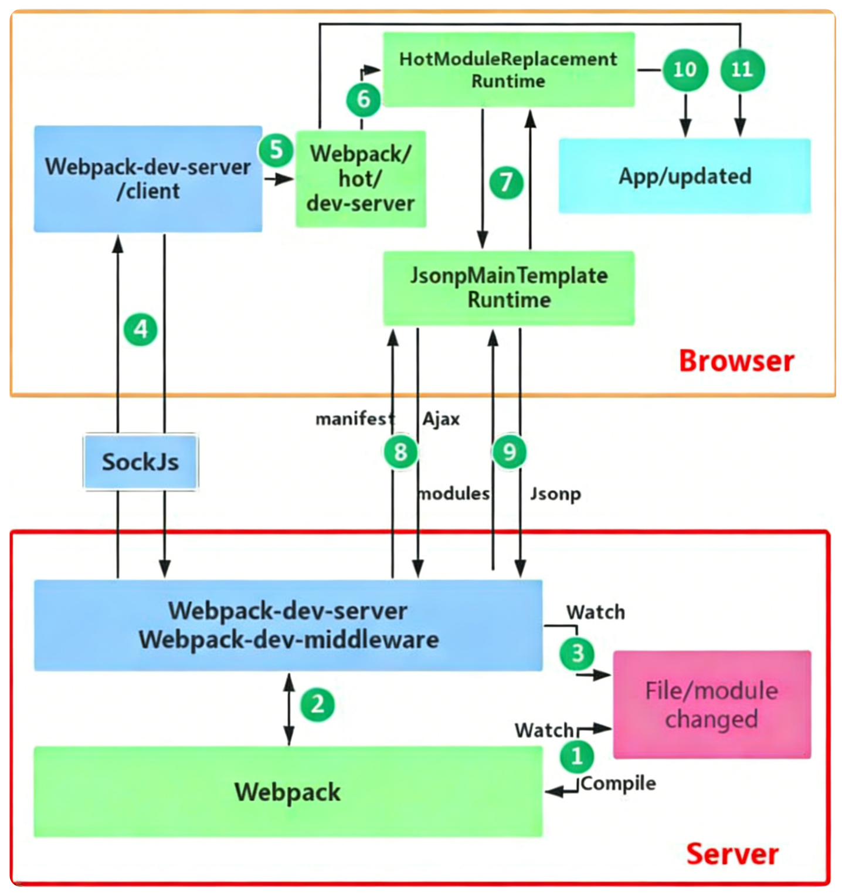

## webpack的目的

早期的前端开发中，开发者需要手动引入每个JavaScript文件和CSS文件，这在项目规模较大时会变得非常麻烦和容易出错。webpack的出现解决了这个问题，它是一个模块打包工具，可以将项目中的各种资源（JavaScript、CSS、图片等）视为模块，并根据依赖关系将它们打包成一个或多个文件，从而简化了资源管理和加载过程。且可以适配不同的语法（React,Vue,TS,ES6+）,并对代码进行优化（如Tree Shaking、Code Splitting等），提升性能。

## webpack打包流程

1. **初始化参数（Initialization）**：从配置文件（如 `webpack.config.js`）和 Shell 命令行中读取并合并参数，得出最终的配置对象。Webpack 基于此配置实例化全局唯一的 `Compiler` 对象，并注册所有配置的插件（Plugins）。
2. **入口（Entry）**：webpack调用 `Compiler.run()` 开始编译，并从一个或多个入口文件开始构建依赖图，默认是`src/index.js`。
3. **模块解析（Module Resolution）**：webpack根据入口文件分析依赖关系，递归地解析所有依赖的模块。
4. **加载器（Loaders）**：webpack使用加载器来处理非JavaScript文件（如CSS、图片等），将它们转换为JavaScript模块。
5. **插件（Plugins）**：在整个编译的过程中，webpack会广播出许多事件，各种插件监听到对应事件后执行更广泛任务，如优化打包结果、管理资源等。
6. **输出（Output）**：webpack将打包后的文件输出到指定的目录，默认是`dist`。

### 1.初始化参数

在这个阶段，Webpack 会将命令行工具（如 `npm run build` 传入的参数）和 `webpack.config.js` 中的配置进行合并，得到最终的运行参数。也就是“参数合并与初始化”。随后，根据这些参数实例化一个全局唯一的 `Compiler` 对象，注册配置中所有的 Plugin，接着调用 `Compiler.run()` 开始正式编译流程。

> **补充：什么是 Compiler 对象？**
> `Compiler` 对象是 Webpack 的核心实例，可以被理解为整个 Webpack 的“大管家”。
>
> **它的核心作用：**
> 1. **生命周期管控**：它负责控制整个 Webpack 构建过程的完整生命周期（如启动、编译、输出、停止等）。它继承自 `Tapable` 类，会在构建的各个阶段暴露出许许多多的 Hook（钩子，比如 `compile`、`make`、`emit` 等）。
> 2. **保存全局状态和配置**：它内部保存着完整的 Webpack 运行配置（Options）、所有的插件实例（Plugins）、依赖的文件系统等。在 Webpack 整个运行期间，`Compiler` 只被实例化一次（例如在 Webpack-dev-server 运行中，即使代码多次热更新、重新编译，使用的始终是同一个 `Compiler` 实例）。
> 3. **创建 Compilation 对象**：真正负责每次具体的代码编译工作的是 `Compilation`（编译）对象，每次有代码修改触发重新构建时，`Compiler` 都会新创建一个 `Compilation` 来完成具体的编译任务。

### 2.入口

一般配置在webpack.config.js中，指定入口文件路径，如：

```javascript
module.exports = {
  entry: './src/index.js',
  // ...
};
```

webpack会从这个入口文件开始，分析其依赖关系，构建出一个依赖图（有向无环图）。解析文件中的import语句，找到所有依赖的模块，使用loader，再继续解析这些模块的依赖，直到没有新的依赖为止。多入口配置可以指定多个入口文件，webpack会为每个入口文件生成一个独立的打包结果。

### 3.模块解析

webpack会根据入口文件分析依赖关系，递归地解析所有依赖的模块。对于每个模块，webpack会将其转换为一个JavaScript模块，并将其添加到依赖图中。对于不同的模块（本地模块、第三方模块等），webpack会采用不同的解析策略。如果是本地模块，webpack会根据相对路径解析；如果是第三方模块，webpack会根据模块名称在`node_modules`目录中查找（找到文件的index.js）。

### 4.加载器

确定模块路径并读取文件内容后，webpack 会根据配置的 loader 规则对对应文件进行编译转换，例如通过 babel-loader 处理 JSX、ES6+ 语法，通过 css-loader 处理样式文件，将各类资源统一转为 webpack 可处理的 JS 模块。直到所有模块递归解析、编译完成并形成完整依赖图。由于webpack采用的是compose的方式，读取loader的时候是从右往左读取的（或者从下往上读取的），所以在配置loader时需要注意顺序。如`[style-loader, css-loader, sass-loader]`，webpack会先使用`sass-loader`将scss文件转换为css，再使用`css-loader`将css转换为js模块，最后使用`style-loader`将样式注入到页面中。

### 5.插件（Plugins）

在 webpack 整个编译周期中，会广播出许多事件。Plugin 可以监听到这些事件，在合适的时机通过 webpack 提供的 API 干预输出结果。Loader 主要用于转换某些类型的模块（专注于文件级别的转换），而 Plugin 则可以执行范围更广的任务。

任务包括：打包优化、资源管理和注入环境变量等。
常用的插件比如：
- `HtmlWebpackPlugin`：自动生成 HTML 文件，并注入生成的 bundle（带hash值的文件）。
- `MiniCssExtractPlugin`：将 CSS 提取为独立的文本文件。

### 6.输出（Output）

webpack 根据入口和模块之间的依赖关系，组装成一个个包含多个模块的 Chunk（代码块）。在各种插件处理完这些 Chunk 后，webpack 会将它们转换成浏览器可以运行的文件资源（通常是 js 文件），最终根据配置中的 `output` 参数，将这些打包结果写入到文件系统中（默认是 `dist` 目录）。

```javascript
module.exports = {
  // ...
  output: {
    filename: '[name].[contenthash].js', // 输出的文件名
    path: path.resolve(__dirname, 'dist'), // 输出的绝对路径
    clean: true, // 每次构建前清理 /dist 文件夹
  }
};
```

## webpack的热重载过程



⾸先要知道server端和client端都做了处理⼯作：
1. 第⼀步，在 webpack 的 watch 模式下，⽂件系统中某⼀个⽂件发⽣修改，webpack 监听到⽂件变化，根据配置⽂ 
件对模块重新编译打包，并将打包后的代码通过简单的 JavaScript 对象保存在内存中。 
2. 第⼆步是 webpack-dev-server 和 webpack 之间的接⼝交互，⽽在这⼀步，主要是 dev-server 的中间件 webpack- dev-middleware 和 webpack 之间的交互，webpack-dev-middleware 调⽤ webpack 暴露的 API对代码变化进⾏监 控，并且告诉 webpack，将代码打包到内存中。 
3. 第三步是 webpack-dev-server 对⽂件变化的⼀个监控，这⼀步不同于第⼀步，并不是监控代码变化重新打包。当我们在配置⽂件中配置了devServer.static.watch 为 true 的时候，Server 会监听这些配置⽂件夹中静态⽂件的变化，变化后会通知浏览器端对应⽤进⾏自动 live reload（如果配置为false需要手动刷新）。注意，这⼉是浏览器刷新，和 HMR 是两个概念。 
4. 第四步也是 webpack-dev-server 代码的⼯作，该步骤主要是通过 sockjs（webpack-dev-server 的依赖）在浏览器端和服务端之间建⽴⼀个 websocket ⻓连接，将 webpack 编译打包的各个阶段的状态信息告知浏览器端，同时也包括第三步中 Server 监听静态⽂件变化的信息。浏览器端根据这些 socket 消息进⾏不同的操作。当然服务端传递的最主要信息还是新模块的 hash 值，后⾯的步骤根据这⼀ hash 值来进⾏模块热替换。 
5. webpack-dev-server/client 端并不能够请求更新的代码，也不会执⾏热更模块操作，⽽把这些⼯作⼜交回给了webpack，webpack/hot/dev-server 的⼯作就是根据 webpack-dev-server/client 传给它的信息以及 dev-server 的配置决定是刷新浏览器呢还是进⾏模块热更新。当然如果仅仅是刷新浏览器，也就没有后⾯那些步骤了。 
6. HotModuleReplacement.runtime 是客户端 HMR 的中枢，它接收到上⼀步传递给他的新模块的 hash 值，它通过JsonpMainTemplate.runtime 向 server 端发送 Ajax 请求，服务端返回⼀个 json，该 json 包含了所有要更新的模块的 hash 值，获取到更新列表后，该模块再次通过 jsonp 请求，获取到最新的模块代码。这就是上图中 7、8、9 步骤。 
> json示例：
>   ```json
>   {
>     "h": "3845c43d2c94d01db320", // 本次编译生成的最新 hash 值
>     "c": { 
>       "main": true, 
>       "vendor": true, 
>       "chunk1": true 
>     }                             // 告知浏览器哪些 chunk (代码块) 需要更新
>   }
>   ```
然后浏览器端根据这个 json 中的 hash 值和更新列表，去请求最新的模块代码。如`http://localhost:8080/main.3845c43d2c94d01db320.js`
> 模块代码示例：
>   ```js
>   webpackHotUpdate("main", {
>   // 第一个变更模块 key
>   "./src/App.vue": () => { /* 全量新代码 */ },
>   
>   // 第二个变更模块 key
>   "./src/components/Header.vue": () => { /* 全量新代码 */ },
>
>   // 第三个变更模块 key
>   "./src/main.js": () => { /* 全量新代码 */ }
>   });
>   ```
10. ⽽第 10 步是决定 HMR 成功与否的关键步骤，在该步骤中，HotModulePlugin 将会对新旧模块进⾏对⽐，决定是否更新模块，在决定更新模块后，检查模块之间的依赖关系，更新模块的同时更新模块间的依赖引⽤。 
11. 最后⼀步，当 HMR 失败后，回退到 live reload 操作，也就是进⾏浏览器刷新来获取最新打包代码。

## bundle，chunk，module是什么？

- bundle：是由webpack打包出来的⽂件； 
- chunk：代码块，⼀个chunk由多个模块组合⽽成，⽤于代码的合并和分割；
- module：是开发中的单个模块，在webpack的世界，⼀切皆模块，⼀个模块对应⼀个⽂件（js/css/html），webpack会从配置的 entry中递归开始找出所有依赖的模块。

## Loader和Plugin的不同？

不同的作⽤: 
- Loader直译为"加载器"。Webpack将⼀切⽂件视为模块，但是webpack原⽣是只能解析js⽂件，如果想将其他⽂件也打包的话，就会⽤到 loader 。 所以Loader的作⽤是让webpack拥有了加载和解析⾮JavaScript⽂件的能⼒。 
- Plugin直译为"插件"。Plugin可以扩展webpack的功能，让webpack具有更多的灵活性。 在 Webpack 运⾏的⽣命周期中会⼴播出许多事件，Plugin 可以监听这些事件，在合适的时机通过 Webpack 提供的 API 改变输出结果。

不同的⽤法: 
- Loader在 module.rules 中配置，也就是说他作为模块的解析规则⽽存在。 类型为数组，每⼀项都是⼀个 Object ，⾥⾯描述了对于什么类型的⽂件（ test ），使⽤什么加载( loader )和使⽤的参数（ options ） 
- Plugin在 plugins 中单独配置。 类型为数组，每⼀项是⼀个 plugin 的实例，参数都通过构造函数传⼊。

## 如何使用webpack来优化前端性能

### 压缩代码

采用plugin如`TerserPlugin`来压缩JavaScript代码、`CssMinimizerPlugin`来压缩CSS代码，减少文件体积，提高加载速度。主要就是通过替换变量名、删除注释、空格、换行等无用字符来减小文件大小。

### CDN加速

将静态资源（如图片、字体、第三方库等）上传到 CDN（内容分发网络），并在 webpack 配置中使用 `externals` 将这些资源排除在打包之外，改为从 CDN 加载。这样可以利用 CDN 的全球分发网络来加速资源加载，提高性能。

**示例：以 Vue 为例**

1.  在 `index.html` 中引入 CDN 链接，这里用个公共的仅作示例，实际使用时应替换为公司内部的 CDN 链接以防投毒：
    ```html
    <script src="https://cdn.jsdelivr.net/npm/vue@3.2.0/dist/vue.global.js"></script>
    ```

2.  在 `webpack.config.js` 中配置 `externals`：
    ```javascript
    module.exports = {
      // ...
      externals: {
        // key 是代码中从 npm 安装的包名，value 是 CDN 脚本在全局变量中导出的名称
        'vue': 'Vue'
      }
    };
    ```

3.  在业务代码中正常使用：
    ```javascript
    import { createApp } from 'vue'; // 此时 webpack 不会把 vue 打包进去，而是直接从全局变量 Vue 中获取
    ```

### Tree shaking

Tree shaking 是一种通过静态分析代码来删除未使用的代码的技术。webpack 在生产模式下默认启用 Tree shaking，可以通过配置 `sideEffects` 来告诉 webpack 哪些模块是纯函数（没有副作用）的，从而更有效地进行 Tree shaking。

Treeshaking 只支持 ES6 模块语法（即 `import` 和 `export`），不支持 CommonJS 模块语法（即 `require` 和 `module.exports`）。因为ESM 模块是静态的，webpack 可以在编译时分析出哪些模块被使用了，哪些模块没有被使用，从而删除未使用的代码。而 CommonJS 模块是动态的，webpack 无法在编译时确定哪些模块被使用了，哪些模块没有被使用，因此无法进行 Tree shaking。

```javascript
module.exports = {
  // ...
  optimization: {
    usedExports: true, // 启用 Tree shaking
  },
  // 如果某些模块有副作用（影响其他文件，如全局变量等），告诉 webpack 不要删除它们
  sideEffects: [
    './src/some-module.js', // 这个模块有副作用，不要删除
    '*.css' // 所有 CSS 文件都有副作用，不要删除
  ],
};
```

webpack在构建依赖过程中，会根据模块的导出和导入关系来分析哪些代码是被使用的，哪些代码是未使用的。对于未使用的代码，webpack 会将其标记为“dead code”（注释为/* unused harmony export ... */），并在**压缩代码**阶段，由 TerserPlugin 等压缩工具将这些未使用的代码删除，从而减小最终输出的文件体积，提高加载性能。

### 代码分割

代码分割（Code Splitting）是将代码分割成多个小块（chunk），实现按需加载或并行加载，从而避免单个 bundle 文件过大导致首页白屏时间过长。

#### 1. 入口点分割 (Entry Points)
通过配置 Webpack 的 `entry` 选项，手动分离代码。适用于多页应用。
```javascript
module.exports = {
  entry: {
    index: './src/index.js',
    another: './src/another-module.js',
  },
  output: {
    filename: '[name].bundle.js',
  },
};
```

#### 2. 防止重复 (SplitChunksPlugin)
如果多个入口文件都引用了同一个第三方库（如 lodash），Webpack 默认会把该库打入每个 bundle 中。通过 `optimization.splitChunks` 可以将公共依赖提取到单独的 chunk 中。
```javascript
module.exports = {
  // ...
  optimization: {
    splitChunks: {
      chunks: 'all', // 可选值：all (推荐，同步/异步都分割), async (仅分割动态导入), initial (仅分割同步导入)
    },
  },
};
```

#### 3. 动态导入 (Dynamic Imports)
使用 ECMAScript 提案中的 `import()` 语法。**Webpack 会自动将该模块分离成独立的 chunk**，并在代码执行到该行时才发起网络请求加载。
```javascript
// 类型一：动态导入。这种即便写在顶层也会触发独立分包（新 Chunk）。虽然页面加载时会立即触发请求，但由于它是异步的，不会阻塞主 Bundle 的解析执行。更多的时候是采用类型二的情况，作为某种条件下才触发的加载。
import('./some-module.js')
// 类型二：使用时导入，如Vue和React的路由组件
const SomeComponent = () => import('./SomeComponent.vue');
const SomeComponent = React.lazy(() => import('./SomeComponent.jsx'));
```

#### 4. 预取/预加载 (Prefetch/Preload)
在动态导入时，可以通过“魔法注释”告诉浏览器如何加载资源：

| 特性           | Prefetch (预取)                             | Preload (预加载)                           |
| :------------- | :------------------------------------------ | :----------------------------------------- |
| **指示方式**   | `import(/* webpackPrefetch: true */ '...')` | `import(/* webpackPreload: true */ '...')` |
| **浏览器指令** | `<link rel="prefetch">`                     | `<link rel="preload">`                     |
| **场景**       | **未来**（如下一个路由）可能用到的资源      | **当前**导航中立即需要的关键资源           |
| **加载优先级** | **最低**。待浏览器空闲（Idle）时加载        | **最高**。与主资源并行，立即发起加载       |
| **对首屏体验** | 几乎不影响，提升后续点击的流畅度            | 为当前页提速，但也可能因抢占带宽而拖慢首页 |
| **缓存**       | 存入 HTTP 缓存                              | 存入内存缓存                               |

```javascript
// 示例：用户在当前页，后台偷偷加载下一个页面的代码
import(/* webpackPrefetch: true */ './next-page.js');
```
